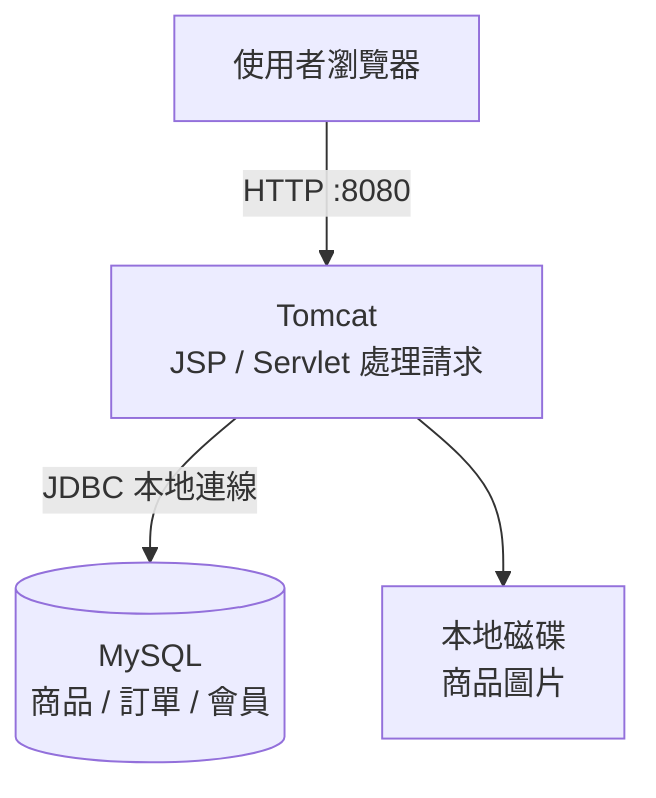
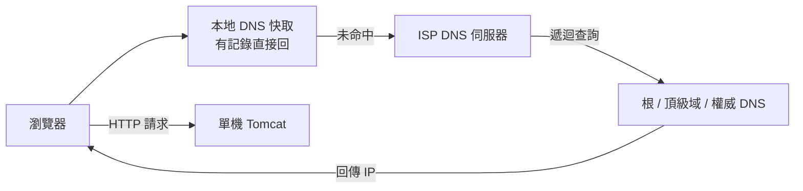

# 1.1 淘寶初期的 Web 架構：單機 Tomcat + 資料庫

## 從一個問題開始

2003 年，淘寶剛上線。團隊只有幾個人，商品只有幾百件，同時上線的人不到一百個。這時候老闆問你：「給我一個能讓人上網買東西的網站，越快上線越好。」你會怎麼架伺服器？

最自然的答案是：去機房（或租一台主機），把 Web 程式和資料庫全裝在同一台機器上。一個 Tomcat 跑前台，一個 MySQL 存訂單，開機就能做生意。這就是所有大網站的起點——**單機單體（Single-Node Monolith）**。

本節就重現這個起點：它長什麼樣子、一次請求經歷了什麼、為什麼它只能撐過創業初期。

## 單機站：所有東西塞進一台機器

所謂單機架構，就是 **Web 伺服器、應用程式、資料庫全跑在同一台作業系統上**。當年的典型組合是 Linux + Apache + Tomcat + MySQL，用 Java 寫頁面（JSP/Servlet），訂單直接寫進本地資料庫。



這種架構只有一個節點，沒有負載均衡、沒有備機。好處是部署極簡：打一個 WAR 包丟進 Tomcat，資料庫建幾張表就能開張。壞處也一目了然：機器一掛，全站全掛。

## LAMP 與 Java 技術棧的對照

課本常提 LAMP，淘寶走的則是 Java 路線。兩者思想完全一樣，只是選型不同：

| 層次 | LAMP 棧 | 淘寶初期 Java 棧 |
|---|---|---|
| 作業系統 | Linux | Linux |
| Web 入口 | Apache | Apache / Tomcat |
| 應用邏輯 | PHP | Java JSP / Servlet |
| 資料庫 | MySQL | MySQL / Oracle 前身 |
| 部署單元 | 一台主機全包 | 一台主機全包 |

為什麼選 Java 而不用 PHP？因為團隊預期商品和交易邏輯會迅速變複雜，Java 的物件導向與事務支援更適合做訂單、庫存這種「算錯一筆就賠錢」的邏輯。這個選擇也為後來擁抱 Dubbo、Spring 全家桶埋下伏筆。

## 使用者輸入網址後發生了什麼：DNS 流程

在罵「網站好慢」之前，先搞懂一次請求走了多遠。使用者在瀏覽器輸入網址，第一步不是連你的 Tomcat，而是問 **DNS（Domain Name System，網域名稱系統）**：這個域名對應哪個 IP？



1. 瀏覽器先查自己的快取，命中就直接連。
2. 未命中就問作業系統設定的 DNS（通常是電信商提供）。
3. DNS 一層層遞迴查詢，最終回傳權威 DNS 上登記的 IP。
4. 瀏覽器拿著 IP 發起 HTTP 連線，Tomcat 才真正收到請求。

單機時代 DNS 只做一件事：**域名翻譯成唯一的 IP**。還沒有後來的 DNS 輪詢、就近接入、CDN 調度（見 3.4 節）。

## Tomcat 裡的一次請求之旅

請求抵達後，Tomcat 用執行緒處理它：解析 HTTP、呼叫對應的 Servlet、經 JDBC 讀寫本地 MySQL、再把 HTML 吐回去。

```xml
<!-- server.xml：單機時代唯一的調優就是改這幾個數字 -->
<Connector port="8080" protocol="HTTP/1.1"
           maxThreads="200" minSpareThreads="10"
           connectionTimeout="20000" />
```

```java
// 典型的早期 Servlet：讀商品、直接拼 HTML
protected void doGet(HttpServletRequest req, HttpServletResponse resp)
        throws IOException {
    long itemId = Long.parseLong(req.getParameter("id"));
    Item item = itemDao.findById(itemId); // JDBC 直連本地 MySQL
    resp.getWriter().write("<h1>" + item.getTitle() + "</h1>");
}
```

注意這段程式碼的三個單機假設：資料庫就在本機（`localhost:3306`）、圖片就在本地磁碟、Session 就在 Tomcat 記憶體裡。這三個假設，後面三節會一個一個被打破。

## 這種架構的上限：優缺點一覽

| 面向 | 表現 |
|---|---|
| 開發速度 | 極快，一個人全端搞定 |
| 部署成本 | 極低，一台機器、一個 WAR 包 |
| 效能 | 幾十到幾百併發尚可，全靠機器體質 |
| 可靠性 | 零冗餘，硬碟壞了、Tomcat 掛了就是全站宕機 |
| 擴展性 | 無法擴展，只能換更大的機器（垂直擴展） |
| 維護性 | 應用和資料庫搶資源，互相拖累（見 1.3 節） |

一句話總結：**單機架構是最好的起點，也是最先碰到的天花板。**

## 本章小結

- 淘寶起點是**單機單體**：Tomcat + MySQL 全塞同一台 Linux 主機
- LAMP 與 Java 棧只是選型差異，思想都是「一台機器做完所有事」
- 一次請求先走 **DNS 解析**，再進 Tomcat → JDBC → 本地資料庫
- Tomcat 用執行緒池處理請求，Session、圖片、資料庫全在本地
- 優點是快而便宜，缺點是**無冗餘、無擴展性**，為第一次演進埋下伏筆

## 想一想

1. 為什麼創業初期「全塞一台機器」反而是正確的工程決策？什麼時候它會變成錯誤？
2. DNS 解析的每一步如果變慢或被污染，使用者會看到什麼現象？跟 Tomcat 有關係嗎？
3. 上面的 Servlet 程式碼隱含了哪三個「本地假設」？如果流量漲十倍，哪一個會先崩？

## 中英術語對照

| 中文 | 英文 |
|---|---|
| 單機單體架構 | Single-Node Monolith |
| 網域名稱系統 | Domain Name System (DNS) |
| 應用伺服器 | Application Server (Tomcat) |
| 遞迴查詢 | Recursive Query |
| 執行緒池 | Thread Pool |
