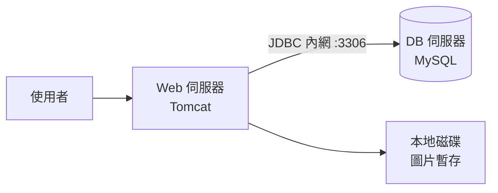
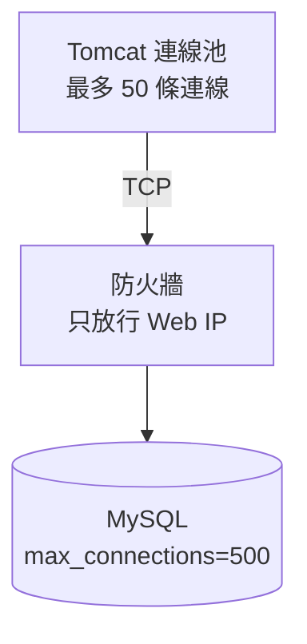

# 1.2 第一次演進：Web 伺服器與資料庫分離部署

## 從一個問題開始

單機跑了幾個月，生意變好了，商品從幾百件變成幾萬件。某天凌晨，網站突然全掛了。起來排查，發現磁碟被 MySQL 的資料檔塞滿，Tomcat 連日誌都寫不進去——賣家傳一張商品圖都沒地方放。

這就是單機架構的第一個死因：**應用和資料庫在同一台機器上互相搶資源**。最自然的止血辦法是什麼？把資料庫搬出去，單獨給它一台機器。這就是架構演進的第一次拆分。

## 拆分：兩台機器，各做各的事

演進後的拓撲很簡單：Web 機器只跑 Tomcat，DB 機器只跑 MySQL，兩者之間用內網 TCP 連線。應用第一次有了「遠端依賴」的概念。



這一步看似微小，卻是架構史上的關鍵一躍：**計算（Compute）與儲存（Storage）第一次解耦**。從此兩邊可以獨立調優、獨立重啟、獨立升級。

## 分離帶來什麼好處

| 面向 | 分離前（單機） | 分離後（兩台） |
|---|---|---|
| 資源隔離 | Tomcat 與 MySQL 搶 CPU、內存、磁碟 | 各用各的機器，互不干擾 |
| 調優自由 | 改 MySQL 快取會擠壓 Tomcat 堆內存 | DB 可專門調大 InnoDB Buffer Pool |
| 故障隔離 | 一掛全掛，連日誌都查不到 | Web 掛了資料還在，DB 掛了可單獨搶修 |
| 安全性 | 資料庫與外網同機，風險高 | DB 藏進內網，只對 Web 開放 3306 |
| 代價 | 無 | 多一台機器錢 + 內網延遲（約 0.5ms） |

多出來的內網延遲幾乎可以忽略，換來的是運維上的巨大自由。這筆買賣在當年是穩賺不賠的。

## 連線字串的改變：第一次感受到「分散式」

拆分在程式碼上只改一行，卻是心智上的分水嶺：

```properties
# 分離前：資料庫就在本機
jdbc.url=jdbc:mysql://localhost:3306/taobao?useUnicode=true

# 分離後：資料庫是遠端某個 IP，開始需要帳號、密碼、防火牆、連線池
jdbc.url=jdbc:mysql://192.168.1.11:3306/taobao?useUnicode=true
jdbc.username=app_user
jdbc.maxPoolSize=50
jdbc.timeout=3000
```

從此工程師必須思考新問題：內網 IP 變了怎麼辦？DB 機器連不上要重試幾次？連線池開多大？這些就是分散式系統的雛形——**網路不再是可靠的本地呼叫，而是一個會超時、會斷線的第三方**。



## 檔案系統的第一次尷尬

資料庫搬走了，但商品圖片還在 Web 機器的本地磁碟上。這時埋下一個伏筆：如果以後加第二台 Web 機器（見第 3 章），兩台機器的圖片就不一致了。這個「檔案去哪了」的問題，最終會逼出獨立的檔案系統與 CDN，但那是後話。這裡先記住：**每一次拆分都會暴露下一個耦合點**。

## 本章小結

- 第一次演進的動機是**資源競爭**：Web 與 DB 同機互相拖累
- 解法是**計算與儲存分離**：Tomcat 一台，MySQL 一台，內網互連
- 收益是隔離性、可調優性、安全性，代價是多一台機器與網路依賴
- 連線字串從 `localhost` 變成內網 IP，工程師第一次面對超時與重試
- 圖片仍在本地磁碟，為下一次演進（無狀態化）埋下伏筆

## 想一想

1. 為什麼「把資料庫搬到另一台機器」幾乎沒有缺點？什麼情況下內網延遲會變成問題？
2. 防火牆只放行 Web 機器的 IP 有什麼安全意義？如果把 DB 直接暴露到公網會怎樣？
3. 連線池的 `maxPoolSize` 設太大或太小分別會引發什麼故障？跟 DB 的 `max_connections` 是什麼關係？

## 中英術語對照

| 中文 | 英文 |
|---|---|
| 計算與儲存分離 | Compute-Storage Separation |
| 資源隔離 | Resource Isolation |
| 連線池 | Connection Pool |
| 內網 / 防火牆 | Intranet / Firewall |
| 故障隔離 | Fault Isolation |
