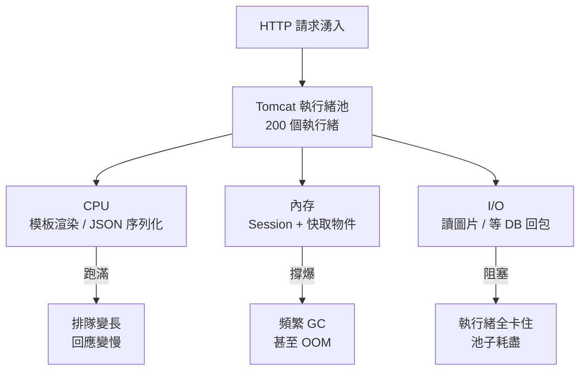

# 1.3 應用伺服器的效能瓶頸：CPU、內存與 I/O 競爭

## 從一個問題開始

資料庫搬走後清靜了沒幾個月，新的凌晨告警又來了：大促預熱一開始，Tomcat 回應時間從 50ms 飆到 5 秒，CPU 跑滿 100%，最後 Full GC 把整站卡死。重啟能好十分鐘，然後繼續掛。

這次兇手不在資料庫，而在 Web 機器自己身上。一台應用伺服器的資源就三樣：**CPU、內存（Memory）、I/O**。它們互相競爭，一個見頂，全站跟著陪葬。本節就解剖這三種瓶頸。

## 三種資源，三種死法



關鍵洞察：三種瓶頸的**症狀都是變慢**，但病因和藥方完全不同。加 CPU 救不了內存洩漏，加內存也救不了慢 SQL 拖住的 I/O。

## 瓶頸對照表：症狀、檢測、對策

| 瓶頸 | 典型症狀 | 怎麼確認 | 短期對策 |
|---|---|---|---|
| CPU 瓶頸 | load 飆高，top 看見 java 佔滿 | `top`、`jstack` 看是否卡在序列化、加密 | 精簡模板邏輯、減少反射、升級 CPU |
| 內存瓶頸 | 頻繁 Full GC、停頓數秒、OOM | `jstat -gc`、heap dump 看 Session 堆積 | 限制 Session 大小、調大堆、可疑快取加 TTL |
| I/O 瓶頸 | CPU 很閒但回應慢、執行緒全 BLOCKED | `iostat`、執行緒棧停在 socketRead | DB 加索引、連線池調優、圖片走 CDN |

一個真實的教訓：早期有人把「使用者瀏覽紀錄」全塞進 Session，一個 Session 幾 MB，幾千人同時在線就把 2GB 堆撐爆。這不是 CPU 不夠，而是**內存被濫用**——加機器只會讓你死得貴一點。

## 實戰：用三個命令定位瓶頸

```bash
# 1. CPU 還是 I/O？看 load 與 %wa
top          # load > CPU核數 → CPU 排隊；%wa 高 → 磁碟/網路 I/O 等待

# 2. 內存在幹嘛？看 GC
jstat -gcutil <pid> 1000  # FGC 頻繁增長 → 堆不夠或洩漏

# 3. 執行緒在幹嘛？看堆疊
jstack <pid> | grep -c "socketRead"  # 大量執行緒等 DB 回包 → I/O 瓶頸
```

```properties
# 對應的 Tomcat 調優片段：執行緒池不是越大越好
maxThreads=200        # 太大 → 上下文切換壓垮 CPU；太小 → I/O 等待時無人幹活
acceptCount=100       # 池滿後再排 100 個，多餘直接拒絕，快速失敗好過全站卡死
```

調優的本質是**取捨**：執行緒開多，CPU 切換開銷大；開少，I/O 一慢就沒人幹活。沒有銀彈，只有壓測。

## 為什麼單機調優終究有天花板

就算你是調優大師，把 CPU、內存、I/O 都榨到極限，單台機器的物理上限擺在那裡：CPU 最多幾十核，內存最多幾百 GB。而流量是指數漲的。這就引出下一節的核心問題：**當一台機器無論如何都不夠用時，我們是換更大的機器，還是加更多的機器？**

## 本章小結

- 應用伺服器的瓶頸只有三種：**CPU、內存、I/O**，症狀都是變慢，病因各異
- CPU 瓶頸看運算，內存瓶頸看 GC 與 Session，快取濫用是常見兇手
- I/O 瓶頸最陰險：CPU 很閒，但執行緒全卡在等 DB 或磁碟
- `top`、`jstat`、`jstack` 是定位三板斧，執行緒池大小是核心取捨
- 單機調優有物理上限，逼出下一節：水平 vs 垂直擴展

## 想一想

1. CPU 使用率很低但網站很慢，可能是什麼瓶頸？該用哪個命令驗證？
2. 為什麼 Tomcat 執行緒數「不是越大越好」？試著從 CPU 上下文切換的角度解釋。
3. Session 裡塞大物件為什麼是內存殺手？有什麼替代方案？（提示：見 3.2 節）

## 中英術語對照

| 中文 | 英文 |
|---|---|
| 效能瓶頸 | Performance Bottleneck |
| 垃圾回收 / 內存溢出 | Garbage Collection (GC) / OutOfMemory (OOM) |
| 輸入輸出等待 | I/O Wait |
| 執行緒堆疊 / 上下文切換 | Thread Stack / Context Switch |
| 快速失敗 | Fail Fast |
