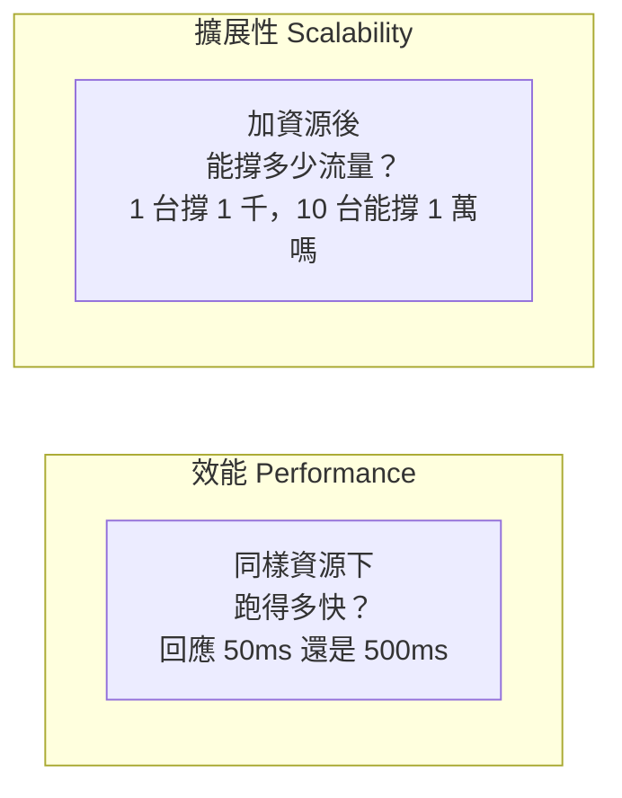
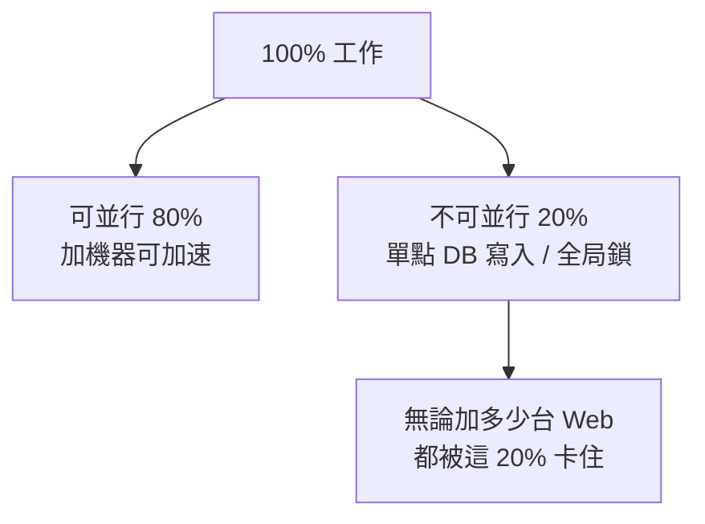

# 1.4 單體什麼時候不夠用：擴展性 vs 效能

## 從一個問題開始

1.3 節我們把單台 Tomcat 調到極限，但流量還在漲。老闆拍了兩種方案在你桌上：方案 A，花大錢買一台 64 核、512GB 內存的神機；方案 B，買十台便宜的普通機器，把流量分攤。你選哪個？

這就是架構師的第一道分水嶺：**垂直擴展（Scale-up）vs 水平擴展（Scale-out）**，以及更深層的問題——**效能（Performance）跟擴展性（Scalability）根本是兩回事**。

## 效能 vs 擴展性：先分清兩個詞

很多人混用這兩個詞，但它們回答的是不同問題：

- **效能**：固定資源下的速度。靠演算法、索引、快取、調優提升。
- **擴展性**：加資源後吞吐量的增長能力。靠架構設計決定。

一台調優到極致的單體，效能可以很好，但擴展性是零——因為它根本加不了第二台（Session 在本地、圖片在本地磁碟）。反過來，一個設計良好的集群，單台效能平平，但加機器就能線性扛住更多流量。

## 垂直 vs 水平：對比表

| 面向 | 垂直擴展 Scale-up（換大機器） | 水平擴展 Scale-out（加多台機器） |
|---|---|---|
| 做法 | 更強的 CPU、更大的內存 | 更多台機器 + 負載均衡 |
| 上限 | 物理上限，很快到頂 | 理論無限，加機器即可 |
| 成本曲線 | 越往上越貴（高端伺服器溢價） | 線性增長，可用便宜機器 |
| 可靠性 | 仍是單點，掛了全掛 | 一台掛了，其他頂上 |
| 改造難度 | 零改造，停機升級即可 | 需改造：無狀態化、Session 外移 |
| 適用階段 | 初期救火 | 長期正道 |

結論很明確：**垂直擴展是止痛藥，水平擴展是治病**。淘寶選擇了後者，但代價是整個單體必須為「多台機器協同」而改造——這正是第 3 章（無狀態化、負載均衡、Session 共享）要講的故事。

## 阿姆達爾定律：為什麼加機器不是萬能的

水平擴展有一個冷酷的數學上限——**阿姆達爾定律（Amdahl's Law）**：系統中不可並行的部分，決定了加速比的天花板。

假如應用的 20% 時間花在「寫同一個資料庫行」上（不可並行），那麼就算 Web 機器加到無限多，整體加速比也超不過 5 倍。這就是為什麼第 2 章要先啃資料庫、第 4 章要拆分資料庫——**不解決共享狀態的瓶頸，加 Web 機器只是讓更多執行緒去排同一個隊**。

## 單體不夠用的四個訊號

什麼時候該承認「單體到頭了」？出現以下任一訊號就是：

1. **擴容無效**：加 Web 機器，吞吐量不漲——瓶頸在 DB 或共享狀態。
2. **部署恐懼**：改一行程式碼要全站停機半小時，沒人敢發布。
3. **團隊打架**：幾十人同時改一個程式庫，合併衝突天天上演。
4. **故障 blast radius 太大**：一個小功能 OOM，整個交易鏈路陪葬。

出現這些訊號，答案不是「更大的機器」，而是「不同的架構」：先引入快取（第 2 章），再做無狀態集群（第 3 章），最後拆分服務與資料庫（第 4–5 章）。

## 本章小結

- **效能**是固定資源下的速度，**擴展性**是加資源後的增長能力，兩者不可混淆
- **垂直擴展**簡單但有上限且仍是單點，是止痛藥
- **水平擴展**是長期正道，但要求無狀態化與負載均衡改造
- **阿姆達爾定律**指出：不可並行的共享狀態決定了加速上限
- 單體不夠用的訊號：擴容無效、部署恐懼、團隊打架、故障半徑過大

## 想一想

1. 一台 64 核神機和十台 8 核普通機器，總核數差不多，為什麼後者的可靠性更高？
2. 用阿姆達爾定律解釋：為什麼資料庫沒拆之前，Web 機器加再多也沒用？
3. 你負責的系統出現了「改一行程式碼要全站停機」的症狀，這是效能問題還是擴展性問題？該怎麼治？

## 中英術語對照

| 中文 | 英文 |
|---|---|
| 擴展性 / 效能 | Scalability / Performance |
| 垂直擴展 / 水平擴展 | Scale-up / Scale-out |
| 阿姆達爾定律 | Amdahl's Law |
| 單點故障 | Single Point of Failure (SPOF) |
| 無狀態化 | Stateless Design |
