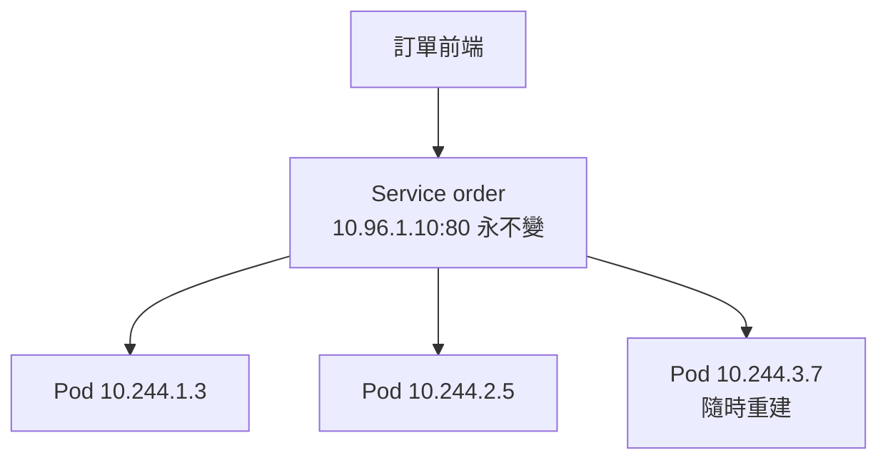
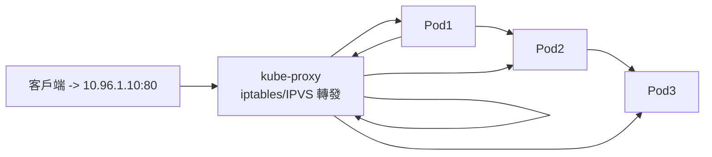

# 10.1 Service：ClusterIP / NodePort / LoadBalancer

> Pod 會漂移、會重建，IP 朝生暮死。Service 給它一個「不變的門牌號」。

## 為什麼需要 Service

回顧 3.1 節：Nginx 靠 `upstream` 手寫後端 IP 列表。K8s 裡 Pod 隨時被調度、被銷毀，IP 根本寫不死。**Service** 用標籤選擇器動態跟蹤 Pod，並提供一個穩定的虛擬 IP + DNS 名。



## 三種型別：由內到外

```yaml
# svc-clusterip.yaml：集群內部通訊，預設型別
apiVersion: v1
kind: Service
metadata:
  name: order
spec:
  type: ClusterIP
  selector: { app: order }
  ports:
  - port: 80          # Service 的埠
    targetPort: 8080  # Pod 的埠
```

```yaml
# svc-nodeport.yaml：開發測試用，每台 Node 開同一個埠
apiVersion: v1
kind: Service
metadata:
  name: order-np
spec:
  type: NodePort
  selector: { app: order }
  ports:
  - port: 80
    targetPort: 8080
    nodePort: 30080   # 30000-32767，訪問 任一NodeIP:30080
```

```yaml
# svc-lb.yaml：生產對外，雲廠商自動配負載均衡器
apiVersion: v1
kind: Service
metadata:
  name: order-lb
spec:
  type: LoadBalancer
  selector: { app: order }
  ports:
  - port: 80
    targetPort: 8080
```

```bash
kubectl apply -f svc-clusterip.yaml
kubectl get svc,endpoints
kubectl run debug --image=busybox:1.36 -it --rm -- nslookup order
```

| 型別 | 訪問範圍 | 生產建議 |
|------|---------|---------|
| ClusterIP | 僅集群內 | 微服務互調預設用它 |
| NodePort | 每台 NodeIP:NodePort | 僅調試，埠範圍受限 |
| LoadBalancer | 公網 / VPC | 對外服務，但每個都建 LB 太貴，配合 Ingress（10.2 節） |

## kube-proxy：交通警察的兩種執法方式

Service 的虛擬 IP 並不存在真實網卡上，靠每台 Node 的 **kube-proxy** 寫轉發規則實現：

- **iptables 模式**：相容性最好，規則遍歷，Service 上千後效能下降。
- **IPVS 模式**：核心級哈希 + 多種負載演算法（rr、lc、wrr），大促、大規模集群首選。

```bash
# 查看 kube-proxy 模式
kubectl logs -n kube-system $(kubectl get pods -n kube-system -l k8s-app=kube-proxy -o name | head -n 1)
# 切換 IPVS（以 kubeadm 為例，修改 ConfigMap 後重啟）
kubectl get configmap kube-proxy -n kube-system -o yaml | grep -i mode
```



這正是 3.3 節 LVS 的雲原生重生：IPVS 本來就是 LVS 的血脈。

## 與前篇呼應

- 3.1 節 Nginx：人工維護 upstream；Service：自動跟蹤 Endpoints。
- 3.3 節 LVS：硬體/獨立部署的四層負載；kube-proxy IPVS：每台 Node 上的分散式 LVS。
- 5.3 節 Zookeeper 服務發現：需業務埋 SDK；K8s DNS（`order.default.svc`）開箱即用。

## 本章小結

- Service 用標籤解耦「穩定入口」與「漂移 Pod」。
- ClusterIP 管內部，NodePort 管調試，LoadBalancer 管對外。
- kube-proxy 靠 iptables / IPVS 實現虛擬 IP，IPVS 適合大規模。
- DNS 名 `服務名.命名空間.svc` 是微服務互調的標準姿勢。
- 對外入口的成本優化，交給下一節 Ingress。

## 想一想

1. Pod 重建後 IP 變了，為什麼調用方不受影響？Endpoints 在其中起什麼作用？
2. iptables 與 IPVS 各有什麼優劣？什麼規模下必須切 IPVS？
3. 每個對外服務都建一個 LoadBalancer 有什麼成本問題？Ingress 如何解決？
