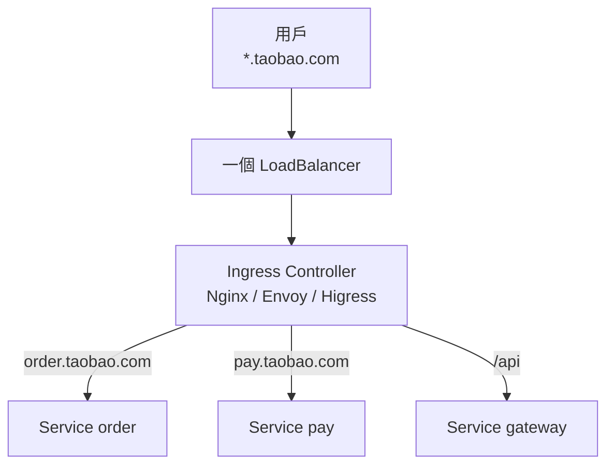

# 10.2 對外入口：Ingress 與雲原生網關

> 10.1 節每個服務一個 LoadBalancer，10 個服務 10 份錢。Ingress：一個入口，全站路由。

## 從 Nginx 到 Ingress：呼應 3.1 節

還記得 3.1 節的 Nginx 反向代理嗎？寫 `server_name`、配 `location`、reload。**Ingress** 把同一套七層路由能力搬進 K8s：用 YAML 聲明「哪個域名 + 路徑 → 哪個 Service」，由 **Ingress Controller** 真正執行轉發。



| 3.1 節 Nginx | K8s Ingress |
|-------------|-------------|
| 手寫 `nginx.conf` | 寫 Ingress YAML，Git 管理 |
| 手動 reload | Controller 自動監聽、熱載入 |
| 單機 / 少數節點 | 隨集群擴縮、高可用 |
| 限流靠插件手配 | 註解（Annotation）一鍵開啟 |

## 一個可直接 apply 的 Ingress

```yaml
# ingress.yaml
apiVersion: networking.k8s.io/v1
kind: Ingress
metadata:
  name: taobao
  annotations:
    nginx.ingress.kubernetes.io/rewrite-target: /$2
    nginx.ingress.kubernetes.io/limit-rps: "100"   # 每 IP 每秒 100 請求，呼應 5.4 節限流
spec:
  ingressClassName: nginx   # 或 higress / alb
  rules:
  - host: order.taobao.com
    http:
      paths:
      - path: /
        pathType: Prefix
        backend:
          service: { name: order, port: { number: 80 } }
  - host: pay.taobao.com
    http:
      paths:
      - path: /api(/|$)(.*)
        pathType: ImplementationSpecific
        backend:
          service: { name: pay, port: { number: 80 } }
```

```bash
# 安裝 Controller（選其一，minikube 內建）
minikube addons enable ingress
# 或 Helm 安裝 ingress-nginx
kubectl apply -f ingress.yaml
kubectl get ingress
curl -H "Host: order.taobao.com" http://<INGRESS-IP>/
```

Rewrite 註解把 `/api/user` 剝掉前綴轉給後端；`limit-rps` 直接在入口限流，正是 5.4 節「三板斧」的前置防線。

## 雲原生網關：Envoy 與 Higress

傳統 Ingress Controller 多基於 Nginx。雲原生新一代是 **Envoy**：C++ 高效能代理，xDS 動態配置，是 Istio（10.3 節）的資料面。阿里開源的 **Higress** 則把「流量網關 + 微服務網關 + 安全網關」三合一，原生對接 Nacos、Sentinel。

| 網關 | 底座 | 強項 |
|------|------|------|
| ingress-nginx | Nginx | 生態最熟，註解最豐富 |
| Envoy Gateway | Envoy | xDS 動態、高效能、Gateway API 標準 |
| Higress | Envoy + Istio | Wasm 插件、Nacos 服務發現、限流熔斷開箱即用 |

新專案建議直接學 **Gateway API**（`Gateway` + `HTTPRoute`），它是 Ingress 的官方繼任者，角色分離更清晰（平台管 Gateway，業務管 Route）。

```yaml
# httproute.yaml：Gateway API 風格
apiVersion: gateway.networking.k8s.io/v1
kind: HTTPRoute
metadata:
  name: order-route
spec:
  parentRefs: [{ name: prod-gateway }]
  hostnames: ["order.taobao.com"]
  rules:
  - matches: [{ path: { type: PathPrefix, value: /api } }]
    backendRefs: [{ name: order, port: 80 }]
```

## TLS：生產必備

```yaml
# 只需加 tls 段 + 憑證 Secret（見 10.4 節）
spec:
  tls:
  - hosts: [order.taobao.com]
    secretName: order-tls
```

配合 cert-manager 可自動申請 Let's Encrypt，免去手動續期的半夜驚魂。

## 本章小結

- Ingress 是集群的七層總入口：一個 LB + 按域名路徑路由。
- Controller 才是幹活的，Ingress YAML 只是期望聲明。
- Rewrite 與限流註解，把 3.1 節 Nginx 與 5.4 節限流雲原生化。
- Envoy / Higress 是新一代，Gateway API 是未來方向。
- 七層之下的東西向治理，交給 10.3 節 Istio。

## 想一想

1. 對比手寫 nginx.conf 與 Ingress YAML：後者在版本管理、自動化上有何優勢？
2. Rewrite 註解解決了什麼問題？沒有它，前後端路徑不一致怎麼辦？
3. 什麼時候用 Ingress，什麼時候需要升級到 Higress / Gateway API？
