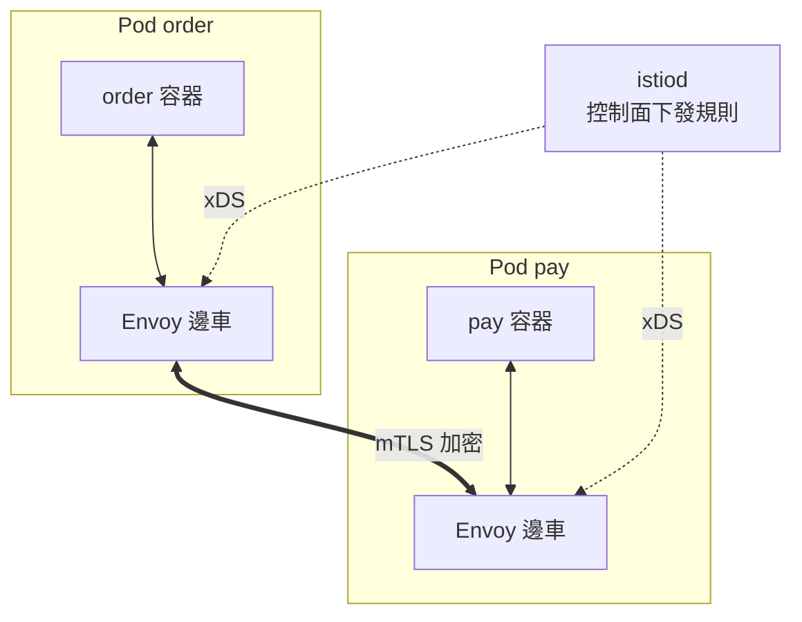

# 10.3 服務網格：Istio 無侵入治理與 mTLS

> 10.2 節管「南北流量」（進出集群），本節管「東西流量」（服務互調）。不改一行業務程式碼，加上可觀測、可控、可信的治理層。

## 邊車模式：每個 Pod 配一個保鏢

**服務網格（Service Mesh）** 的核心是邊車（Sidecar）：給每個業務 Pod 自動注入一個 Envoy 代理，所有進出流量都經它轉發。業務只管調 `http://pay:80`，治理（重試、熔斷、加密、可觀測）全由邊車完成。



```bash
# 安裝並啟用自動注入（以 istioctl 為例）
istioctl install --set profile=default -y
kubectl label namespace default istio-injection=enabled
kubectl apply -f deployment.yaml   # 重建 Pod 即帶邊車
kubectl get pods -o jsonpath='{.items[0].spec.containers[*].name}'
```

這呼應 5.4 節：以前限流熔斷要埋 Sentinel SDK，現在**零侵入**，換語言也照樣治理。

## mTLS：預設就加密

網格內服務間預設開啟 **mTLS**：身份認證 + 流量加密，防止內網竊聽與偽造。這是零信任的基礎。

```yaml
# peerauthn.yaml：整個命名空間強制 mTLS
apiVersion: security.istio.io/v1beta1
kind: PeerAuthentication
metadata:
  name: default
  namespace: default
spec:
  mtls: { mode: STRICT }
```

```bash
kubectl apply -f peerauthn.yaml
istioctl authn tls-check order-pod   # 驗證是否生效
```

## 流量治理：VirtualService + DestinationRule

```yaml
# vs-dr.yaml：金絲雀 5% + 熔斷，可直接 apply
apiVersion: networking.istio.io/v1beta1
kind: VirtualService
metadata:
  name: order
spec:
  hosts: [order]
  http:
  - match: [{ headers: { x-canary: { exact: "true" } } }]
    route: [{ destination: { host: order, subset: v2 } }]
  - route:
    - destination: { host: order, subset: v1 }
      weight: 95
    - destination: { host: order, subset: v2 }
      weight: 5
---
apiVersion: networking.istio.io/v1beta1
kind: DestinationRule
metadata:
  name: order
spec:
  host: order
  subsets:
  - name: v1
    labels: { version: v1 }
  - name: v2
    labels: { version: v2 }
  trafficPolicy:
    connectionPool: { tcp: { maxConnections: 100 }, http: { h2UpgradePolicy: DEFAULT } }
    outlierDetection:   # 熔斷：連續 5 錯就逐出 30s，呼應 5.4 節
      consecutive5xxErrors: 5
      interval: 10s
      baseEjectionTime: 30s
```

```bash
kubectl apply -f vs-dr.yaml
# 按 Header 灰度驗證
curl -H "x-canary: true" http://order/
kubectl exec deploy/order -- curl -s http://order/  # 觀察 95/5 分流
```

## 治理能力一覽

| 能力 | 傳統做法（第五章） | 網格做法 |
|------|------------------|---------|
| 負載均衡 | SDK（Ribbon） | 邊車自動完成 |
| 熔斷限流 | 埋 Sentinel | DestinationRule / 註解 |
| 灰度發布 | 人工切 Nginx | VirtualService 權重 |
| 可觀測 | 各服務打日誌 | 自動產出三金指標 + Trace（13.2 節） |
| 加密 | 手配 TLS | mTLS 預設開啟 |

代價是資源與複雜度：每個 Pod 多一個邊車（約幾十 MB + 0.1 核），小集群別硬上。

## 本章小結

- 服務網格 = 邊車代理 + 控制面，治理東西流量。
- 注入無侵入，mTLS 預設加密，零信任落地。
- VirtualService 管路由（灰度），DestinationRule 管策略（熔斷、連接池）。
- 呼應 5.4 節三板斧，但從 SDK 埋點升級為平台能力。
- 儲存與配置這類「狀態」問題，交給 10.4 節。

## 想一想

1. 邊車模式的最大優點（無侵入）與最大代價（資源/複雜度）各是什麼？小團隊該上 Istio 嗎？
2. VirtualService 與 10.2 節 Ingress 的分工有何不同？一個請求同時經過兩者時順序是？
3. mTLS STRICT 模式開啟後，未注入邊車的舊服務會發生什麼？如何平滑遷移？
