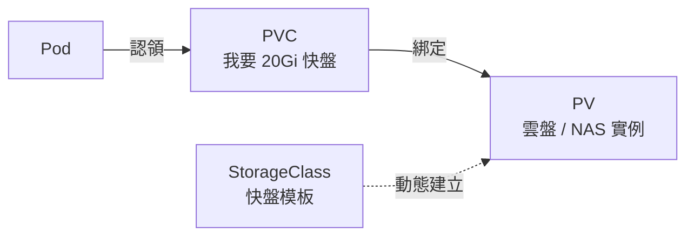

# 10.4 儲存與配置：PV / PVC / StorageClass / ConfigMap / Secret

> 容器是「無狀態的蟬」，蛻皮（重建）就失憶。本節給它「持久的殼」與「外掛的大腦」。

## 有狀態的煩惱

8.2 節的 Docker Volume 只活在單機。K8s 裡 Pod 隨時漂移到別台 Node，MySQL 資料怎麼辦？答案是三層抽象：



- **PV（PersistentVolume）**：真實儲存，集群管理員預建或動態建立。
- **PVC（PersistentVolumeClaim）**：業務的「申請單」，只說要多大、多快。
- **StorageClass**：儲存模板，定義「快盤 / 慢盤 / NAS」，實現動態供給。

## 動態供給實戰：MySQL 掛盤

```yaml
# mysql-pvc.yaml + deploy，可直接 apply
apiVersion: v1
kind: PersistentVolumeClaim
metadata:
  name: mysql-data
spec:
  accessModes: [ReadWriteOnce]
  storageClassName: alicloud-disk-essd   # ACK / EKS 各有對應，minikube 用 standard
  resources:
    requests: { storage: 20Gi }
---
apiVersion: apps/v1
kind: Deployment
metadata:
  name: mysql
spec:
  replicas: 1
  selector:
    matchLabels: { app: mysql }
  template:
    metadata:
      labels: { app: mysql }
    spec:
      containers:
      - name: mysql
        image: mysql:8.0
        env:
        - name: MYSQL_ROOT_PASSWORD
          valueFrom:
            secretKeyRef: { name: mysql-pass, key: password }
        volumeMounts:
        - name: data
          mountPath: /var/lib/mysql
      volumes:
      - name: data
        persistentVolumeClaim: { claimName: mysql-data }
```

```bash
kubectl apply -f mysql-pvc.yaml
kubectl get pvc,pv -w   # 觀察 Bound
kubectl get sc          # 看集群有哪些 StorageClass
```

Pod 重建、漂移，資料跟著雲盤走。這正是 4.x 節分庫分表後，資料庫高可用的容器化答案。

## ConfigMap：呼應 5.3 節 Zookeeper

5.3 節用 Zookeeper / Nacos 存配置，K8s 原生答案是 **ConfigMap**：非敏感 KV，掛載為檔案或環境變數，改配置不必重打映像。

```yaml
# config.yaml
apiVersion: v1
kind: ConfigMap
metadata:
  name: order-conf
data:
  application.properties: |
    db.url=jdbc:mysql://mysql:3306/taobao
    cache.ttl=300
    feature.canary=true
```

掛載方式：把 `order-conf` 作為 Volume 掛到 `/app/config`，或以環境變數注入，改配置不必重打映像。

```bash
kubectl apply -f config.yaml
kubectl get cm order-conf -o yaml
# 改配置後滾動重啟生效（原生不自動熱載，需配合 Reloader 或 Nacos）
kubectl create configmap order-conf --from-file=application.properties --dry-run=client -o yaml | kubectl apply -f -
kubectl rollout restart deployment/order
```

| Zookeeper / Nacos（5.3 節） | ConfigMap |
|---------------------------|-----------|
| 支援監聽熱更新、服務發現 | 需重啟或外掛，定位是「靜態配置」 |
| 需額外部署集群 | K8s 內建，etcd 保障 |
| 適合高頻動態開關 | 適合啟動期配置、檔案掛載 |

生產常見組合：ConfigMap 存靜態配置 + Nacos 存需熱更新的開關。

## Secret：別把密碼寫進 YAML 明文

```yaml
# secret.yaml（data 需 base64，僅防誤看不防盜）
apiVersion: v1
kind: Secret
metadata:
  name: mysql-pass
type: Opaque
data:
  password: VGFvQmFvMTIzIQ==   # echo -n 'TaoBao123!' | base64
```

```bash
kubectl apply -f secret.yaml
# 更安全：直接從字面量建立，不留明文檔
kubectl create secret generic mysql-pass --from-literal=password='TaoBao123!' --dry-run=client -o yaml | kubectl apply -f -
kubectl get secret mysql-pass -o jsonpath='{.data.password}' | base64 -d
```

生產鐵律：開 RBAC + etcd 加密 + 外部 KMS（Vault / 阿里 KMS），Git 裡只存 SealedSecret 或 ExternalSecret 引用。

## 本章小結

- PV 是實體盤，PVC 是申請單，StorageClass 是動態模板。
- 資料跟盤走，Pod 漂移不丟資料，有狀態服務才能容器化。
- ConfigMap 是 K8s 版配置中心（靜態），呼應 5.3 節 Zookeeper。
- Secret 存敏感資訊，base64 只是編碼，生產必須加密 + RBAC。
- 有了儲存與配置，下一章解決「掛了誰來救、忙了誰來擴」。

## 想一想

1. PV / PVC / StorageClass 三者各解決什麼問題？為什麼不讓 Pod 直接掛雲盤？
2. ConfigMap 與 Zookeeper / Nacos 各適合什麼配置？熱更新場景該選誰？
3. Secret 的 base64 能防誰、不能防誰？生產環境還需要哪三道防線？
