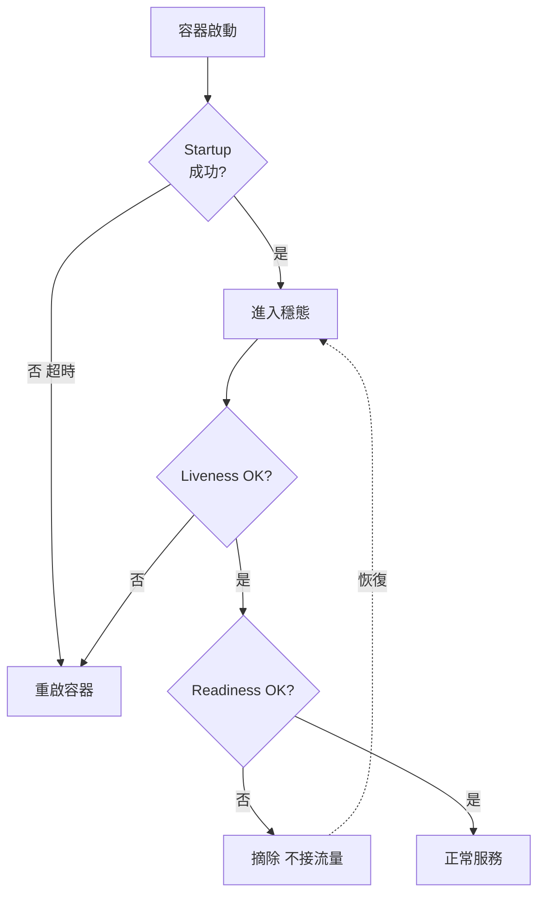
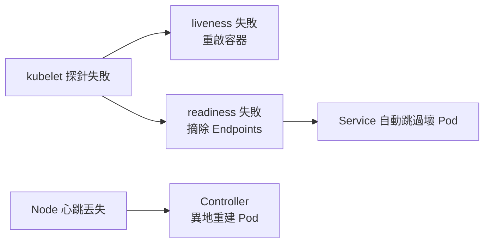

# 11.1 自癒：Liveness 與 Readiness 探針

> 機器會壞、程式會僵死。自癒不是「祈禱不掛」，而是「掛了自動有人收屍並補上」。

## 三種探針，分工明確

| 探針 | 問題 | 失敗動作 | 比喻 |
|------|------|---------|------|
| **Liveness** | 還活著嗎？ | 重啟容器 | 心跳停了叫救護車 |
| **Readiness** | 能接客嗎？ | 從 Service 摘除 | 廚師還沒備菜，先別接單 |
| **Startup** | 啟動完了嗎？ | 啟動期內不判 liveness 死刑 | 給慢啟動應用的寬限期 |

三者缺一不可：沒 liveness，死鎖容器永遠佔位；沒 readiness，9.4 節滾動更新會把流量導入未就緒 Pod；沒 startup，Java 大應用啟動慢會被誤殺。



## 可直接 apply 的完整範例

```yaml
# probe.yaml
apiVersion: apps/v1
kind: Deployment
metadata:
  name: order
spec:
  replicas: 3
  selector:
    matchLabels: { app: order }
  template:
    metadata:
      labels: { app: order }
    spec:
      containers:
      - name: order
        image: taobao/order:v2
        ports: [{ containerPort: 8080 }]
        startupProbe:    # 啟動慢的 Java 應用，給足 2 分鐘
          httpGet: { path: /health, port: 8080 }
          failureThreshold: 24
          periodSeconds: 5
        livenessProbe:   # 死鎖就重啟
          httpGet: { path: /health, port: 8080 }
          initialDelaySeconds: 10
          periodSeconds: 10
          failureThreshold: 3
          timeoutSeconds: 2
        readinessProbe:  # 依賴（DB/Redis）沒好就別接流量
          httpGet: { path: /ready, port: 8080 }
          periodSeconds: 5
          failureThreshold: 2
          successThreshold: 1
```

```bash
kubectl apply -f probe.yaml
kubectl describe pod <pod> | grep -A 8 Liveness
kubectl get events --sort-by=.lastTimestamp | grep -i probe
# 模擬故障：進入容器殺主進程或讓 /ready 返回 500，觀察摘除與重啟
```

探針三種手法：`httpGet`（Web 服務首選）、`tcpSocket`（資料庫類）、`exec`（執行腳本判活）。

## 自癒完整鏈路



注意分工：kubelet 管單 Pod 生死，Controller 管跨 Node 補位（呼應 9.2 節），9.4 節的滾動更新靠 readiness 保證不斷服。

## 調參血淚談

- `initialDelaySeconds` 別拍腦袋：太小誤殺，太大帶病上崗，配合 startupProbe 更穩。
- `/health` 與 `/ready` 要分開：活著 ≠ 可服務（如下游 DB 斷了，活但不接單）。
- 探針本身要輕：探針接口查全表，等於每 5 秒一次小 DDoS。

## 本章小結

- Liveness 管重啟，Readiness 管摘除，Startup 管寬限期。
- 健康與就緒必須分開檢查，對應不同的失敗動作。
- kubelet + Controller 兩級自癒，構成 K8s 的「免疫系統」。
- 調參核心：給足啟動寬限、探針輕量、閾值留餘地。
- 活下來之後，下一步是「忙時自動加人」：HPA。

## 想一想

1. Liveness 與 Readiness 失敗後的動作有何不同？為什麼不能合併成一種探針？
2. 沒有 Startup 探針時，啟動慢的 Java 應用會遭遇什麼？畫出誤殺時序。
3. readiness 接口依賴下游 DB：如果 DB 掛了，該讓 readiness 失敗嗎？為什麼？
