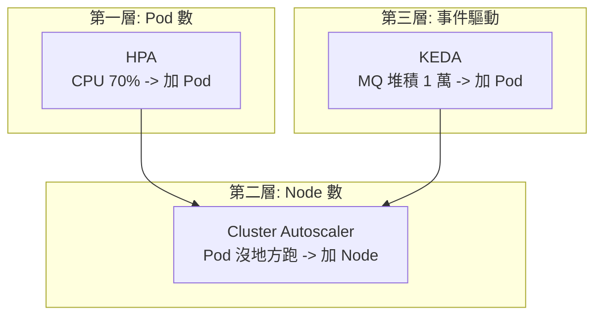

# 11.2 應對大促：HPA / Cluster Autoscaler / KEDA

> 雙十一零點流量 10 倍，提前買 10 倍機器？FinOps 會哭。彈性擴縮：忙時加人、閒時下班。

## 三層彈性，各管一層



| 擴縮器 | 看什麼訊號 | 管什麼 | 呼應 |
|--------|-----------|--------|------|
| **HPA** | CPU / 記憶體 / 自訂指標 | Deployment 副本數 | 雙十一訂單服務主力 |
| **Cluster Autoscaler** | 有 Pod Pending（沒 Node 可调度） | Node 數量 | 雲上按量付費 ECS |
| **KEDA** | MQ 堆積、Cron、Kafka lag | 任意 workload，甚至可縮到 0 | 6.2 節削峰場景 |

## HPA 實戰：雙十一訂單服務

```yaml
# hpa.yaml：CPU 60% 就擴，2~20 個副本，可直接 apply
apiVersion: autoscaling/v2
kind: HorizontalPodAutoscaler
metadata:
  name: order
spec:
  scaleTargetRef:
    apiVersion: apps/v1
    kind: Deployment
    name: order
  minReplicas: 2
  maxReplicas: 20
  behavior:   # 大促關鍵：快速擴、慢速縮，防止抖動
    scaleUp:
      stabilizationWindowSeconds: 0
      policies: [{ type: Percent, value: 100, periodSeconds: 15 }]
    scaleDown:
      stabilizationWindowSeconds: 300
      policies: [{ type: Percent, value: 10, periodSeconds: 60 }]
  metrics:
  - type: Resource
    resource:
      name: cpu
      target: { type: Utilization, averageUtilization: 60 }
```

```bash
# 前置：集群需裝 metrics-server，Pod 必須設 resources.requests（見 11.3 節）
kubectl apply -f deployment.yaml -f hpa.yaml
kubectl get hpa -w
# 壓測驗證
kubectl run load --image=busybox:1.36 -- /bin/sh -c "while true; do wget -q -O- http://order/; done"
kubectl get hpa,deploy -w
```

雙十一劇本：0 點前預熱到 10 副本（`kubectl scale`）→ HPA 按 CPU 自動衝到 20 → 凌晨 2 點緩慢縮回，中間 Node 不夠時 Cluster Autoscaler 自動加 ECS。

## KEDA：按 MQ 堆積擴縮

HPA 看 CPU 不夠：秒殺場景 CPU 還沒漲，MQ 已堆積 10 萬。KEDA 直連 RocketMQ / Kafka lag：

```yaml
# keda-so.yaml（需先裝 KEDA，SOURCE 略）
apiVersion: keda.sh/v1alpha1
kind: ScaledObject
metadata:
  name: order-consumer
spec:
  scaleTargetRef: { name: order-consumer }
  minReplicaCount: 1
  maxReplicaCount: 30
  triggers:
  - type: rocketmq
    metadata:
      nameServerAddress: "rocketmq:9876"
      topic: order-pay
      consumerGroup: order-group
      lagThreshold: "1000"   # 堆積超 1000 就加消費者
```

這正是 6.2 節「MQ 削峰」的編排版：堆積即擴，清空即縮，甚至夜間縮到 0 省錢。

## 大促 checklist

- HPA 的 `requests` 必須準（11.3 節），否則 CPU 利用率失真。
- 壓測決定 `maxReplicas`：別讓 HPA 衝爆下游 DB（4.x 節的拆分極限）。
- 配合 9.4 節 `maxSurge` 與 PDB（PodDisruptionBudget），保證縮容不斷服。

## 本章小結

- HPA 管 Pod 數，CA 管 Node 數，KEDA 管事件驅動，三層互補。
- 大促策略：快速擴、慢速縮，提前預熱 + 上限封頂。
- HPA 依賴 metrics-server 與 requests 配額，KEDA 適合 MQ 堆積場景。
- 彈性不是無限：下游 DB 與成本（FinOps）是天花板。
- 有了彈性，還要管住資源：下一節 Requests / Limits。

## 想一想

1. 為什麼 scaleUp 要快、scaleDown 要慢？快速縮容會引發什麼抖動？
2. HPA 看 CPU、KEDA 看 MQ 堆積，各適合什麼業務？秒殺下單該用哪個？
3. 如果 Pod 沒設 resources.requests，HPA 會發生什麼？為什麼？
