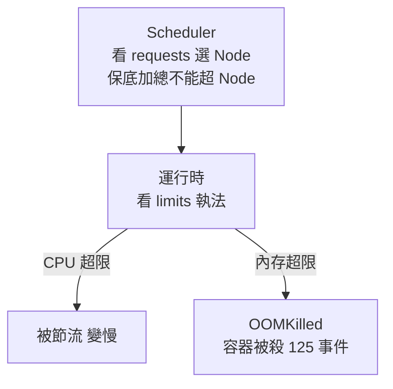

# 11.3 資源治理：Requests & Limits 與 OOM 防護

> 沒配額的集群像合租不立規矩：有人開礦機，全屋跳閘。Requests 是「保底」，Limits 是「天花板」。

## 兩個數字，兩種語義

```yaml
resources:
  requests:
    cpu: "500m"      # 保底 0.5 核：調度保證，HPA 算利用率的分母
    memory: "512Mi"  # 保底 512M
  limits:
    cpu: "2000m"     # 上限 2 核：超了被節流（throttle）
    memory: "1Gi"    # 上限 1G：超了直接 OOMKilled
```



```bash
kubectl apply -f deployment.yaml
kubectl describe node | grep -A 5 Allocated   # 看保底分配率
kubectl top pods   # 需 metrics-server，對比實際用量
```

經驗法則：`requests` = 壓測 P50 用量，`limits` = P99 × 1.2。Java 應用務必讓 `-Xmx` 小於 memory limit，否則必被誤殺。

## QoS 三等級：驅逐時的救生艇順序

K8s 按配額把 Pod 分三等，Node 資源耗盡時按序驅逐：

| QoS | 條件 | 驅逐順序 | 適用 |
|-----|------|---------|------|
| **Guaranteed** | requests == limits（每個容器） | 最後 | 支付、訂單核心鏈路 |
| **Burstable** | 設了至少一項（常見） | 中間 | 普通微服務 |
| **BestEffort** | 什麼都沒設 | 最先被殺 | 測試、批處理 |

```bash
kubectl get pods -o jsonpath='{range .items[*]}{.metadata.name} {.status.qosClass}{"\n"}{end}'
```

血淚教訓：大促前把核心鏈路設 Guaranteed，邊緣任務設 BestEffort，資源爭搶時死的先是次要的。

```yaml
# guaranteed.yaml：支付核心鏈路，requests == limits
apiVersion: apps/v1
kind: Deployment
metadata:
  name: pay
spec:
  replicas: 3
  selector:
    matchLabels: { app: pay }
  template:
    metadata:
      labels: { app: pay }
    spec:
      containers:
      - name: pay
        image: taobao/pay:v2
        resources:
          requests: { cpu: "1000m", memory: "1Gi" }
          limits: { cpu: "1000m", memory: "1Gi" }   # 相等即 Guaranteed
```

```bash
kubectl apply -f guaranteed.yaml
kubectl get pods -o jsonpath='{range .items[*]}{.metadata.name} {.status.qosClass}{"\n"}{end}'
# 壓測對比：Guaranteed 的 pay 與 BestEffort 的 batch，Node 壓力下誰先被驅逐
kubectl top pods --sort-by=memory
```

## OOM 與驅逐：兩種死法

- **OOMKilled（容器級）**：單容器超 memory limit，kubelet 直接殺，`kubectl describe pod` 見 `Reason: OOMKilled`。
- **Eviction（節點級）**：Node 記憶體/磁碟耗盡，kubelet 按 QoS 趕 Pod 下車，`kubectl get events` 見 `Evicted`。

```bash
# 排查三連
kubectl describe pod <pod> | grep -i -A 3 oom
kubectl get events --sort-by=.lastTimestamp | grep -i -E "evict|oom|kill"
kubectl top node   # Node 是否被打爆
```

防護組合拳：合理 limits + HPA（11.2 節）+ PDB + 監控告警（13.2 節）。FinOps 視角：requests 虛高 = 花冤枉錢買閒置，要定期用 VPA / 金絲雀壓測校準。

## 與前篇呼應

- 1.3 節單機 CPU/內存競爭，容器時代重演：只是戰場從進程變成 Pod。
- 6.4 節「在我機器上能跑」：缺的就是這組配額聲明，上生產直接打架。

## 本章小結

- requests 保調度與 HPA 分母，limits 保上限執法。
- CPU 超限被節流，內存超限被殺，兩者行為完全不同。
- QoS 三等決定驅逐順序，核心鏈路用 Guaranteed。
- OOM 是容器死，Eviction 是節點趕人，排查路徑不同。
- 配額是彈性與成本的基石，下一節解決「 Pod 該住哪、集群怎麼跨機房」。

## 想一想

1. CPU 與內存超限的後果有何不同？為什麼 CPU 可壓縮、內存不可壓縮？
2. 什麼樣的 Pod 會被分到 BestEffort？它在資源緊張時命運如何？
3. requests 設得過大或過小，各有什麼代價？（提示：調度、HPA、FinOps）
