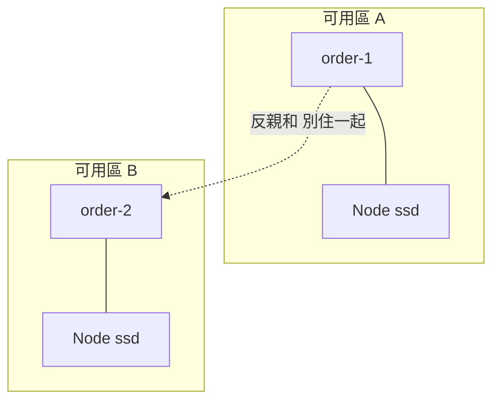
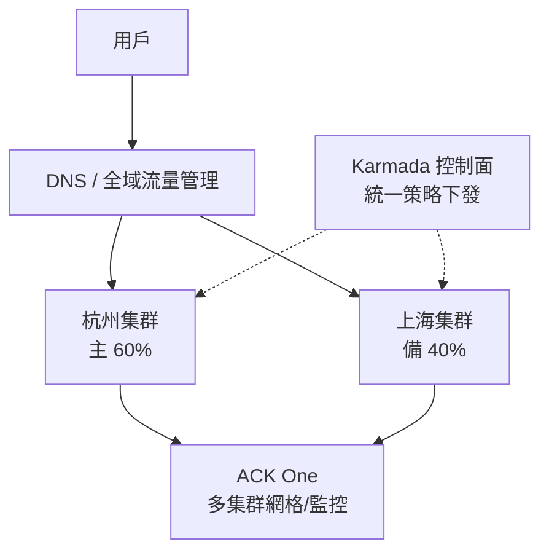

# 11.4 多機房多集群：Affinity / Taints / Tolerations / Karmada

> 把所有 Pod 堆在同一個機架 = 把雞蛋放在同一個籃子裡。3.4 節的異地多活，在 K8s 裡要有編排級的表達。

## 讓 Pod 住對地方：Affinity

**親和性（Affinity）**：告訴 Scheduler「想跟誰住一起 / 分開」。

```yaml
# affinity.yaml 片段：訂單 Pod 強制打散到不同 Node + 儘量靠近 Redis
affinity:
  podAntiAffinity:
    requiredDuringSchedulingIgnoredDuringExecution:
    - labelSelector: { matchLabels: { app: order } }
      topologyKey: kubernetes.io/hostname   # 同 app 不住同台 Node
  nodeAffinity:
    preferredDuringSchedulingIgnoredDuringExecution:
    - weight: 80
      preference:
        matchExpressions:
        - { key: disktype, operator: In, values: [ssd] }
```



`required` 是硬性（住不到就 Pending），`preferred` 是盡量，生產多用後者保彈性。

## 讓 Node 拒絕閒雜 Pod：Taints / Tolerations

**污點（Taints）** 是 Node 的「謝絕牌」，**容忍（Tolerations）** 是 Pod 的「通行證」。經典場景：GPU 節點只給 AI 任務、支付專用節點隔離。

```bash
# 給 GPU 節點打污點
kubectl taint nodes gpu-1 nvidia.com/gpu=:NoSchedule
# 給支付節點打污點
kubectl taint nodes pay-node workload=pay:NoExecute
```

```yaml
# 只有帶容忍的 Pod 能住上去
tolerations:
- key: nvidia.com/gpu
  operator: Exists
  effect: NoSchedule
- key: workload
  operator: Equal
  value: pay
  effect: NoExecute
  tolerationSeconds: 3600
```

| Effect | 語義 |
|--------|------|
| NoSchedule | 新 Pod 沒通行證不許來 |
| PreferNoSchedule | 盡量別來 |
| NoExecute | 已在上面的沒通行證也趕走 |

```bash
kubectl describe node gpu-1 | grep Taints
kubectl get pods -o wide | grep gpu-1   # 驗證隔離生效
```

## 多集群：Karmada 與 ACK One

單集群再強也怕機房級故障。3.4 節 DNS + CDN 是流量層多活，**Karmada / ACK One** 是編排層多活：一套策略，多個集群統一調度。



```yaml
# karmada-propagation.yaml：訂單 Deployment 同時下發兩集群
apiVersion: policy.karmada.io/v1alpha1
kind: PropagationPolicy
metadata:
  name: order-policy
spec:
  resourceSelectors:
  - apiVersion: apps/v1
    kind: Deployment
    name: order
  placement:
    clusterAffinity:
      clusterNames: [hangzhou, shanghai]
    replicaScheduling:
      replicaDivisionPreference: Weighted
      replicaDivision:
      - weight: 6
        clusterAffinity: { clusterNames: [hangzhou] }
      - weight: 4
        clusterAffinity: { clusterNames: [shanghai] }
```

```bash
# ACK One 側：註冊多集群，一處看全域
kubectl --cluster hangzhou get deploy order
kubectl --cluster shanghai get deploy order
```

這正是全書閉環：1.x 單機 → 3.4 異地多活 → K8s 多集群，能力從「人工切流量」升級為「策略即程式碼」。

## 本章小結

- Affinity 管「想住哪」：親和靠攏、反親和打散，保可用性。
- Taints / Tolerations 管「誰不許來」：GPU、支付隔離的標準手段。
- 單集群高可用靠打散，多機房高可用靠多集群。
- Karmada 做策略分發，ACK One 做雲上託管多集群，兩者互補。
- 第五篇到此收束：下一站是 Serverless 與 FinOps 的成本與效率之辯。

## 想一想

1. required 與 preferred 親和各有什麼風險？硬性打散在小集群會引發什麼問題？
2. NoSchedule 與 NoExecute 的差別是什麼？什麼場景必須用 NoExecute？
3. 對比 3.4 節的 DNS 多活與本節 Karmada 多活：兩者分別解決哪一層的問題？缺一會怎樣？
