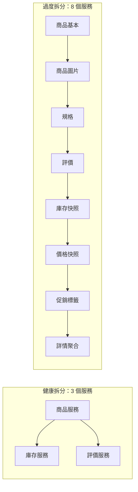

# 12.1 微服務過度拆分的技術債

## 從「拆」到「拆過頭」：淘寶式演進的反面教材

第五篇我們把大單體拆成微服務，解決了部署耦合與擴展難題。但當團隊把「拆」當成唯一的正確答案，就會走向另一個極端：**過度拆分（Over-decomposition）**。

想像教學模型中的淘寶：商品服務被拆成「商品基本資訊、商品圖片、商品規格、商品評價、商品庫存快照」五個服務，只為了讓每個小組都有自己的服務。結果一次商品詳情頁請求，要跨 5 次 RPC，任何一個抖動都讓整頁失敗。

> 過度拆分不是架構問題，而是組織問題：**康威定律被誤用**——為了讓組織圖好看而拆服務。



## 四種典型的拆分技術債

**1. 網路呼叫取代函數呼叫**：本機方法呼叫是奈秒級，RPC 是毫秒級，還附帶序列化、超時、重試成本。拆得越碎，P99 延遲越高。

**2. 分散式事務蔓延**：原本一個本地事務能保證的「扣庫存 + 建訂單」，拆開後要引入 Saga、TCC、最終一致性補償，複雜度指數上升（見 4.4 節）。

**3. 版本地獄與契約漂移**：N 個服務就有 N×(N-1) 條潛在依賴邊。A 改一個欄位，B、C、D 跟著改，還要向前相容三個版本。

**4. 測試與除錯成本爆炸**：單體時代一個整合測試能覆蓋主流程；過度拆分後要搭整套環境才能重現一個 Bug，Trace 滿天飛。

| 症狀 | 健康微服務 | 過度拆分 |
|------|-----------|---------|
| 服務數量 | 10~30 個核心服務 | 上百個奈米服務 |
| 一次請求跨服務數 | 2~4 跳 | 8 跳以上 |
| 本地事務比例 | 主流程仍是本地事務 | 主流程全是 Saga 補償 |
| 發布是否獨立 | 真獨立發布 | 改一處要聯調五處 |
| 團隊感受 | 邊界清晰 | 「改個欄位要開三個會」 |

## 如何量化：拆分是否過度

用三個指標自我檢查：

```bash
# 1. 請求扇出（Fan-out）：一次前端請求觸發的下游 RPC 數
kubectl logs deploy/product-page -n prod | grep -c "downstream-call" 

# 2. P99 延遲中網路佔比（透過 Trace 分析）
# 若序列化 + 網路等待 > 總延遲 60%，多半拆太碎

# 3. 跨服務事務比例
# 主鏈路若超過 3 個參與者的 Saga，就該考慮合併
```

經驗法則：**一個服務應該對應一個限界上下文（Bounded Context），而不是一張資料表，更不是一個函數**。若兩個服務「總是一起改、一起發布」，它們就是同一個服務。

## 償還技術債的三條路

- **合併回來**：把高內聚的奈米服務合併成模組化單體（見 12.2 節）。
- **下沉為函數**：低頻、事件觸發的碎片邏輯改走 FaaS（見 12.3、12.4 節）。
- **用非同步解耦**：讀多寫少的聚合關係改走事件/CQRS，減少同步 RPC 鏈（見 6.2 節 RocketMQ 模式）。

```yaml
# 反模式：商品詳情頁同步扇出 6 個下游
# 重構方向：只同步調商品+價格，其餘走事件物化視圖
apiVersion: v1
kind: ConfigMap
metadata:
  name: detail-page-policy
data:
  sync-calls: "product,price"      # 同步只留 2 跳
  async-materialized: "review,stock-snapshot,promo-tag"  # 其餘事件驅動
```

## 本章小結

- **過度拆分是拿分散式複雜度換組織便利**，代價是延遲、事務、版本、測試四重技術債
- 判斷標準：扇出跳數、P99 網路佔比、跨服務事務比例、「是否總是一起發布」
- 一個服務 = 一個限界上下文，不是資料表也不是函數
- 償還路徑：合併（12.2）、Serverless 化（12.3/12.4）、非同步解耦

## 想一想

1. 為什麼「一次請求跨 8 個服務」會讓 P99 延遲惡化？網路、序列化、重試分別扮演什麼角色？
2. 「總是一起改、一起發布的兩個服務應該合併」——這個判準背後的內聚性原理是什麼？
3. 以你做過的專案為例，找出一個「拆太碎」的候選，並說明你會用合併、FaaS 化、非同步化中的哪條路償還，為什麼？
