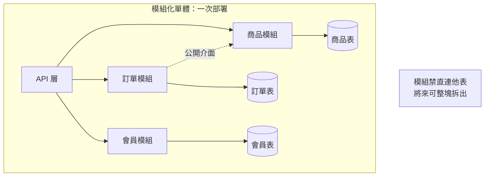
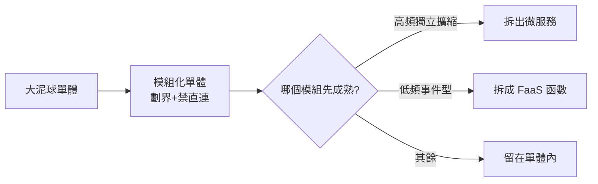

# 12.2 模組化單體的復興：幾時該拆、幾時該合

## 單體回來了，但不是以前的單體

2024–2026 年，業界出現一波「單體回歸」：Amazon Prime Video 把微服務合併回單體省下 90% 成本的故事廣為流傳，Kelsey Hightower 等人也直言「多數公司不需要微服務」。但回歸的不是當年那團泥球，而是**模組化單體（Modular Monolith）**。

**模組化單體 = 一次部署的單體 + 微服務級的模組邊界**：模組之間只能走公開介面、不能直連資料庫、各自獨立演進，保留將來拆出的選項。



## 拆合準則：一張決策表

| 维度 | 傾向合（模組化單體） | 傾向拆（微服務） |
|------|---------------------|-----------------|
| 團隊規模 | < 15 人、1~2 隊 | 多隊並行、需獨立發布 |
| 流量特徵 | 各模組流量同漲同跌 | 某模組需獨立擴縮 10 倍 |
| 事務需求 | 主流程強一致、本地事務 | 可接受最終一致、Saga |
| 技術異構 | 同一語言/框架即可 | 需多語言、多儲存 |
| 故障隔離 | 可接受整體重啟 | 需局部降級、熔斷隔離 |
| 運維能力 | 無專職 SRE | 有成熟 DevOps/SRE |

**口訣**：先合後拆、合而有界。**預設從模組化單體開始**，直到某個模組同時滿足「獨立擴縮 + 獨立發布 + 邊界清晰」才拆。

## 模組邊界的三條紀律

1. **模組只能調公開介面**：禁止跨模組 import 內部類、禁止直連他人資料表。
2. **模組有自己的測試邊界**：每個模組可獨立單元測試 + 契約測試。
3. **模組可整塊搬遷**：打包方式讓某天能把模組原封不動搬成獨立服務或 Function。

以 Spring Modulith（Java 技術棧）為例：

```bash
# Spring Modulith 驗證模組邊界：違規引用直接失敗
./mvnw test -Dtest=ModularityTests

# 輸出範例：order 模組偷用了 product 內部類 -> 構建失敗
# Violation: order -> product.internal.ProductEntity
```

```yaml
# 部署仍是單一 Deployment：運維成本與單體相同
apiVersion: apps/v1
kind: Deployment
metadata:
  name: modular-shop
spec:
  replicas: 3
  template:
    spec:
      containers:
      - name: app
        image: shop:modular-2.4.0
        ports:
        - containerPort: 8080
```

## 演進路線：合 → 模組化 → 按需拆



實務上，淘寶教學模型裡的「評價」「優惠券過期提醒」這類低頻模組，2025 年後多半直接走向 Serverless（見 12.4 節），而不是拆成常駐微服務。

## 本章小結

- **模組化單體 = 單體的運維成本 + 微服務的邊界紀律**，是預設起點
- 拆合準則看六維：團隊、流量、事務、異構、隔離、運維
- 三條紀律：公開介面、測試邊界、可搬遷；用工具（如 Modulith 測試）強制執行
- 演進方向：合 → 模組化 → 按需拆成微服務或 FaaS

## 想一想

1. 「先合後拆」為什麼比「先拆後合」便宜？從重構成本與風險角度分析。
2. 模組化單體的「禁直連他人資料表」紀律，是為了解決什麼未來問題？
3. 假設你的訂單模組流量是其他模組的 20 倍且需獨立發布，你會拆嗎？對照六維準則逐項說明。
