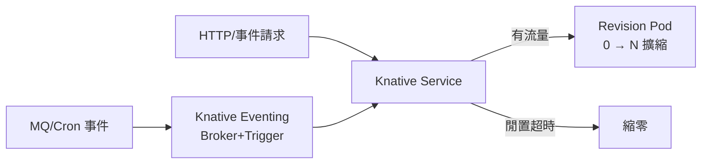

# 12.3 全面 Serverless 化：Knative 與冷啟動優化

## 為什麼 Serverless 是微服務反思的答案之一

12.1 的奈米服務若改成常駐 Deployment，既浪費（低頻卻佔 Pod）又難管；12.2 說低頻模組可拆成函數——這正是 **Serverless / FaaS** 的位置：**有請求才有實例，閒置縮零，按調用付費**。

Kubernetes 世界的標準答案是 **Knative**：Serving（流量、縮零、版本）+ Eventing（事件驅動），讓「從微服務到 FaaS」不必換平台。



## Knative 核心：一個 Service 走天下

```yaml
# 一個 Knative Service = Deployment + HPA + KPA + Ingress
apiVersion: serving.knative.dev/v1
kind: Service
metadata:
  name: coupon-expire
  namespace: prod
spec:
  template:
    metadata:
      annotations:
        autoscaling.knative.dev/minScale: "0"      # 閒置縮零
        autoscaling.knative.dev/maxScale: "20"
        autoscaling.knative.dev/target: "50"       # 每 Pod 併發目標
    spec:
      containers:
      - image: registry/shop/coupon-expire:v1.9
        ports:
        - containerPort: 8080
        resources:
          requests: {cpu: "100m", memory: "128Mi"}
          limits: {cpu: "500m", memory: "256Mi"}
  traffic:
  - percent: 90
    revisionName: coupon-expire-00009
  - percent: 10                                    # 金絲雀 10%
    revisionName: coupon-expire-00010
```

```bash
# 常用操作：部署後看版本與流量
kn service list -n prod
kn revision list -n prod
kubectl get ksvc coupon-expire -n prod -o yaml | grep -A5 traffic
```

## 冷啟動：Serverless 的頭號敵人

**冷啟動（Cold Start）** = 從零擴出實例的首次請求延遲：拉鏡像 → 建容器 → 啟動運行時 → 載入業務 → 建連線池。Java Spring 動輒 5~10 秒，Node/Python 常在 1 秒內。

| 優化手段 | 原理 | 效果 | 代價 |
|---------|------|------|------|
| 保留最小實例 | minScale=1，永不全縮零 | 核心鏈路零冷啟動 | 付 1 份常駐錢 |
| 預留/預熱 | 定時觸發、預熱探針 | 毛刺前先熱好 | 需預測流量 |
| 精簡運行時 | GraalVM Native、Node 精簡鏡像 | 啟動 10s→100ms 級 | 構建複雜、反射受限 |
| 鏡像加速 | P2P 分發、懶加載（Nydus/esh） | 拉鏡像 30s→3s | 需集群支援 |
| 連線複用 | 全域連線池、RDS Proxy | 省去建連 200ms+ | 程式要配合 |
| 分層編譯/快照 | CRIU 快照、SnapStart | 恢復即運行 | 僅特定語言/平台 |

```yaml
# 核心鏈路：保留 1 個暖實例；邊緣鏈路：允許縮零
apiVersion: serving.knative.dev/v1
kind: Service
metadata:
  name: order-create
spec:
  template:
    metadata:
      annotations:
        autoscaling.knative.dev/minScale: "1"   # 核心鏈路不縮零
        autoscaling.knative.dev/activationScale: "2"
    spec:
      containers:
      - image: registry/shop/order-create:v3.2
        readinessProbe:                 # 暖身完成才接流量
          httpGet: {path: /warmup, port: 8080}
          periodSeconds: 5
```

## 2025–2026 新變數：FunctionAI 與按需 GPU

2025 年阿里雲推出 **FunctionAI**（見 15.3 節）：把 Knative 經驗延伸到 AI 推理與 Agent 長時運行——支援會話親和、GPU 按需掛載，冷啟動優化從「Java 啟動」延伸到「模型載入」。思路相通：**分層預熱（先起容器、再掛模型）+ 共享快取**。

## 本章小結

- Knative Service 一個 YAML 統一部署、擴縮、流量、金絲雀，是 K8s 上 FaaS 標準
- 冷啟動鏈條：拉鏡像→建容器→啟運行時→載入業務→建連線，逐段優化
- 核心鏈路用 minScale 保暖，非核心放心縮零；優化手段各有代價，對照選型
- 2025 後冷啟動戰場延伸到模型載入（FunctionAI 模式）

## 想一想

1. 為什麼 Java 比 Node 更怕冷啟動？從 JVM 啟動與類加載角度解釋。
2. minScale=1 與 minScale=0 的取捨是什麼？什麼鏈路值得付這份「保暖費」？
3. 若你的函數瓶頸是「拉鏡像 30 秒」，你會先試鏡像加速、精簡鏡像中的哪一個？為什麼？
