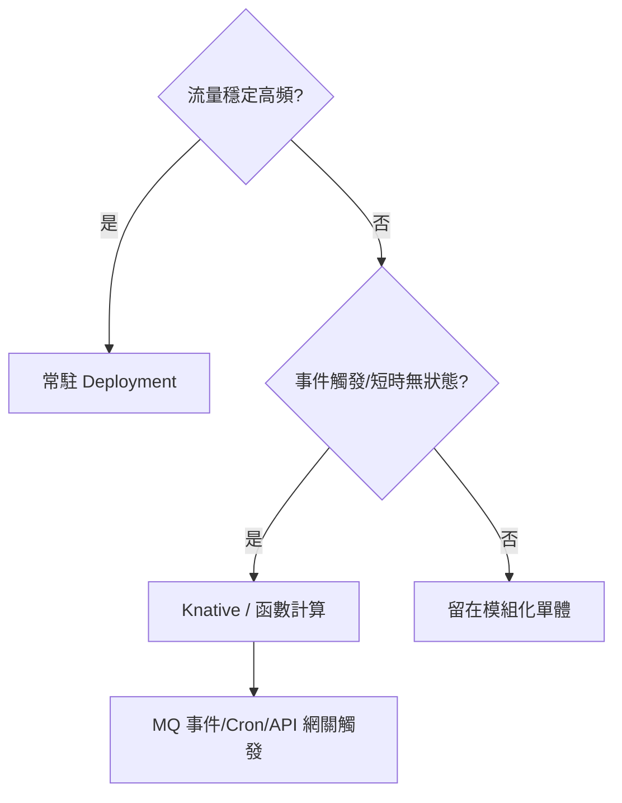
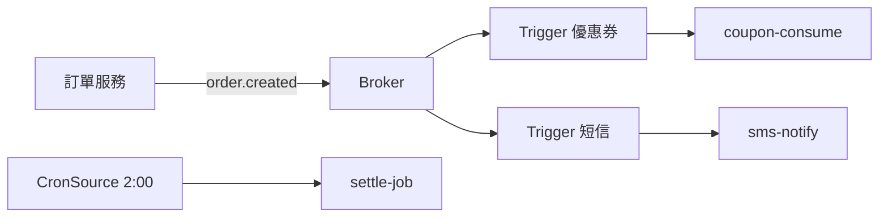

# 12.4 從微服務到 FaaS：前端與業務平台實踐

## 哪些該上 FaaS：三個判斷句

不是所有微服務都值得變成函數。實戰判準只有三句：

1. **流量抖得厲害**（大促尖峰 vs 深夜閒置差 10 倍以上）→ 彈性值錢。
2. **事件觸發**（訂單建立、圖片上傳、定時結算）→ 不必常駐等請求。
3. **無狀態且短時**（秒級完成、狀態放外部）→ 縮零無負擔。

反之：高頻穩定流量、長連線、有狀態會話，留在 Deployment/StatefulSet 更划算。



## 實踐一：BFF 與前端 SSR 上 Serverless

淘寶系前端（Node.js 技術棧，見 16.4 節）最早 Serverless 化的是 **BFF 層**：頁面聚合、SSR 渲染潮汐特徵明顯，大促前 1 小時流量漲 10 倍，閒時幾乎為零。

| 層 | 常駐 | FaaS 化後 |
|----|------|----------|
| BFF 聚合（Node） | 常駐 50 Pod 扛尖峰 | 0→200 彈性，閒時縮零 |
| SSR 渲染 | 與 Web 同擴縮 | 獨立按頁面熱度擴縮 |
| 圖片裁剪/轉碼 | 佔用 Web 資源 | 事件觸發，非同步回填 |

```yaml
# BFF 聚合函數：HTTP 觸發 + 併發目標調優（Node 單進程高併發）
apiVersion: serving.knative.dev/v1
kind: Service
metadata:
  name: bff-detail
spec:
  template:
    metadata:
      annotations:
        autoscaling.knative.dev/target: "200"   # Node 承載高併發
        autoscaling.knative.dev/maxScale: "200"
    spec:
      containers:
      - image: registry/shop/bff-detail:node20-v5
        env:
        - name: DOWNSTREAM_TIMEOUT_MS
          value: "800"
```

## 實踐二：業務平台——事件驅動的標準接法

訂單、優惠券、通知這類平台邏輯，標準接法是 **MQ → Knative Eventing → 函數**：

```bash
# 事件鏈：訂單建立 -> 觸發優惠券核銷 + 短信通知兩個函數
kn broker create order-broker -n prod
kn trigger create coupon-consume --broker order-broker \
  --filter type=order.created --sink ksvc/coupon-consume -n prod
kn trigger create sms-notify --broker order-broker \
  --filter type=order.created --sink ksvc/sms-notify -n prod

# 定時結算：Cron 觸發每日對賬函數
kn source cron create daily-settle --schedule "0 2 * * *" \
  --data '{"job":"settle"}' --sink ksvc/settle-job -n prod
```



## 成本對比：什麼時候 FaaS 真省錢

| 場景 | 常駐成本 | FaaS 成本 | 結論 |
|------|---------|----------|------|
| 穩定 70% 利用率 | 10 Pod 常駐 | 按次計費反而貴 20% | 留常駐 |
| 尖峰 10 倍、閒時 5% | 按尖峰備 100 Pod | 閒時近零 | FaaS 省 60%+ |
| 每天跑 1 次結算 | 1 Pod 空轉 23h | 每天跑 5 分鐘 | FaaS 省 90%+ |

**教訓**：FaaS 省的是「閒置」，不是「計算」。先看利用率曲線再搬。

## 本章小結

- 上 FaaS 三判準：抖動大、事件觸發、無狀態短時；反之留常駐
- 前端 BFF/SSR 是最經典的 FaaS 場景（潮汐流量 + Node 高併發）
- 業務平台標準接法：MQ/Cron → Eventing Broker/Trigger → 函數
- 成本公式：FaaS 省閒置不省計算，先看利用率曲線

## 想一想

1. 為什麼 BFF 層比核心交易鏈路更適合先 FaaS 化？
2. 你的「每天跑一次的結算任務」若用常駐 Pod，浪費比例是多少？算一算。
3. 事件驅動（Broker+Trigger）相比同步 RPC 調函數，有什麼解耦好處與除錯代價？
