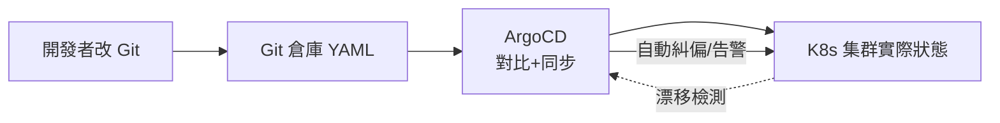

# 13.1 GitOps 持續部署：ArgoCD 實戰

## GitOps 一句話：Git 是唯一的真理來源

傳統 kubectl apply 是「人說了算」：誰敲了什麼命令，集群就變成什麼樣，事後無從審計。**GitOps** 反過來：**Git 倉庫裡的 YAML 就是期望狀態，ArgoCD 負責讓集群持續對齊它**。人只改 Git，不直連集群。



## ArgoCD 實戰：從安裝到 Application

```bash
# 1. 安裝 ArgoCD（生產請用 HA 版 + 獨立 namespace）
kubectl create namespace argocd
kubectl apply -n argocd -f https://raw.githubusercontent.com/argoproj/argo-cd/stable/manifests/install.yaml

# 2. 取初始密碼並登入
kubectl -n argocd get secret argocd-initial-admin-secret -o jsonpath="{.data.password}" | base64 -d
kubectl port-forward svc/argocd-server -n argocd 8080:443
```

```yaml
# 3. Application：聲明「哪個 Git 路徑 -> 哪個集群 namespace」
apiVersion: argoproj.io/v1alpha1
kind: Application
metadata:
  name: shop-prod
  namespace: argocd
spec:
  project: default
  source:
    repoURL: https://git/shop/manifests.git
    targetRevision: main
    path: overlays/prod          # Kustomize 目錄
  destination:
    server: https://kubernetes.default.svc
    namespace: prod
  syncPolicy:
    automated:                   # 自動同步
      prune: true                # Git 刪了就刪集群資源
      selfHeal: true             # 手工 kubectl 改了會被糾回
    syncOptions:
    - CreateNamespace=true
```

## 金絲雀與漸進交付：Argo Rollouts

ArgoCD 管「對齊」，**Argo Rollouts** 管「漸進」：金絲雀、藍綠、自動回滾。

```yaml
# Rollout：v2 先放 10% 流量，分析通過再全量
apiVersion: argoproj.io/v1alpha1
kind: Rollout
metadata:
  name: product-page
spec:
  replicas: 10
  strategy:
    canary:
      steps:
      - setWeight: 10
      - pause: {duration: 5m}
      - analysis:              # 自動看 Prometheus 指標
          templates:
          - templateName: success-rate
          args:
          - name: service
            value: product-page
      - setWeight: 50
      - pause: {duration: 5m}
      - setWeight: 100
```

| 能力 | ArgoCD | Argo Rollouts | Flagger |
|------|--------|---------------|---------|
| 期望狀態同步 | 支援 | 不負責 | 不負責 |
| 金絲雀/藍綠 | 基礎 | 強（含分析） | 強（綁定網格） |
| 自動回滾 | 同步回滾 | 指標失敗自動回滾 | 支援 |
| 適用 | 所有 GitOps 場景 | K8s 漸進交付首選 | Istio/Linkerd 用戶 |

## 多環境與目錄結構

```bash
manifests/
├── base/                 # 共用底座
│   ├── deployment.yaml
│   └── kustomization.yaml
└── overlays/
    ├── staging/          # 測試：鏡像 tag=main，副本 1
    └── prod/             # 正式：tag=版本號，副本 10 + HPA
```

配合分支策略：`main` 分支對 staging 自動同步，`release/*` 打 tag 才同步 prod——**發布 = 合併 PR**，天然有審計與回滾（revert 即回滾）。

## 本章小結

- GitOps：Git 即期望狀態，ArgoCD 負責對比、同步、漂移糾偏
- Application 三要素：repo+path、destination、syncPolicy（prune/selfHeal）
- 漸進交付用 Argo Rollouts：金絲雀步進 + 指標分析 + 自動回滾
- 多環境用 Kustomize overlays；發布即合併，回滾即 revert

## 想一想

1. selfHeal=true 解決了什麼問題？沒有它時「有人手動 kubectl 改了集群」會怎樣？
2. 金絲雀分析（success-rate）為什麼要接 Prometheus？人工盯著看有什麼風險？
3. 為什麼說「回滾即 revert」比傳統「重新部署舊版」更可靠？
