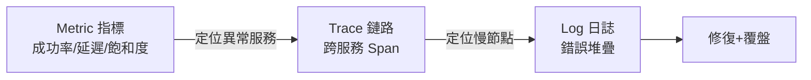
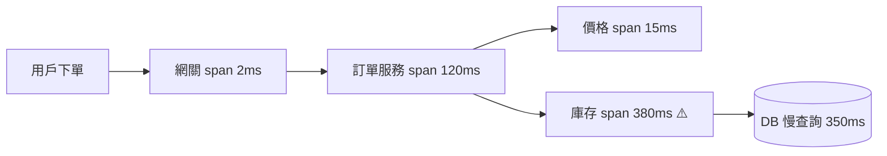

# 13.2 可觀測性三支柱：Log / Metric / Trace 與 OpenTelemetry

## 半夜被告警叫醒，你先看什麼

大促零點，訂單成功率從 99.99% 跌到 99.5%。老手排查三步曲：**Metric 看「哪裡」異常 → Trace 看「哪一跳」變慢 → Log 看「為什麼」出錯**。三者缺一不可，這就是可觀測性三支柱。



## 三支柱與開源全家桶

| 支柱 | 回答的問題 | 開源標準 | 阿里雲對應（ARMS 系） |
|------|-----------|---------|----------------------|
| Metric | 系統健康嗎？趨勢如何 | Prometheus + Grafana | ARMS Prometheus 版 |
| Trace | 請求卡在哪一跳 | Jaeger / Tempo + OpenTelemetry | ARMS 應用監控（ tracing） |
| Log | 具體錯在哪行程式 | Loki / ELK | SLS 日誌服務 |

**OpenTelemetry（OTel）** 是 2025 年事實標準：一次插樁，同時產出三種訊號，可切換後端不換程式碼。

```yaml
# Prometheus：抓取訂單服務指標 + 告警規則
apiVersion: monitoring.coreos.com/v1
kind: ServiceMonitor
metadata:
  name: order-svc
  namespace: monitoring
spec:
  selector:
    matchLabels: {app: order-svc}
  endpoints:
  - port: metrics
    interval: 15s
    path: /metrics
---
# 告警：P99 延遲連續 5 分鐘超 800ms
apiVersion: monitoring.coreos.com/v1
kind: PrometheusRule
metadata:
  name: order-slo
spec:
  groups:
  - name: slo
    rules:
    - alert: OrderP99High
      expr: histogram_quantile(0.99, rate(http_duration_seconds_bucket{app="order-svc"}[5m])) > 0.8
      for: 5m
      labels: {severity: critical}
```

## Trace 實戰：OTel 三行插樁

```bash
# Java：加 OTel agent，無侵入自動產生 Trace
java -javaagent:opentelemetry-javaagent.jar \
  -Dotel.service.name=order-svc \
  -Dotel.exporter.otlp.endpoint=http://otel-collector:4317 \
  -jar order-svc.jar
```



看到庫存 span 佔 380ms、其中 DB 350ms——直接定位到慢 SQL，再下鑽到 Log 看完整語句。**沒有 Trace，你只能對著 8 個服務的日誌大海撈針**。

## 黃金訊號與 SLI/SLO

Google SRE 的四個黃金訊號：**延遲（Latency）、流量（Traffic）、錯誤（Errors）、飽和度（Saturation）**。每個核心鏈路都要定義 SLI/SLO，例如「訂單建立成功率 99.95%、P99 < 500ms」，告警只對 SLO 燒蝕（Burn Rate）發聲——否則告警疲勞會淹沒真正的故障。

## 本章小結

- 排查三步：Metric 定位服務 → Trace 定位慢跳 → Log 定位原因
- OTel 一次插樁三種訊號；Prometheus+Grafana 看指標，Jaeger/Tempo 看鏈路，Loki/ELK/SLS 看日誌
- ServiceMonitor + PrometheusRule 把抓取與告警寫成 YAML（GitOps 化）
- 只對 SLO 燒蝕告警，拒絕告警疲勞

## 想一想

1. 只有 Log 沒有 Trace 時，排查「跨 5 個服務的慢請求」會遇到什麼困難？
2. 為什麼告警要綁 SLO（如成功率 99.95%）而不是綁機器 CPU？兩者各有什麼盲點？
3. OTel「一次插樁、多後端匯出」的價值是什麼？和廠商鎖定有什麼關係？
