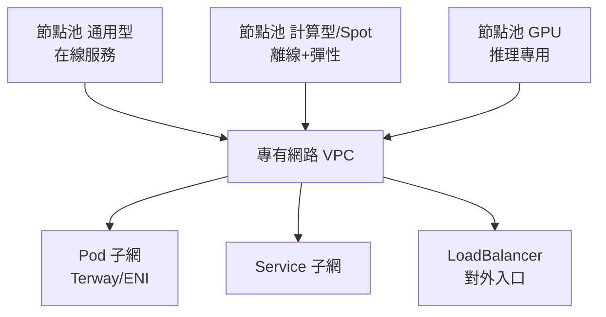

# 13.4 公有雲託管 K8s：ACK / EKS / GKE 最佳實踐

## 自建還是託管：一道算術題

自建 K8s 要養 control plane（高可用、etcd 備份、升級、證書輪換）；託管 K8s（ACK/EKS/GKE）把這些交給雲廠商，你只管 Worker 與工作負載。**除非你在做雲廠商，否則預設選託管**。

| 维度 | ACK（阿里雲） | EKS（AWS） | GKE（Google） |
|------|--------------|-----------|---------------|
| 生態親和 | 阿里雲 VPC/ARMS/ASM 一體 | IAM 深度整合 | Autopilot 全託管最省心 |
| 網路 | Terway ENI 高性能 | VPC CNI | 原生 VPC 直連 |
| Serverless 容器 | ECI Virtual Node | Fargate | Autopilot |
| AI/GPU | GPU 共享、AI 套件（見 17.1） | Neuron/GPU Operator | TPU + GPU 強項 |
| 多集群 | ACK One（見 17.1） | EKS Connector | Anthos / Fleet |

## 最佳實踐一：網路與節點池規劃



- **節點池分離**：在線、離線/Spot、GPU 各自成池，互不干擾（配合 13.3 混部）。
- **Pod 網路選 ENI 模式**（Terway/AWS VPC CNI）：每 Pod 獨立 IP，效能與排查都更好。
- **多可用區打散**：`topologySpreadConstraints` 跨 AZ，單 AZ 故障只丟 1/3。

```yaml
# 跨可用區打散 + 親和在線節點池
affinity:
  nodeAffinity:
    requiredDuringSchedulingIgnoredDuringExecution:
      nodeSelectorTerms:
      - matchExpressions:
        - {key: workload, operator: In, values: [online]}
topologySpreadConstraints:
- maxSkew: 1
  topologyKey: topology.kubernetes.io/zone
  whenUnsatisfiable: DoNotSchedule
```

## 最佳實踐二：升級、備份與權限

```bash
# 1. 升級：先升測試集群，再升 prod；ACK/EKS 均支援控制面一鍵升級
aliyun cs GET /clusters/<id> --header "Content-Type=application/json"  # 查版本與升級通道

# 2. ETCD/資源備份：Velero 定時備份
velero install --provider aws --bucket k8s-backup --backup-location-config region=cn-hangzhou
velero schedule create daily --schedule="0 3 * * *" --include-namespaces prod

# 3. 權限最小化：RAM/RBAC 綁定到 namespace，禁用 default 高權 SA
kubectl auth can-i --list --as=system:serviceaccount:prod:deploy-bot -n prod
```

## 最佳實踐三：入口與可觀測統一

- 入口統一走雲 LB + Ingress/Higress 網關（見 10.2 節），TLS、WAF、日誌一處配。
- 指標日誌直接對接雲監控（ARMS/CloudWatch/Cloud Monitoring），大促時才有全鏈路視角。
- 費用視角：開通成本分攤標籤（見 13.3 節），託管控制面費用 vs 自建人力對比入帳。

## 最佳實踐四：彈性與 GPU 節點

- 彈性用雲 Autoscaler + 搶佔式/Spot 節點池跑離線（見 13.3 混部），基座用包年包月。
- GPU 節點獨立池 + 共享切分（見 14.2/14.5），避免推理與訓練互相擠佔。
- 大促前做節點池預熱與配額檢查：雲配額不夠，再好的 HPA 也擴不出來。

```bash
# 大促前檢查：配額、節點池水位、Spot 中斷率
kubectl get nodes -l workload=online -o wide | wc -l     # 基座水位
kubectl top nodes | sort -k3 -h | head -5                # 最熱的 5 台
# 雲控制台確認：ECI 並發配額、GPU 卡配額、LB 規格是否夠尖峰 2 倍
```

## 本章小結

- 預設選託管 K8s：控制面交給雲，你只管節點與負載
- 網路用 ENI 模式；節點池按在線/離線/GPU 分離；跨 AZ 打散
- 升級先測後產、Velero 備份、RBAC 最小化
- 入口、可觀測、成本標籤三統一

## 想一想

1. 自建 control plane 最大的三個隱性成本是什麼？（提示：升級、etcd、半夜告警）
2. 為什麼節點池要按在線/離線/GPU 分離？混在一起會互相傷害什麼？
3. 跨 AZ 打散（maxSkew=1）能防什麼、不能防什麼？（提示：地域級故障見 17.4 多活）
