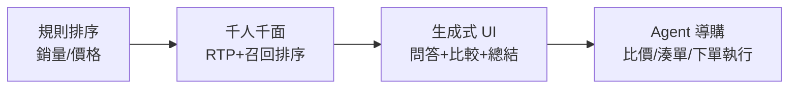
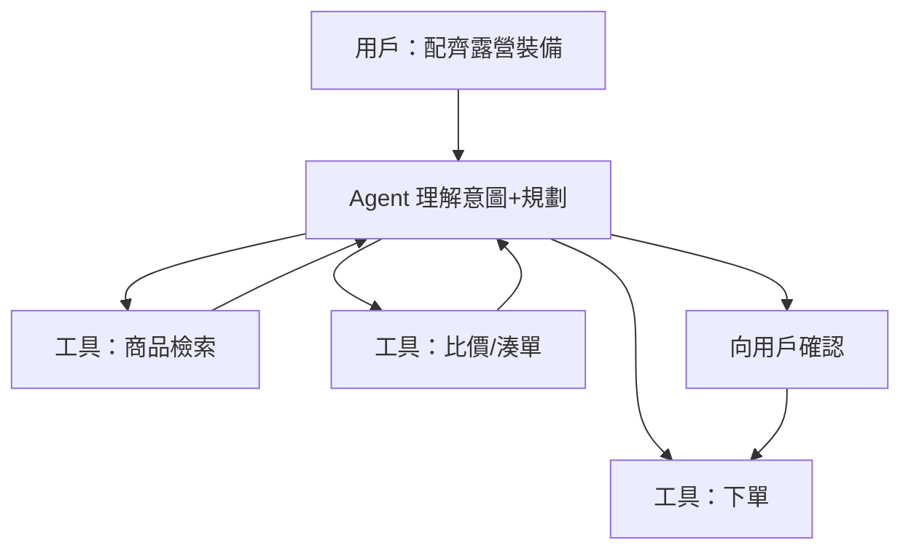
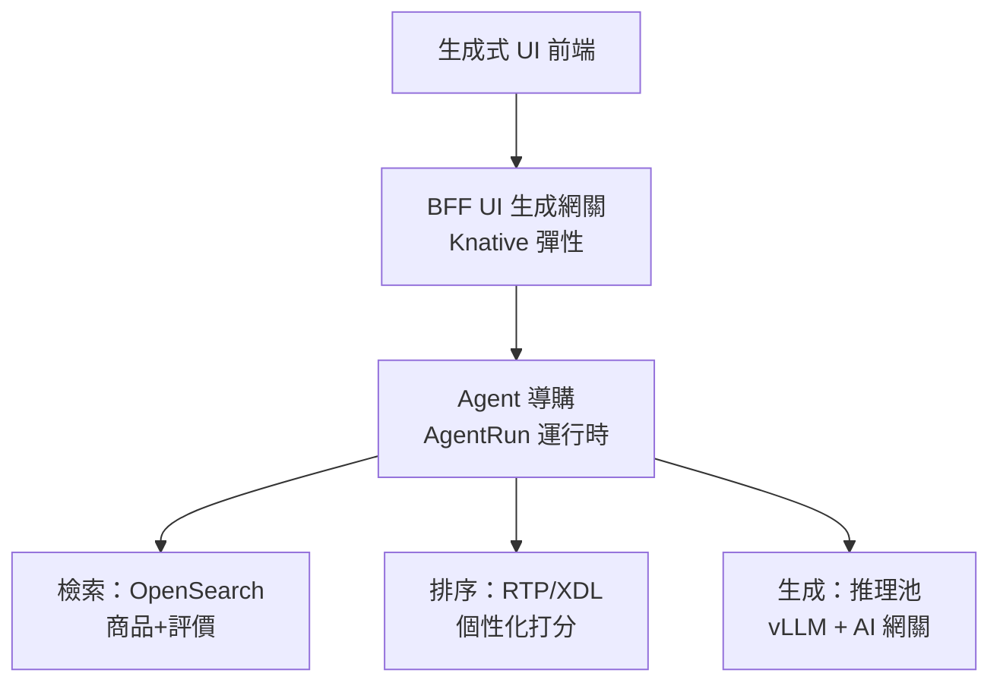

# 14.1 從千人千面到生成式 UI 與 AI Agent 導購

## 推薦系統三代：規則 → 千人千面 → 生成式

淘寶搜推演進可濃縮成三代：**規則排序**（銷量優先）→ **千人千面**（猜你喜歡，RTP/XDL 即時特徵+模型，見 16.3 節）→ **生成式與 Agent 導購**（2024–2026：不再只排商品，而是直接生成答案、替你比價下單）。



## 生成式 UI：頁面不再是模板

傳統詳情頁是固定模板填資料；**生成式 UI** 按問題動態組裝：問「露營新手 2000 元配齊」，頁面生成對比表 + 搭配理由 + 一鍵湊單，而不是十個商品卡片。

- **服務端**：LLM 負責理解意圖、檢索商品/評價（RAG）、生成結構化 UI 描述（JSON）。
- **前端**：按 JSON 渲染卡片、表格、時間線——BFF 層變成「UI 生成網關」（見 12.4 節）。
- **K8s 意義**：推理併發抖動大，適合 Serverless 彈性 + AI 網關限流（見 16.1 節）。

## Agent 導購：從回答到執行

**Wenwen（見 16.4 節）** 是淘寶生成式導購代表：多輪對話搞清預算、偏好、場景，然後調工具執行——查價、湊滿減、下單。架構上是典型的 ReAct 迴圈：



| 能力 | 千人千面 | 生成式 UI | Agent 導購 |
|------|---------|----------|-----------|
| 輸出 | 商品列表 | 動態頁面/答案 | 答案 + 執行結果 |
| 核心技術 | 召回+排序模型 | LLM + RAG | LLM + 工具 + 記憶 |
| 基础设施 | RTP/XDL 常駐 | 推理彈性擴縮 | AgentRun（見 15.2） |
| 風險 | 資訊繭房 | 幻覺、違規承諾 | 誤下單、越權操作 |

## 護欄：幻覺、承諾與誤操作

- **幻覺**：編造不存在的優惠 → 用 RAG 綁定真實商品/價格資料，附引用來源。
- **違規承諾**：「保證最低價」→ 輸出前規則校驗 + 敏感詞攔截。
- **誤操作**：Agent 亂下單 → **執行前確認 + 額度 + 可撤銷**（見 17.4 AI 安全）。

## 落地鏈路：三層架構如何分工



老鏈路（RTP/XDL/OpenSearch）不動，負責「準」；新鏈路（Agent+LLM）負責「懂」與「辦」。兩層之間用場景開關灰度：先 5% 流量驗轉化與差評率，過了再放大（見 15.2 評估）。

```bash
# 灰度開關：只給 5% 用戶看 Agent 導購入口
# 網關按用戶尾號放行，對照組仍走傳統搜推
curl -H "x-user-id: u12345" https://shop/guide -v | grep "x-guide-version"
```

## 本章小結

- 三代演進：規則 → 千人千面（RTP/XDL）→ 生成式 UI → Agent 導購（Wenwen）
- 生成式 UI：後端產結構化 UI 描述，前端動態渲染；BFF 變 UI 生成網關
- Agent 導購 = 意圖理解 + 工具執行 + 確認閉環；護欄重點是幻覺、承諾、誤操作
- 基礎設施需求：推理彈性、AI 網關、AgentRun，後續章節展開

## 想一想

1. 生成式 UI 與傳統模板頁面，在前後端分工上有何本質不同？
2. 為什麼 Agent 導購「下單前必須向用戶確認」？這條護欄防的是什麼風險？
3. RAG 如何緩解導購幻覺？如果檢索到的價格本身過期了，還缺哪道防線？
