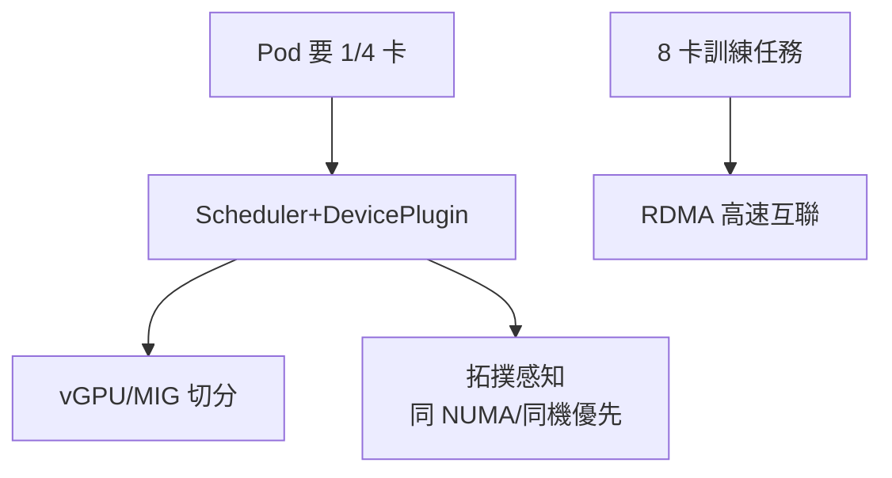

# 14.2 K8s 調度 GPU：vGPU / MIG / RDMA 高速網路

## GPU 為什麼難調度：貴、整卡、還要高速互聯

CPU 可以毫核切分，GPU 傳統上「一卡一任務」：推理只用 20% 顯存，剩下 80% 閒置；大模型訓練又要 8 卡緊耦合，網路慢一點整體就等。K8s 調度 GPU 要解決三件事：**切分、拓撲、網路**。



## 切分技術：vGPU vs MIG 對比

| 方案 | 原理 | 粒度 | 隔離性 | 適用 |
|------|------|------|--------|------|
| vGPU（cGPU/共享） | 軟體切分顯存/算力 | 靈活（如 1/4 卡） | 一般（共享驅動） | 推理混部、開發測試 |
| MIG（A100/H100） | 硬體物理隔離 | 固定檔位（1g/2g/3g…） | 強（故障隔離） | 多租戶推理、SLA 場景 |
| 整卡獨佔 | 不切分 | 1 卡起 | 最強 | 大模型訓練、超大推理 |

```yaml
# MIG：節點標好檔位，Pod 按檔位申請
apiVersion: v1
kind: Pod
metadata:
  name: infer-mig
spec:
  containers:
  - name: infer
    image: registry/shop/vllm:0.6
    resources:
      limits:
        nvidia.com/mig-1g.5gb: 1   # 申請一片 MIG
---
# vGPU（以阿里雲 cGPU 為例）：按顯存申請
# resources:
#   limits:
#     aliyun.com/gpu-mem: 4        # 申請 4G 顯存
```

```bash
# 查看 GPU 資源與拓撲
kubectl get nodes -l accelerator=nvidia -o wide
kubectl describe node gpu-node-01 | grep -A5 nvidia.com
nvidia-smi topo -m    # 節點內 NVLink / NUMA 拓撲
```

## 網路：RDMA 是分散式訓練的生命線

8 卡跨機訓練，每步都要 AllReduce 同步梯度。TCP/IP 協議棧延遲 + CPU 拷貝會把 GPU 餓死；**RDMA（RoCE/InfiniBand）** 讓網卡繞過核心直寫記憶體，延遲降到微秒級。K8s 層面要做：**支援 RDMA 的 CNI + 拓撲感知調度（同機架/同交換機優先）+ 專用訓練節點池**。

## 調度策略速查

- **推理**：優先填滿（BinPack）——把碎片請求塞進同一卡，提高利用率；配合 14.5 節共享彈性。
- **訓練**：優先打散到拓撲最優（Gang 調度 + 拓撲感知）——要麼全起、要麼等，拒絕半吊子上線。
- **混部**：推理（Guaranteed 小片）+ 離線 Batch（可搶佔）同卡，見 13.3 節。

## 實戰：Gang 調度 + 拓撲親和

```yaml
# 訓練任務：Volcano/Kueue Gang 調度，要麼 8 卡全起，要麼排隊等
apiVersion: batch.volcano.sh/v1alpha1
kind: Job
metadata:
  name: train-qwen
spec:
  minMember: 8                 # 缺一卡也不開跑
  tasks:
  - replicas: 8
    template:
      spec:
        nodeSelector: {workload: gpu-train}
        containers:
        - name: torch
          image: registry/shop/torch:2.4-roce
          resources:
            limits: {nvidia.com/gpu: 1}
        affinity:               # 同機優先，跨機選同交換機
          podAffinity:
            preferredDuringSchedulingIgnoredDuringExecution:
            - weight: 100
              podAffinityTerm:
                labelSelector: {matchLabels: {job: train-qwen}}
                topologyKey: kubernetes.io/hostname
```

```bash
# 訓練前檢查 RDMA 與頻寬（少一步，貴的 GPU 時間全浪費）
ibstat | grep -E "State|Rate"          # 網卡狀態與速率
nccl-tests -b 1G -e 8G -f 2 -g 8       # AllReduce 頻寬基線
```

## 本章小結

- GPU 三難：切分（vGPU 靈活/MIG 隔離）、拓撲（NUMA/NVLink）、網路（RDMA）
- 推理用切分+填滿提高利用率；訓練用 Gang+拓撲+RDMA 保證吞吐
- K8s 抓手：DevicePlugin 資源檔位、節點池分離、拓撲感知調度

## 想一想

1. 推理只用 20% 顯存時，整卡獨佔浪費了什麼？vGPU 與 MIG 各適合誰？
2. 為什麼訓練需要 Gang 調度（要麼全起要麼等）？缺一張卡會怎樣？
3. RDMA 繞過了什麼開銷？為什麼它對大模型訓練幾乎是必選？
