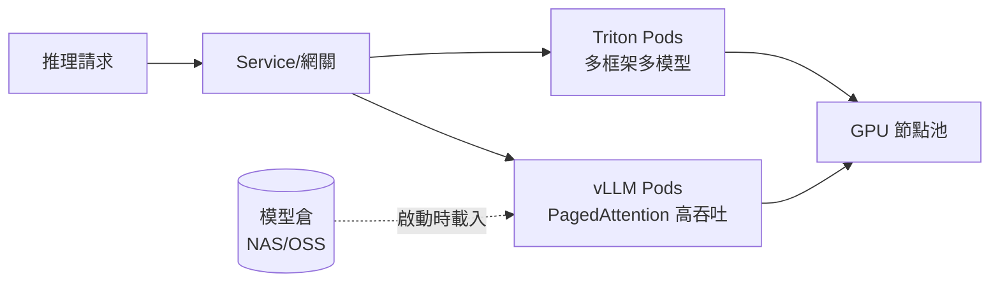

# 14.3 推理服務雲原生部署：vLLM / Triton + K8s

## 推理服務和普通微服務有何不同

普通服務擴縮看 CPU；推理服務看 **KV 快取、顯存、首 Token 延遲（TTFT）與輸出吞吐（TPS）**。模型載入要幾十秒甚至幾分鐘，啟動探針、滾動策略都得重寫——拿部署 Nginx 的方式部署大模型，一定翻車。



## vLLM vs Triton：怎麼選

| 维度 | vLLM | Triton Inference Server |
|------|------|-------------------------|
| 定位 | LLM 專用推理引擎 | 通用推理伺服器（LLM/視覺/排序都可） |
| 殺手鐧 | PagedAttention、連續批處理 | 多框架（TensorRT/ONNX/PyTorch）、多模型併跑 |
| 協議 | OpenAI 相容 API | KServe/HTTP/gRPC 標準協議 |
| 適用 | 對話、導購、客服 LLM | 搜推排序、向量化、多模型混合 |

```yaml
# vLLM 上 K8s：OpenAI 相容接口 + 顯存與探針調優
apiVersion: apps/v1
kind: Deployment
metadata:
  name: vllm-qwen
  namespace: ai
spec:
  replicas: 2
  template:
    spec:
      nodeSelector: {workload: gpu}
      containers:
      - name: vllm
        image: registry/shop/vllm:0.6-qwen2-7b
        args:
        - --model=/models/qwen2-7b
        - --gpu-memory-utilization=0.85
        - --max-model-len=8192
        ports: [{containerPort: 8000}]
        resources:
          limits: {nvidia.com/gpu: 1}
        startupProbe:                 # 模型載入慢，啟動寬限給足
          httpGet: {path: /health, port: 8000}
          failureThreshold: 60
          periodSeconds: 10
        readinessProbe:
          httpGet: {path: /health, port: 8000}
          periodSeconds: 10
```

```bash
# 冒煙測試：OpenAI 協議直接調
curl http://vllm-qwen.ai:8000/v1/completions \
  -H "Content-Type: application/json" \
  -d '{"model":"/models/qwen2-7b","prompt":"介紹一下","max_tokens":50}'

# 關鍵指標：TTFT、TPS、排隊長度（接 Prometheus）
curl http://vllm-qwen.ai:8000/metrics | grep vllm:
```

## 部署要點：模型、擴縮、發布

1. **模型載入**：鏡像只裝引擎，模型放共享儲存（NAS/OSS）掛載或 initContainer 預拉；多副本共用只讀卷，避免每 Pod 下一份。
2. **擴縮看排隊不用 CPU**：HPA 自訂指標（等待隊列長度、TTFT），或 KEDA 按 Prometheus 指標；突發用 AI 網關排隊+限流擋一層（見 16.1）。
3. **發布用權重切流**：新模型先 5% 驗證生成品質（結合 15.2 評估），再全量；回滾 = 切回舊 Revision。

## 本章小結

- 推理是「有狀態的重服務」：看顯存/KV 快取/TTFT，不看 CPU
- vLLM 專精 LLM 吞吐，Triton 通吃多框架多模型
- 三要點：模型與引擎分離、按排隊擴縮、權重發布+品質評估
- 探針寬限、GPU 節點親和缺一不可

## 想一想

1. 為什麼推理 Deployment 的 startupProbe 要給 10 分鐘寬限？模型載入發生了什麼？
2. 用 CPU 利用率給 vLLM 做 HPA 會出什麼問題？應該看什麼指標？
3. 新模型上線只驗「能跑通」夠嗎？生成品質該怎麼驗、誰來驗？
