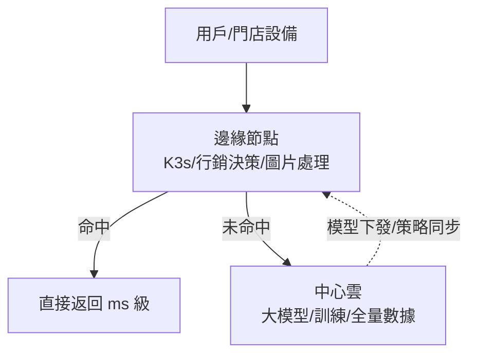

# 14.4 邊緣與 WASM：輕量容器在邊緣路由的應用

## 為什麼需要邊緣：延遲、頻寬與韌性

中心雲再強，也敵不過物理距離：CDN 回源、門店 IoT、掃碼購的本地決策都要**毫秒級**。**邊緣計算**把算力推到離用戶最近的節點：CDN 節點、門店閘道、5G MEC。K8s 延伸到邊緣就是 **K3s/KubeEdge/ACK Edge**。



## WASM：比容器更輕的執行單元

**WebAssembly（WASM）** 讓函數以近原生速度跑在沙箱裡：**毫秒啟動、MB 級體積、強隔離**。在邊緣場景（路由規則、鑑權、圖片裁剪、A/B 分流）比拉一個幾百 MB 容器鏡像划算得多。K8s 生態用 **WasmEdge / SpinKube** 把 WASM 變成可調度的 workload。

| 维度 | 容器 | WASM 模組 |
|------|------|----------|
| 啟動 | 秒級 | 毫秒級（<10ms） |
| 體積 | MB~GB | KB~MB |
| 隔離 | namespace/cgroup | 沙箱（預設無系統呼叫） |
| 適用 | 完整服務、依賴複雜 | 路由、鑑權、轉碼、規則引擎 |

```yaml
# SpinKube：把 WASM 應用部署成 K8s workload
apiVersion: core.spinoperator.dev/v1alpha1
kind: SpinApp
metadata:
  name: edge-router
  namespace: edge
spec:
  image: registry/shop/edge-router-wasm:v1.2
  replicas: 3
  executor: containerd-shim-spin-v2
---
# 邊緣節點：輕量 K3s + 標籤，中心統一納管
# k3s agent --server https://hub:6443 --node-label zone=edge-hangzhou
```

```bash
# 邊緣節點打標，流量按地域路由
kubectl label node edge-hz-01 zone=edge-hangzhou workload=edge
kubectl get nodes -l workload=edge

# 邊緣函數：圖片裁剪（事件觸發，毫秒啟動）
curl "http://edge-router.edge/img?src=a.jpg&w=200" -o small.jpg
```

## 典型模式：雲邊協同

- **決策在邊、學習在雲**：邊緣跑輕量規則/小模型（推薦初排），中心訓練大模型定期下發。
- **斷網可服務**：門店收銀、掃碼購核心鏈路邊緣自治，網路恢復再對賬（最終一致）。
- **分級降級**：中心故障時邊緣返回快取/預設頁（見 17.4 禁用開關）。

## 實戰：邊緣 A/B 分流與模型下發

```yaml
# 邊緣按地域灰度：杭州邊緣先上新推薦策略
apiVersion: networking.istio.io/v1beta1
kind: VirtualService
metadata:
  name: edge-ab
  namespace: edge
spec:
  hosts: [reco.edge]
  http:
  - match:
    - headers: {x-edge-zone: {exact: hangzhou}}
    route:
    - destination: {host: reco-v2}   # 新策略
      weight: 20
    - destination: {host: reco-v1}
      weight: 80
```

```bash
# 中心訓練的小模型定期下發到邊緣（版本化，可回滾）
kubectl annotate spinapp edge-router model-version=v2.3 -n edge --overwrite
kubectl rollout history spinapp/edge-router -n edge   # 版本歷史即回滾路徑
```

## 本章小結

- 邊緣解決距離問題：延遲、頻寬、斷網韌性；K3s/KubeEdge/ACK Edge 納管
- WASM 是邊緣利器：毫秒啟動、MB 體積、強隔離，適合路由/鑑權/轉碼
- SpinKube 讓 WASM 成為 K8s 一等公民
- 模式：決策在邊、學習在雲、斷網可服務

## 想一想

1. 哪些邏輯適合放邊緣、哪些必須回中心？用延遲與一致性要求劃線。
2. WASM 相比容器，犧牲了什麼換來毫秒啟動？（提示：系統呼叫與依賴）
3. 「斷網可服務」的門店收銀，事後對賬要解決什麼一致性難題？
