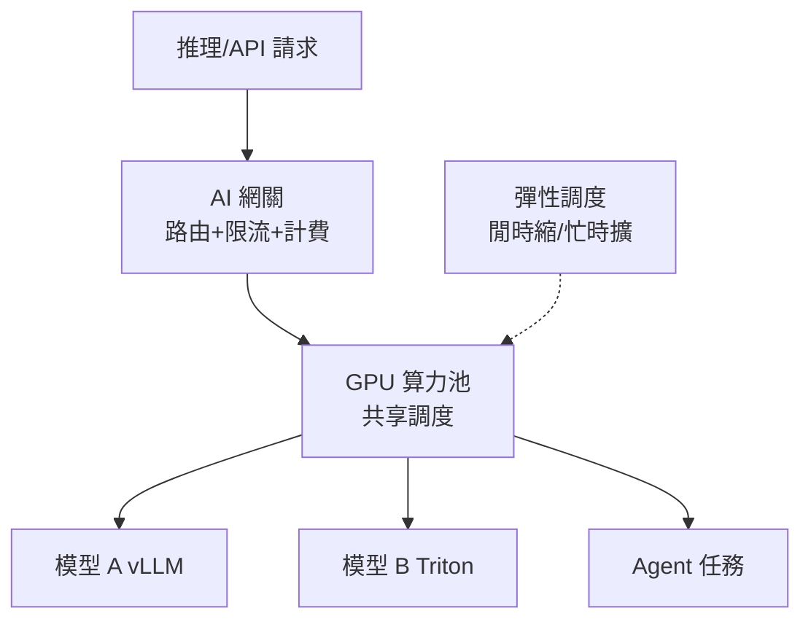

# 14.5 雲原生 AI 推理棧新進展：AI Serving Stack / 機密推理 / GPU 共享與彈性

## 推理進入「電網時代」：從管 Pod 到管算力池

14.3 解決了「把模型跑起來」，本節解決 2025–2026 的規模問題：上百個模型、上千張卡，潮汐來了互相搶，閒時大片空轉。**AI Serving Stack** 的思路是：**推理也搞資源池化**——GPU 共享、多模型混部、按需彈性，像用電一樣用算力。



## 三大新進展

**1. GPU 共享與彈性**：cGPU/vGPU 切分 + 動態裝載——白天導購模型佔卡，深夜切給離線 Batch 評估；突發流量按排隊長度秒級擴（KEDA + AI 網關排隊）。

**2. 機密推理（Confidential Inference）**：金融、醫療、客服錄音這類敏感推理跑在 **TEE（可信執行環境）** 裡——記憶體加密、雲廠商也看不見明文，配合 KMS 密鑰與審計，滿足合規。

**3. 推理棧標準化**：引擎（vLLM/Triton）+ 調度（共享+彈性）+ 網關（路由計費）+ 可觀測（TTFT/TPS/Token）形成標準棧，換模型不換架構。

| 能力 | 傳統做法 | 2025–2026 推理棧 |
|------|---------|------------------|
| GPU 分配 | 整卡獨佔 | 切分共享、閒時混部 |
| 彈性依據 | CPU/HPA | 排隊長度、TTFT、Token 速率 |
| 安全 | 傳輸加密 | TEE 機密推理 + 全鏈路審計 |
| 計費 | 按 Pod | 按 Token/按卡時透傳業務方 |

```yaml
# GPU 共享：兩個推理服務共用一卡（示例：各申請部分顯存）
apiVersion: apps/v1
kind: Deployment
metadata:
  name: infer-a
spec:
  template:
    spec:
      containers:
      - name: vllm
        image: registry/shop/vllm:0.6
        resources:
          limits:
            aliyun.com/gpu-mem: 8    # 共享卡上取 8G
---
# KEDA：按排隊長度彈性（Prometheus 指標）
apiVersion: keda.sh/v1alpha1
kind: ScaledObject
metadata:
  name: infer-scale
spec:
  scaleTargetRef: {name: infer-a}
  minReplicaCount: 1
  maxReplicaCount: 20
  triggers:
  - type: prometheus
    metadata:
      serverAddress: http://prom.monitoring:9090
      metricName: vllm_num_requests_waiting
      threshold: "20"               # 超 20 個排隊就擴
```

## 與 FinOps 的閉環

推理棧天然輸出 FinOps 數據：**每千 Token 成本、每卡時吞吐、閒時利用率**。例行動作：每週看「最貴的三個模型調用」，用蒸餾/量化/降級小模型替換長尾請求（見 16.1 推理路由）。

## 本章小結

- 推理規模化 = 算力池化：共享、彈性、標準棧
- GPU 共享（切分+混部）+ 按排隊彈性（KEDA）是降本主力
- 機密推理（TEE）解決敏感數據合規
- 閉環到 FinOps：按 Token 計費、定期治理長尾調用

## 想一想

1. 為什麼推理彈性要看「排隊長度」而不是 CPU？兩者斷裂時會發生什麼？
2. TEE 機密推理防的是誰？（提示：畫出能接觸明文的三方）
3. 「用小模型處理長尾請求」省了什麼、犧牲了什麼？誰來決定降級邊界？
