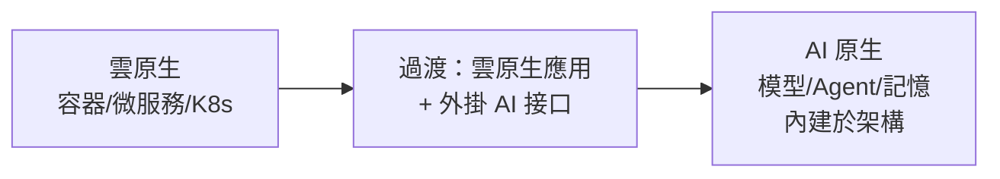
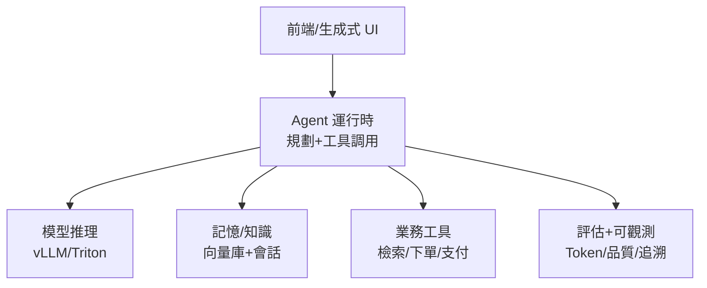
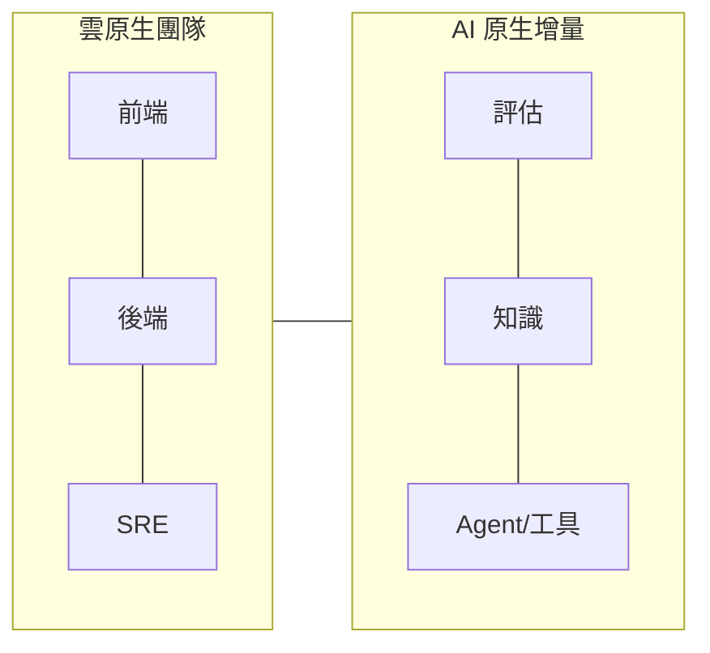

# 15.1 從雲原生到 AI 原生：2025 白皮書與雲智一體

## 2025 是分水嶺：AI 成為預設組件

2025 年阿里雲等廠商發布 **AI 原生（AI-Native）白皮書**，核心判斷只有一句：**未來的應用預設帶 AI 能力，就像今天的應用預設聯網一樣**。雲原生解決「應用如何上雲跑好」，AI 原生解決「應用如何把模型、Agent、知識變成一等公民」。



## AI 原生 vs 雲原生：對比表

| 维度 | 雲原生 | AI 原生（2025 白皮書） |
|------|--------|----------------------|
| 一等公民 | 容器、微服務 | 模型、Agent、知識/記憶、工具 |
| 計算特徵 | CPU 為主、確定性 | GPU/異構、機率性、長時運行 |
| 狀態 | 無狀態服務 + 外部 DB | 會話、記憶、向量狀態內建 |
| 交互 | 人調 API | Agent 調工具、人與 Agent 協作 |
| 可觀測 | 三支柱 | 加上 Token、評估、追溯（哪條知識導致的回答） |
| 基礎設施 | K8s + 網格 + MQ | 加上 AI 運行時/AI 網關/AI MQ（見 15.2） |

## 雲智一體：算力、模型、應用一朵雲

白皮書的另一關鍵詞是**雲智一體**：底層算力（GPU/RDMA）、模型服務（推理/微調）、上層應用（Agent/搜推）**在同一雲體系內編排**，而不是三撥人三套棧。對淘寶意味著：RTP/XDL 搜推鏈路（16.3 節）與 Wenwen Agent（16.4 節）共用同一套 GPU 池與網關，而不是各建煙囪。

- **對架構師**：選型先問「推理在哪、記憶在哪、工具在哪」，再問微服務怎麼拆。
- **對平台隊**：K8s 之上補 Agent 運行時、AI 網關、向量/記憶、可評估性四件套。
- **對業務隊**：把「調模型」升級為「編排 Agent 工作流 + 接入企業知識」。

## 一個最小 AI 原生應用長什麼樣



```bash
# 自查清單：你的應用 AI 原生了嗎？
# [ ] 模型可切換（不綁死單一供應商，見 16.1 多模型適配）
# [ ] 知識可更新（RAG 管道，而非寫死提示詞）
# [ ] 行為可評估（有評測集與回歸，見 15.2）
# [ ] 執行可審計（誰調了什麼工具、花了多少 Token）
# [ ] 成本可歸屬（Token 計費到業務方，見 13.3）
```

## 從雲原生團隊到 AI 原生團隊：組織也要升級

架構變了，分工跟著變。對照康威定律，AI 原生團隊多出三個角色：

| 新角色 | 職責 | 對應傳統角色 |
|--------|------|-------------|
| 模型/評估工程師 | 評測集、品質回歸、模型選型 | 測試 + 算法 |
| 知識工程師 | RAG 管道、文檔治理、向量品質 | DBA/數據工程 |
| Agent 工程師 | 工具開發、護欄、MCP/A2A 契約 | 後端 + 安全 |



轉型建議：別推倒重來，先在現有搜推/客服隊裡長出這三個職能（見 16.3、16.4 實戰），跑順再獨立。

## 本章小結

- AI 原生 = AI 能力是一等公民，不是外掛接口；2025 白皮書定調
- 雲智一體：算力+模型+應用同一體系編排，終結煙囪
- 最小 AI 原生應用：Agent 運行時 + 推理 + 記憶 + 工具 + 評估可觀測
- 自查五項：可切換、可更新、可評估、可審計、可歸屬

## 想一想

1. 「預設帶 AI 就像預設聯網」——這個類比對架構設計有什麼具體含義？
2. 為什麼雲智一體要強調「共用 GPU 池與網關」？煙囪式各建一套浪費了什麼？
3. 用五項自查清單給你熟悉的一個 AI 功能打分，最弱的一項怎麼補？
