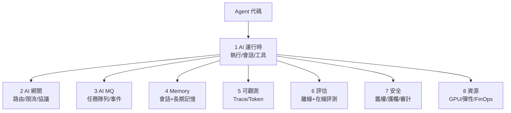

# 15.2 AgentRun 八大組件：AI 運行時 / AI 網關 / AI MQ / Memory / 可觀測 / 評估 / 安全

## Agent 跑在生產，需要一整套「跑道」

寫一個 Demo Agent 只要幾十行；讓一萬個 Agent 在大促跑三天三夜不翻車，需要 **AgentRun**——2025 年興起的 Agent 運行基礎設施理念：**把 Agent 當成一等 workload，提供運行時、網關、消息、記憶、可觀測、評估、安全八大組件**。



## 八大組件速覽

| # | 組件 | 解決什麼 | 雲原生對應 |
|---|------|---------|-----------|
| 1 | AI 運行時 | 長時運行、會話保持、工具調度 | Knative/FunctionAI（見 15.3） |
| 2 | AI 網關 | 多模型路由、Token 限流、協議適配 | Higress/Gateway API（見 16.1） |
| 3 | AI MQ | Agent 任務排隊、重試、削峰 | RocketMQ AI 化（見 16.2） |
| 4 | Memory | 會話記憶、向量知識、跨輪一致 | Redis/向量庫 + 會話親和 |
| 5 | 可觀測 | Trace 到工具級、Token 用量 | OTel + ARMS（見 13.2） |
| 6 | 評估 | 離線評測集、在線 A/B、自動回滾 | Argo Rollouts + 評分 |
| 7 | 安全 | 身份、護欄、工具越權攔截 | mTLS/OPA/審計（見 17.4） |
| 8 | 資源 | GPU 共享彈性、成本分攤 | 推理棧 + FinOps（見 14.5/13.3） |

## 核心模式：會話親和 + 任務隊列

```yaml
# Agent 任務經 MQ 排隊，工作池消費；會話鍵保證親和
apiVersion: keda.sh/v1alpha1
kind: ScaledObject
metadata:
  name: agent-worker
spec:
  scaleTargetRef: {name: agent-worker}
  minReplicaCount: 2
  maxReplicaCount: 50
  triggers:
  - type: rocketmq                  # 按 AI MQ 堆積擴縮
    metadata:
      address: rocketmq:9876
      topic: agent-tasks
      consumerGroup: agent-workers
      lagThreshold: "100"
```

```bash
# 可觀測：每條回答可追溯「哪次工具調用 + 哪條知識 + 多少 Token」
# Trace 標籤約定：agent.id / session.id / tool.name / tokens.in+out
kubectl logs deploy/agent-worker -n prod | grep "session.id=sess-9f2" | head -5
```

## 評估：上線前先考試

- **離線評測集**：200+ 真實導購問答，每版模型/Agent 跑分，低於基線不准上。
- **在線影子流量**：新 Agent 跑 5% 影子請求，只記錄不生效，對比老版本。
- **自動回滾**：差評率/誤操作率超閾值，Rollout 自動切回（見 13.1）。

```bash
# 評估流水線（CI 一環）：跑分不過直接擋發布
agent-eval run --suite guide-200 --agent shopping-guide:v2 > eval.json
agent-eval gate --baseline 0.82 --metric task_success < eval.json \
  && echo PASS || echo "BLOCKED: 低於基線，禁止合併"
```

## 本章小結

- AgentRun = 讓 Agent 在生產長期穩定跑的八大組件
- 核心模式：AI MQ 排隊削峰 + 會話親和 + 工作池彈性
- 評估是生命線：離線考試、影子流量、自動回滾三件套
- 八大組件映射到本書各節，是第六篇的總裝圖

## 想一想

1. 為什麼 Agent 需要專門的 MQ 排隊，而普通微服務同步調用就夠？（提示：長時+削峰）
2. 「會話親和」解決什麼問題？若同一用戶兩輪請求打到不同實例且無共享記憶，會怎樣？
3. 離線評測集 200 題是怎麼來的？為什麼不能只靠人工抽查上線品質？
