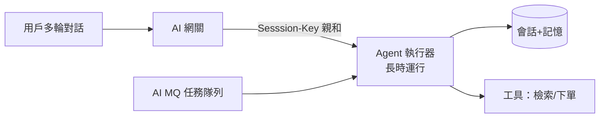

# 15.3 FunctionAI 與 Agent Infra：AWS AgentCore / Azure / FunctionAI 長時運行與會話親和

## FaaS 的短板：Agent 是「長跑選手」

12.3 的 Knative 函數假設「秒級完成、無狀態」；Agent 卻是**長時運行**（多輪對話幾分鐘到幾小時）、**有狀態**（會話+記憶）、**多步工具調用**。普通 FaaS 跑 Agent 會遇到：超時殺掉、狀態丟失、同會話打散。2025–2026 各雲的答案統稱 **Agent Infra / FunctionAI**。



## 三家對比：FunctionAI vs AgentCore vs Azure

| 能力 | 阿里雲 FunctionAI（2025） | AWS AgentCore | Azure（AI Agent Service） |
|------|--------------------------|---------------|--------------------------|
| 定位 | Serverless 化 Agent 運行+推理 | Agent 託管運行時 | 長時運行 + 企業知識 |
| 長時運行 | 支援（分鐘~小時級） | 支援（含 human-in-loop 暫停） | 支援（Durable 模式） |
| 會話親和 | Session-Key 路由 | Session 隔離+記憶 | 會話狀態內建 |
| GPU | 按需掛載、閒時釋放 | 按需推理 | 按需 + Batch |
| 生態 | Knative/ACK/AI 網關一體 | Bedrock 知識庫打通 | OpenAI/365 知識打通 |

**共通原理**：FaaS 的彈性縮零 + 有狀態會話（親和路由 + 外部記憶）+ AI 網關（路由計費）+ 任務隊列（削峰重試）。

## 關鍵模式一：會話親和路由

```yaml
# AI 網關按 session-id 一致性路由，同會話打到同一執行器
apiVersion: networking.istio.io/v1beta1
kind: VirtualService
metadata:
  name: agent-affinity
spec:
  hosts: [agent.shop.com]
  http:
  - match:
    - headers:
        x-session-id: {regex: ".+"}
    route:
    - destination: {host: agent-worker}
    headers:
      request:
        set: {x-session-hash: "%REQ(x-session-id)%"}  # 下游做一致性哈希
  - route:
    - destination: {host: agent-worker}               # 無會話鍵走負載均衡
```

## 關鍵模式二：長時任務檢查點

```bash
# Agent 每完成一步就寫檢查點（checkpoint），超時/遷移後從斷點續跑
# 偽碼：checkpoint(session_id, step, state) -> 外部存储（Redis/OSS）
curl -X POST http://agent-worker/agent/step \
  -H "x-session-id: sess-9f2" \
  -d '{"action":"search","args":{"q":"露營裝備"}}'

# FunctionAI/AgentCore 把「暫停-恢復」做成平台能力：
# 人審批、等支付回調時掛起，不佔執行器；事件回來再喚醒
```

## 選型建議

- 已在 ACK/Knative 體系 → **FunctionAI** 一體性最好（網關+MQ+記憶全打通）。
- 出海多雲/AWS 為主 → AgentCore + Bedrock 知識。
- 企業知識在 365/Office → Azure 链路最短。
- 核心判準永遠是：**會話不斷、狀態不丟、超時不殺、賬可算清**。

## 本章小結

- Agent 是長時有狀態任務，普通 FaaS 三宗罪：超時殺、狀態丟、會話散
- Agent Infra 通解：親和路由 + 外部記憶 + 檢查點續跑 + 任務隊列
- FunctionAI/AgentCore/Azure 殊途同歸，選型看既有生態
- 驗收四句：會話不斷、狀態不丟、超時不殺、賬可算清

## 想一想

1. 為什麼「一致性哈希 + 外部記憶」比「粘性會話存本地」更適合 Agent？實例掛了會怎樣？
2. human-in-loop（等人工審批）時，執行器應該佔著等還是掛起？各付什麼代價？
3. 若你的 Agent 平均運行 20 分鐘，普通函數 60 秒超時，第一個要改的是什麼？
