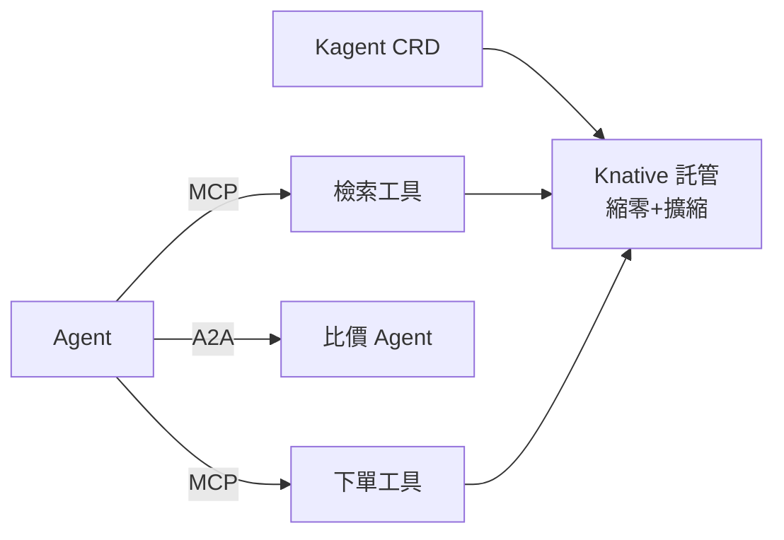

# 15.4 MCP / A2A / Kagent on Knative：Agent 協議的 Serverless 託管

## Agent 也需要「HTTP 時刻」：協議先行

微服務靠 HTTP/gRPC 互通；Agent 生態 2025 年補上三個協議：**MCP（模型上下文協議：Agent 調工具）**、**A2A（Agent to Agent：Agent 調 Agent）**、**Kagent（K8s 上的 Agent 框架：把 Agent 變成 CRD）**。協議統一後，工具與 Agent 才能像微服務一樣被調度、擴縮、治理。



## 三協議速覽

| 協議 | 全稱/定位 | 解決什麼 | 類比 |
|------|----------|---------|------|
| MCP | Model Context Protocol | Agent 統一調工具（檢索/DB/下單） | Agent 的「USB 接口」 |
| A2A | Agent to Agent | Agent 發現並調用另一個 Agent | Agent 的「服務發現+RPC」 |
| Kagent | K8s Agent 框架 | Agent 變成 K8s 資源（CRD+控制器） | Agent 的「Deployment」 |

## 實踐：MCP 工具跑在 Knative 上

最划算的部署：MCP 工具多是**低頻、事件型、無狀態**——天然適合 Knative 縮零（見 12.3）。

```yaml
# MCP 檢索工具：Knative Service 託管，SSE/HTTP 對外
apiVersion: serving.knative.dev/v1
kind: Service
metadata:
  name: mcp-product-search
  namespace: agent
spec:
  template:
    metadata:
      annotations:
        autoscaling.knative.dev/minScale: "0"
        autoscaling.knative.dev/maxScale: "30"
    spec:
      containers:
      - image: registry/shop/mcp-product-search:v1.4
        ports: [{containerPort: 8080}]
        env:
        - name: MCP_TOOL_NAME
          value: product_search
        - name: OPENSEARCH_ENDPOINT     # 工具後端：商品檢索（見 16.3）
          value: "https://opensearch.prod:9200"
---
# Kagent：把導購 Agent 聲明成 CRD，控制器負責調度到 Knative
apiVersion: kagent.dev/v1alpha1
kind: Agent
metadata:
  name: shopping-guide
  namespace: agent
spec:
  model: qwen2-max
  tools:
  - mcp-product-search
  - mcp-price-compare
  runtime: knative                    # 底座：Knative Serverless
  sessionAffinity: true
```

```bash
# A2A：比價 Agent 呼叫庫存 Agent（服務發現即 K8s DNS）
curl http://stock-agent.agent:8080/a2a/invoke \
  -H "Content-Type: application/json" \
  -d '{"task":"check-stock","args":{"sku":"camp-tent-01"}}'

# 擴縮驗證：工具閒時縮零，Agent 呼叫時自動拉起
kubectl get ksvc -n agent -w   # 觀察 0 -> N
```

## 治理要點

- **工具鑑權**：MCP 工具按調用方頒發最小 scope（導購 Agent 不能調退款工具）。
- **配額與計費**：A2A 調用計入調用方 Token/次數（接 16.1 網關）。
- **版本契約**：工具輸入輸出 schema 進 Git，Breaking change 走金絲雀（見 13.1）。

## 本章小結

- MCP 統一工具、A2A 統一 Agent 互調、Kagent 把 Agent 變成 K8s 資源
- MCP 工具低頻無狀態 → Knative 託管最划算；Kagent CRD 聲明 Agent
- 治理三件：最小鑑權、配額計費、契約版本
- 協議統一是 Agent 生態規模化的前提，正如當年的 HTTP

## 想一想

1. 沒有 MCP 時，每接一個工具要做什麼重複工作？MCP 省掉了哪層適配？
2. A2A 與微服務 RPC 的異同是什麼？（提示：任務語義 vs 接口語義）
3. 為什麼 MCP 工具適合縮零，而 Agent 執行器往往要保暖？（提示：冷啟動敏感度）
