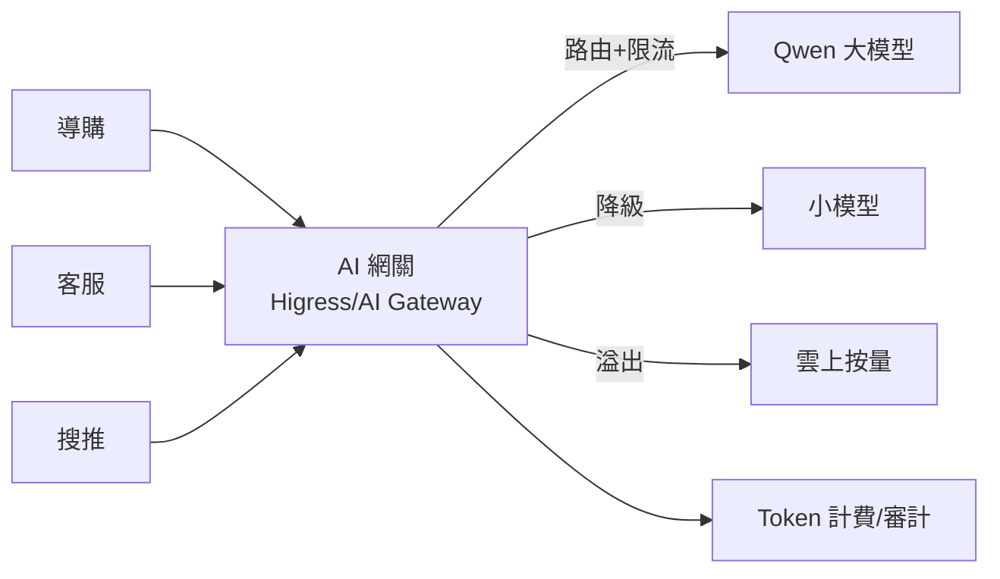

# 16.1 AI 網關：推理路由、Token 限流、多模型協議適配與 Gateway API

## 為什麼推理前面要站一道網關

十個業務都直連 vLLM：大促導購把卡占滿，客服跟著卡死；A 業務刷爆 Token，賬算不清；換個模型要改十處代碼。**AI 網關**就是推理世界的 API Gateway：**路由、限流、適配、計費、護欄**一處搞定。



## 四大能力

| 能力 | 做什麼 | 關鍵配置 |
|------|--------|---------|
| 推理路由 | 按場景/品質分流大小模型 | 場景標籤、權重、金絲雀 |
| Token 限流 | 按業務/用戶限 QPS 與 Token | QPS、每分 Token、併發 |
| 協議適配 | OpenAI 協議適配多後端 | /v1/chat 統一入口 |
| 護欄計費 | 敏感詞、引用、用量記賬 | 規則鏈 + 日誌 |

```yaml
# Gateway API + AI 網關：導購走大模型、長尾走小模型
apiVersion: gateway.networking.k8s.io/v1
kind: HTTPRoute
metadata:
  name: ai-route
  namespace: ai
spec:
  parentRefs: [{name: higress-gateway}]
  rules:
  - matches:
    - headers: [{name: x-scene, value: guide}]
    backendRefs:
    - {name: qwen-max, port: 8000, weight: 90}
    - {name: qwen-small, port: 8000, weight: 10}   # 10% 影子驗證小模型
    filters:
    - type: RequestHeaderModifier
      requestHeaderModifier:
        add: [{name: x-model-tier, value: premium}]
  - matches:
    - headers: [{name: x-scene, value: longtail}]
    backendRefs:
    - {name: qwen-small, port: 8000}               # 長尾降級省成本
```

```bash
# Token 限流：客服每分鐘最多 50 萬 Token，超了排隊
#（Higress AI 插件示例語義，具體 CRD 以版本為準）
kubectl apply -f - <<'EOF'
apiVersion: networking.higress.io/v1
kind: AiQuota
metadata: {name: cs-quota, namespace: ai}
spec:
  consumer: customer-service
  maxTokensPerMinute: 500000
  maxConcurrent: 200
  overflow: queue        # 或 reject：直接拒絕
EOF
```

## 路由策略：品質、成本、延遲三角

- **分級**：核心導購 → 大模型；長尾問答 → 小模型；離線評估 → Batch。
- **溢出**：自有卡滿了溢出到雲按量，保證不斷服（成本閾值告警）。
- **金絲雀**：新模型 5% 流量 + 評估分（見 15.2），過了再放大。

## 本章小結

- AI 網關 = 推理的統一入口：路由、Token 限流、協議適配、護欄計費
- Gateway API 做流量規則，Higress/AI 插件做 AI 語義（Token 配額）
- 策略三角：品質（大模型）/成本（小模型）/延遲（溢出與排隊）
- 所有調用可記賬，是 FinOps 到 Token 的關鍵一環

## 想一想

1. 沒有 AI 網關時，「導購擠死客服」這類事故為什麼必然發生？網關哪個能力擋住了它？
2. Token 限流與 QPS 限流有何不同？為什麼 AI 場景必須限 Token？
3. 長尾請求降級到小模型，省了什麼、風險是什麼？影子流量 10% 在驗什麼？
