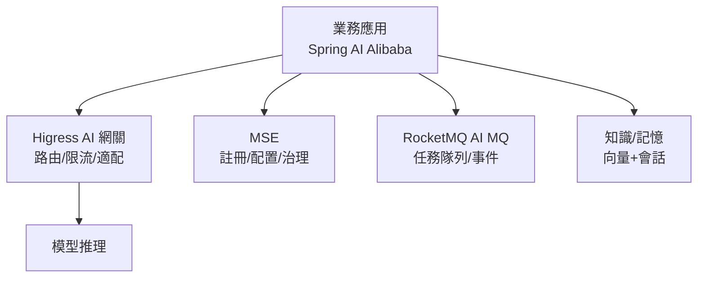

# 16.2 AI 中間件演進：Spring AI Alibaba / Higress / MSE / RocketMQ

## 中間件也要 AI 化：從連服務到連模型

Spring Cloud 連的是微服務；AI 時代要連的是**模型、提示詞、知識、工具**。2025 年阿里系中間件集體 AI 化：**Spring AI Alibaba（應用框架）+ Higress（AI 網關）+ MSE（治理）+ RocketMQ（AI MQ）**，正好對上 AgentRun 八大組件。



## 四件套速覽

| 中間件 | AI 化能力 | 一句話定位 |
|--------|----------|-----------|
| Spring AI Alibaba | ChatClient、RAG、Tool Calling、MCP 客戶端 | Java 寫 Agent 的標準姿勢 |
| Higress | AI 路由、Token 限流、多模型適配 | 推理統一入口（見 16.1） |
| MSE | AI 服務治理、配置、熔斷 | 模型的「Nacos+Sentinel」 |
| RocketMQ | AI MQ：任務隊列、流式事件、削峰 | Agent 的「任務匯流排」（見 15.2） |

```bash
# Spring AI Alibaba：ChatClient 三行調模型（Java）
# application.yml
# spring.ai.dashscope.api-key: ${DASHSCOPE_KEY}
# spring.ai.dashscope.chat.model: qwen-max
```

```java
// 工具調用：Agent 可調的業務工具（比價）
@Tool(description = "查詢商品比價")
public Price compare(String sku) {
    return priceService.compare(sku);
}
// ChatClient 會自動把工具描述發給模型，模型決定何時調用
```

```yaml
# RocketMQ AI MQ：Agent 任務隊列（消費堆積觸發擴縮見 15.2）
apiVersion: v1
kind: ConfigMap
metadata:
  name: agent-mq-topics
data:
  topics: "agent-tasks,agent-events,agent-eval"
  retry-policy: "3 次指數退避，進死信隊列人工看"
```

## 演進邏輯：每一代中間件都跟著計算範式走

- 微服務時代：Dubbo/Spring Cloud（RPC）+ Nacos（發現）+ Sentinel（熔斷）。
- 雲原生時代：K8s Service + Ingress + 网格 mTLS。
- AI 原生時代：**框架連模型（Spring AI）+ 網關懂 Token（Higress）+ MQ 排任務（AI MQ）+ 治理管評估（MSE）**。

## 治理實戰：MSE 熔斷 + 配置灰度

```yaml
# MSE：AI 服務熔斷——TTFT 惡化自動降級到小模型
apiVersion: mse.alibabacloud.com/v1alpha1
kind: CircuitBreaker
metadata:
  name: llm-rerank
  namespace: search
spec:
  service: qwen-max
  rule:
    slowRatioThreshold: 0.2      # 慢請求超 20% 熔斷
    slowRtMs: 1500
    fallback: qwen-small         # 降級目標
    recoveryAfterSec: 60
```

```bash
# 提示詞/閾值配置灰度：先 10% 實例生效（MSE 配置推送）
mse config publish --key guide.prompt.v3 --content "$(cat prompt-v3.txt)" --beta 10%
mse config diff --key guide.prompt.v3 --version v2:v3   # 上線前先對 diff
```

## 本章小結

- AI 中間件四件套：Spring AI Alibaba、Higress、MSE、RocketMQ AI MQ
- 應用層用 ChatClient + @Tool 標準寫法連模型調工具
- 網關、MQ、治理各司其職，對應 AgentRun 組件
- 選型看既有 Java/阿里雲體系沉澱，遷移成本最低

## 想一想

1. @Tool 註解把「工具描述發給模型」這一步解決了什麼問題？沒有它會怎樣？
2. AI MQ 與普通業務 MQ 在消息語義上有何不同？（提示：長時任務+重試+死信）
3. 把 Sentinel 的熔斷思想搬到 AI 網關，熔斷指標應該從「錯誤率」變成什麼？
