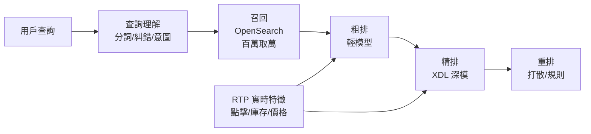

# 16.3 淘寶 AI OS 實戰：搜索推薦全圖架構、RTP / XDL / OpenSearch 百萬 QPS

## 一張圖：搜推全鏈路

用戶敲「露營帳篷」到看到結果，背後是四級漏斗：**召回（百萬→萬）→ 粗排 → 精排 → 重排**，每一級都壓著延遲紅線。全鏈路要在 **百毫秒內扛百萬 QPS**，靠的是 RTP（實時計算）+ XDL（深度學習訓練推理）+ OpenSearch（檢索）三駕馬車。



## 三駕馬車：各自解決什麼

| 系統 | 定位 | 關鍵技術 |
|------|------|---------|
| OpenSearch | 全文+向量檢索召回 | 倒排索引、向量 ANN、毫秒召回 |
| RTP | 實時特徵生產 | 流式計算、秒級特徵更新（剛點的立刻記住） |
| XDL | 訓練+在線打分 | 稀疏大模型、PS 架構、高併發打分 |

```yaml
# 精排服務：CPU 密集打分，常駐 + HPA 跟 QPS
apiVersion: apps/v1
kind: Deployment
metadata:
  name: ranker
  namespace: search
spec:
  replicas: 60
  template:
    spec:
      containers:
      - name: ranker
        image: registry/taobao/ranker:xdl-v8
        ports: [{containerPort: 8080}]
        resources:
          requests: {cpu: "4", memory: "8Gi"}
          limits: {cpu: "8", memory: "16Gi"}
        readinessProbe:
          httpGet: {path: /ready, port: 8080}
          periodSeconds: 5
---
apiVersion: autoscaling/v2
kind: HorizontalPodAutoscaler
metadata:
  name: ranker
spec:
  scaleTargetRef: {apiVersion: apps/v1, kind: Deployment, name: ranker}
  minReplicas: 40
  maxReplicas: 400
  metrics:
  - type: Pods
    pods: {metric: {name: qps_per_pod}, target: {type: AverageValue, averageValue: 2000}}
```

## 百萬 QPS 的四個秘密

1. **漏斗逐層減量**：召回用便宜索引砍掉 99%，貴的深模只算 Top 幾百。
2. **特徵預熱與快取**：熱門 Query 結果、特徵快照多級快取（見 2.2 節）。
3. **異構算力**：召回/粗排 CPU 集群，精排onnx/GPU 混合，LLM 重排走推理池（見 14.5）。
4. **全鏈路壓測與限流**：大促前全鏈路壓測定水位，網關按場景限流保核心（見 16.1）。

## AI OS 視角：搜推是 AI 原生的老祖宗

回看 15.1：搜推早就是「模型+特徵+工具」一等公民——RTP 是特徵管道，XDL 是模型底座，OpenSearch 是檢索工具。今天的 AgentRun 只是把這套搬到對話與執行。可以說：**淘寶搜推是第一代 AI OS，Wenwen 是第二代**。

## 本章小結

- 搜推漏斗：召回→粗排→精排→重排，逐層減量保延遲
- OpenSearch 管召回、RTP 管實時特徵、XDL 管打分
- 百萬 QPS 靠漏斗、快取、異構算力、壓測限流四件套
- 搜推即第一代 AI OS，方法論直接複用到 Agent 時代

## 想一想

1. 為什麼貴的深排模型只算 Top 幾百？漏斗每層的「成本-精度」取捨是什麼？
2. RTP「剛點的立刻記住」解決了什麼問題？沒有實時特徵會怎樣？
3. 把搜推架構映射到 AgentRun 八大組件：RTP、XDL、OpenSearch 各對應哪個？
