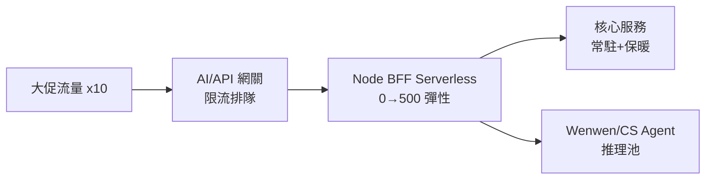

# 16.4 淘寶最新落地：Node.js Serverless 核心鏈路、智能客服亞秒級、Wenwen 生成式導購

## Node.js 上核心鏈路？先回答三個質疑

淘寶前端 Node.js 技術棧（見 12.4 節 BFF）2025 年把部分**核心鏈路聚合層**搬上 Serverless。質疑有三：單進程怕掛？冷啟動怕慢？大促怕崩？答案是三板斧：**多實例+快速拉起蓋住單點、保暖+預熱蓋住冷啟動、AI 網關+限流蓋住尖峰**。



```yaml
# 核心鏈路 BFF：保暖 + 高併發目標 + 預熱探針
apiVersion: serving.knative.dev/v1
kind: Service
metadata:
  name: bff-core
  namespace: prod
spec:
  template:
    metadata:
      annotations:
        autoscaling.knative.dev/minScale: "20"   # 大促保暖基座
        autoscaling.knative.dev/maxScale: "500"
        autoscaling.knative.dev/target: "300"    # Node 高併發
    spec:
      containers:
      - image: registry/taobao/bff-core:node20-v12
        readinessProbe:
          httpGet: {path: /warmup, port: 3000}
          periodSeconds: 5
        resources:
          requests: {cpu: "500m", memory: "512Mi"}
          limits: {cpu: "2000m", memory: "1Gi"}
```

## 智能客服：亞秒級的三級火箭

| 級 | 內容 | 延遲 | 成本 |
|----|------|------|------|
| L1 | 知識庫直答（RAG 檢索） | ~200ms | 最低 |
| L2 | 小模型生成 | ~500ms | 中 |
| L3 | 大模型 + 人工轉接 | 1s+ | 最高 |

流量 80% 在 L1 解決，只有疑難進 L3——**分級是亞秒級與成本的雙保險**。

## Wenwen 生成式導購：16.1+15.2 的總裝

Wenwen = 生成式 UI（14.1）+ AgentRun（15.2）+ AI 網關（16.1）的集大成：意圖理解 → MCP 工具（檢索/比價/湊單）→ 生成對比頁 → 確認後下單。全鏈路護欄：**價格 RAG 綁定真實源、下單前確認、可撤銷**。

```bash
# 大促 SOP：預熱 -> 壓測 -> 護欄 -> 值班
kn service update bff-core --scale-min 50 -n prod   # 提前保暖
hey -z 5m -c 500 https://bff.prod/health            # 全鏈路壓測
kubectl apply -f ai-quota-cs.yaml                   # Token 配額就位
# 值班看板：TTFT、L1 命中率、轉人工率、Token/單
```

## 複盤數據：三個數字證明價值

| 指標 | 上線前 | Serverless+AI 化後 |
|------|--------|-------------------|
| 大促閒時資源成本 | 100%（按尖峰常駐） | 降 55%（縮零+按量） |
| 客服平均首響 | 3.2s（人工排隊） | 0.8s（L1 直答） |
| 導購湊單轉化 | 基線 | +12%（Wenwen 生成式對比頁） |

數字背後是同一公式：**潮汐用彈性吃、重複用分級擋、決策用 Agent 升**。這也是全書從 12.3 到 16.4 的一條暗線。

## 本章小結

- Node Serverless 上核心鏈路靠三板斧：多實例、保暖預熱、網關限流
- 智能客服亞秒級 = L1 檢索直答 + L2 小模型 + L3 大模型/人工，分級承載
- Wenwen 是全書技術的總裝：生成式 UI + Agent + 網關 + 護欄
- 大促 SOP：預熱、壓測、配額、看板四步

## 想一想

1. Node 單進程模型為什麼反而適合 BFF 聚合？（提示：I/O 密集+高併發）
2. 客服 L1 命中率從 80% 掉到 50% 會發生什麼連鎖反應？哪個指標先報警？
3. Wenwen 下單前確認環節，若為了轉化率想去掉，你用什麼論據反對？
