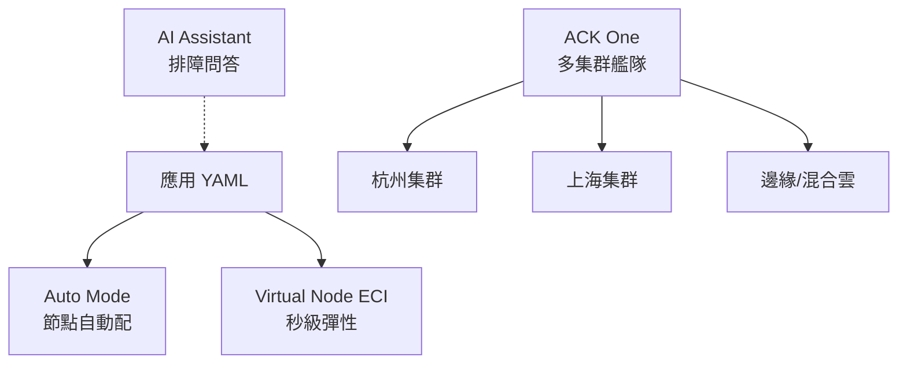

# 17.1 ACK 2025–2026 新能力：Auto Mode / Virtual Node / ACK One 多集群 / AI Assistant

## 託管 K8s 的新方向：越託管、越多集群、越 AI

13.4 講了託管選型；2025–2026 年 ACK 的四個新能力把「託管」推到極致：**Auto Mode（節點全託管）+ Virtual Node（Serverless 容器秒彈）+ ACK One（多集群一盤棋）+ AI Assistant（排障問 AI）**。



## 四能力速覽

| 能力 | 解決什麼 | 典型用法 |
|------|---------|---------|
| Auto Mode | 不用管節點規格/升級/縮容 | 新業務默認開啟，平臺隊減負 |
| Virtual Node（ECI） | 秒級彈性、按秒計費 | 大促尖峰、CI、Serverless（見 12.3） |
| ACK One | 多集群統一管理、流量 failover | 異地多活、邊緣納管 |
| AI Assistant | 自然語言排障、YAML 生成 | 「為什麼 Pod Pending？」直接問 |

```yaml
# Virtual Node：尖峰任務調度到 ECI，閒時不佔節點
apiVersion: batch/v1
kind: Job
metadata:
  name: promo-settle
spec:
  template:
    spec:
      nodeSelector:
        k8s.aliyun.com/eci: "true"     # 落到虛擬節點
      tolerations:
      - key: k8s.aliyun.com/eci
        operator: Exists
      containers:
      - name: settle
        image: registry/shop/settle:v3
        resources:
          requests: {cpu: "4", memory: "8Gi"}
---
# ACK One 簡化示意：GitOps  fleet 一份配置多集群生效
#（實際用 ACK One 控制台 / Fleet 管理員下發）
```

```bash
# AI Assistant 式排障：先問 AI 再動手（示例流程）
kubectl get events -n prod --sort-by=.lastTimestamp | tail -20
kubectl describe pod order-svc-xyz -n prod | grep -A5 Events
# 把事件貼給 AI Assistant：推薦檢查 request 配額 / 節點親和 / 鏡像拉取
```

## 選型口訣

- **日常基座**：Auto Mode，別再手選機型。
- **尖峰毛刺**：Virtual Node，來了就彈、走了就收。
- **多活多地域**：ACK One，配置一次多集群生效（配 17.4 多活）。
- **排障提效**：AI Assistant 先診斷，人再確認執行。

## 成本視角：四能力都是 FinOps 工具

| 能力 | 省什麼錢 |
|------|---------|
| Auto Mode | 省選型錯配（規格過大）+ 升級人力 |
| Virtual Node | 省尖峰預留（按秒計費 vs 包年空轉） |
| ACK One | 省多集群重複運維人力 |
| AI Assistant | 省 MTTR（故障每少 10 分鐘都是錢） |

```bash
# 例行檢查：VN 彈性是否真省錢（對比常駐）
# 若某服務 VN 月賬 > 同規格包年 70%，說明它不夠「尖峰」，該回常駐池
kubectl get pods -n prod -o wide | grep -c "eci-"    # 本月落到 VN 的量級
```

## 本章小結

- ACK 新四件：Auto Mode、Virtual Node、ACK One、AI Assistant
- 口訣：基座自動、尖峰虛擬、多活艦隊、排障問 AI
- 與前文閉環：VN 接 Serverless（12.3）、One 接多活（17.4）、Assistant 接可觀測（13.2）

## 想一想

1. Auto Mode 把什麼工作從平台隊拿走了？平台隊省下的時間該投到哪裡？
2. Virtual Node 按秒計費 vs 包年節點，什麼流量形狀適合前者？畫出曲線說明。
3. AI Assistant 給出「刪掉這個 PDB 重啟」建議時，你第一步該做什麼？為什麼？
