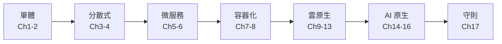
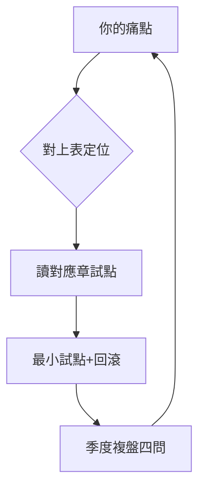

# 17.2 全景複盤：單體 → 分散式 → 微服務 → 雲原生 → AI 原生

## 14 次演進，一條主線

本書用淘寶教學模型走了 14 次演進，主線只有一句：**流量漲 10 倍，就有一個舊假設崩掉，就換一層架構**。單機扛不住 → 分離；DB 扛不住 → 快取+拆分；人多了 → 微服務；環境亂了 → Docker；機器多了 → K8s；成本貴了 → FinOps；AI 來了 → AI 原生。



## 五代架構對比總表

| 代 | 核心解法 | 代表技術 | 解掉的痛 | 新欠的債 |
|----|---------|---------|---------|---------|
| 單體 | 一個包跑天下 | Tomcat+DB | 簡單快速 | 擴展與協作 |
| 分散式 | 拆 DB、加 LB | Nginx/Redis/分庫分表 | 併發與可用 | 一致性、事務 |
| 微服務 | 拆應用、服務化 | Dubbo/Spring Cloud | 團隊與發布 | 運維地獄 |
| 容器/雲原生 | 標準打包+編排 | Docker/K8s/GitOps | 環境與彈性 | 成本與複雜度 |
| AI 原生 | 模型/Agent 一等公民 | 推理棧/AgentRun/網關 | 智能與執行 | 評估、安全、算力賬 |

## 每次演進的「不變量」

1. **快取思想**（2.2）：從 Redis 到特徵快取到 KV 快取，永遠是第一優化。
2. **非同步解耦**（6.2/15.2）：從 RocketMQ 削峰到 AI MQ 排任務。
3. **拆合辯證**（12.1/12.2）：拆解決協作，合解決複雜，來回擺動。
4. **可觀測先行**（13.2）：每代都先補監控，否則不敢擴。
5. **成本意識**（13.3）：每代紅利吃完，賬單倒逼下一代優化。

## 複盤方法：給自己畫演進圖

```bash
# 團隊複盤模板（每季度一次）：
# 1) 當前最大痛點是什麼？（延遲/成本/發布/智能）
# 2) 它屬於哪一代的債？（見上表「新欠的債」列）
# 3) 下一代解法中最小的一步是什麼？（先試點，不推倒）
# 4) 回滾計劃是什麼？（見 17.4）
```

## 本書章節與演進的對應：速查地圖

| 你遇到的痛 | 先讀 | 再讀 |
|-----------|------|------|
| 發布慢、環境亂 | Ch7 Docker、13.1 GitOps | Ch9 K8s 核心 |
| 大促扛不住 | Ch11 彈性、13.2 可觀測 | 16.3 搜推、16.4 實戰 |
| 帳單太貴 | 13.3 FinOps、12.3 縮零 | 14.5 推理棧、17.1 VN |
| 微服務太碎 | 12.1 技術債、12.2 合併 | 12.4 FaaS |
| 想加 AI | 15.1 白皮書、15.2 AgentRun | 16.1 網關、16.2 中間件 |
| 要穩定多活 | 17.4 八原則 | 13.4 託管、17.1 ACK One |



這張地圖也是教學用法：授課先讓學生說痛，再進章節；結課用 17.3 選型模板做課程設計評審。

記住主線那句話：**下一次流量漲 10 倍時，先問哪個假設會崩，而不是先問用什麼新技術**。假設先行，技術隨後——這就是演進式架構的全部心法。

## 本章小結

- 主線：流量漲 10 倍 → 舊假設崩 → 換一層架構
- 五代表：每代解舊痛、欠新債；沒有終極架構，只有當下合適
- 不變量：快取、非同步、拆合辯證、可觀測、成本意識
- 複盤四問：痛點、哪代債、最小步、回滾計劃

## 想一想

1. 為什麼「沒有終極架構」？用「解舊痛、欠新債」解釋微服務與 AI 原生的例子。
2. 五個不變量中，哪一個在你經歷的專案裡最缺？補上它要做的最小一步是什麼？
3. 若流量再漲 10 倍，你認為下一個崩掉的假設是什麼？（提示：看看 17.3 的選型陷阱）
