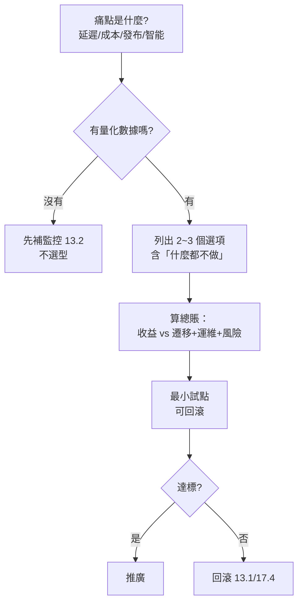

# 17.3 技術選型白皮書：避免為了雲原生 / AI 而雲原生 / AI

## 最貴的四個字：為了…而…

「為了微服務而拆」「為了 AI 而加個聊天框」是全書最貴的反模式。選型只有一個標準：**解決真痛點，且收益大於代價**。本節給出一頁紙的選型框架，貼在牆上用。



## 選型對照：何時用、何時不用

| 技術 | 用它，當… | 別用，當… |
|------|-----------|----------|
| 微服務 | 多隊並行、需獨立發布擴縮 | <15 人、邊界模糊（用 12.2） |
| Serverless | 抖動 10 倍、事件短時 | 穩定高頻、長連線有狀態 |
| GPU 切分共享 | 推理利用率 <30% | 訓練緊耦合、需整卡拓撲 |
| Agent/LLM | 非標任務、需理解生成 | 確定性流程（規則更快更便宜） |
| 向量/RAG | 知識常變、需引用 | 靜態問答（快取，見 2.2） |
| 多集群/多活 | 地域容災合規要求 | 單地域已夠（成本翻倍） |

## 算總賬模板

```bash
# 選型一頁紙（PR 模板，必填）：
# 1. 痛點與數據：P99 從 X 漲到 Y / 帳單佔比 Z%（附 Grafana 連結）
# 2. 選項：A 微服務拆分 / B 模組化單體 / C 什麼都不做
# 3. 總成本：遷移人日 __ + 新增運維 __ + 風險 __
# 4. 試點：範圍 __ / 指標 __ / 回滾 __（對應 Rollout）
# 5. 決策人與複審日：誰拍板 / 何時回看
```

```yaml
# 反模式：為 AI 而 AI——靜態退貨政策問答也上大模型
# 正解：L1 快取/RAG 直答（見 16.4），命中率 95%+ 才考慮生成
apiVersion: v1
kind: ConfigMap
metadata:
  name: ai-gating
data:
  rule: "確定性任務先走規則/檢索；生成只處理長尾 5%"
  budget: "AI 成本不超過該鏈路總成本 15%，超了自動降級"
```

## 三條紅線

1. **沒有數據不選型**：先補監控（13.2），再談架構。
2. **試點必須可回滾**：沒有 Rollout 回滾方案的選型一律駁回（13.1）。
3. **AI 先算賬**：每個 AI 功能標 Token 成本與上限（16.1 配額 + 13.3 分攤）。

## 常見「為了…而…」病例

| 病例 | 症狀 | 處方 |
|------|------|------|
| 為了微服務而拆 | 3 人團隊拆出 20 個服務 | 合併回模組化單體（12.2） |
| 為了 K8s 而上 | 2 個服務也要自建集群 | 託管/Serverless（13.4/12.3） |
| 為了 AI 而聊 | 靜態問答硬上大模型 | L1 檢索直答（16.4） |
| 為了多活而多活 | 單地域夠用卻建三地 | 先做好備份+演練（17.4） |

每個病例的共同病因：**把手段當目的**。開處方前先回 17.2 的演進圖問一句——你現在的真痛點，到底是哪一代的債？

## 本章小結

- 選型標準：真痛點 + 收益大於總代價；流程：數據→選項→算賬→試點→複審
- 對照表：每個技術都有「別用」列，先看再選
- 一頁紙模板 + 三條紅線：無數據不選、無回滾不試、AI 必算賬

## 想一想

1. 「什麼都不做」為什麼必須是選項之一？它防住了什麼決策偏差？
2. 為確定性退貨政策上大模型，錯在哪三處？（成本、延遲、幻覺）
3. 給你手頭一個想引入的技術填一頁紙模板，哪一欄最難寫？缺的數據怎麼補？
