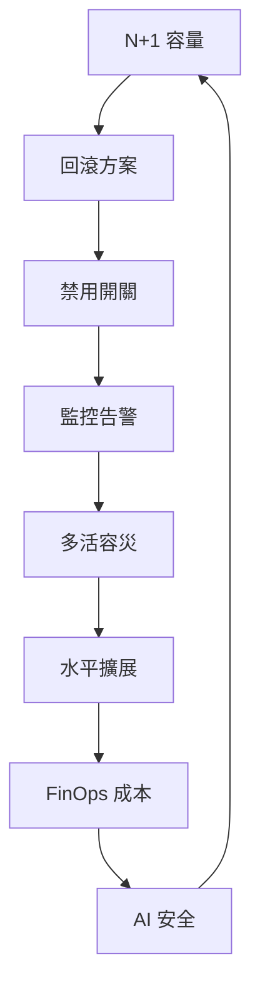

# 17.4 架構設計原則：N+1、回滾、禁用、監控、多活、水平擴展、FinOps 與 AI 安全

## 全書收束：八條保命原則

前面 16 章是「招式」，本節是「心法」。八條原則不分先後，大促前逐條打勾：



## 原則 1–4：活下來

| 原則 | 做法 | 檢查命令/配置 |
|------|------|--------------|
| N+1 | 掛掉一個 AZ/一批節點仍夠用 | 壓測水位 × 1.3 備量，HPA max 留餘 |
| 回滾 | 每次發布可一鍵回滾 | Argo Rollouts 自動回滾（13.1） |
| 禁用 | 非核心一鍵降級 | 開關中心 + 網關限流（16.1） |
| 監控 | SLO 燒蝕才叫人 | PrometheusRule + OnCall（13.2） |

```yaml
# 禁用開關：大促時關掉非核心（評價圖片、個性化裝飾）
apiVersion: v1
kind: ConfigMap
metadata:
  name: degrade-switches
  namespace: prod
data:
  review-images: "off"        # 關：只顯示文字評價
  fancy-theme: "off"          # 關：用預設皮膚
  recommend-llm-rerank: "off" # 關：降級為 XDL 排序（見 16.3）
```

## 原則 5–6：擴得開、容得災

- **水平擴展**：無狀態優先；有狀態（DB/會話）用分片+親和（15.3）+ 外部記憶。
- **多活**：同城雙活扛機房災、異地多活扛地域災；ACK One 統一下發（17.1）；核心鏈路 RPO≈0、RTO 分鐘級，演練按季度。

```bash
# 多活演練清單（摘錄）：
# [ ] DNS/流量一鍵切 20% 到備地域
# [ ] 備地域 DB 延遲 < 50ms 且無堆積
# [ ] 禁用開關在備地域同樣生效
# [ ] 演練後流量切回，主備資料對賬一致
```

## 原則 7–8：算得清、守得住（含 AI 安全）

- **FinOps**：每條鏈路有成本歸屬（13.3），AI 按 Token（16.1）；大促預算封頂，超了自動降級。
- **AI 安全**： prompt 注入過濾、工具最小授權、執行前確認、輸出合規校驗、全鏈路審計。

```bash
# AI 安全上線檢查：
# [ ] 系統提示詞防注入（外部內容不作指令執行）
# [ ] Agent 工具 scope 最小（導購無退款權）
# [ ] 下單/支付類操作需用戶確認 + 可撤銷
# [ ] 所有工具調用記審計（who/when/what/tokens）
# [ ] 敏感推理走 TEE/機密通道（見 14.5）
# [ ] 輸出合規校驗（承諾類話術攔截，見 14.1 護欄）
```

## 本章小結

- 八原則：N+1、回滾、禁用、監控、多活、水平擴展、FinOps、AI 安全
- 活下來（1–4）→ 擴得開容得災（5–6）→ 算得清守得住（7–8）
- 每條都有具象抓手：開關 ConfigMap、Rollout、SLO 告警、演練清單、安全檢查表
- 這是全書的「畢業考試」：新架構先過八條再上線

## 想一想

1. N+1 的「1」怎麼定？是 1 台機器、1 個 AZ 還是什麼？和成本如何 trade-off？
2. 禁用開關為什麼要在平時就演練？從未用過的開關在大促時會怎樣？
3. AI 安全檢查表中，若只能先落三項，你選哪三項？為什麼？
