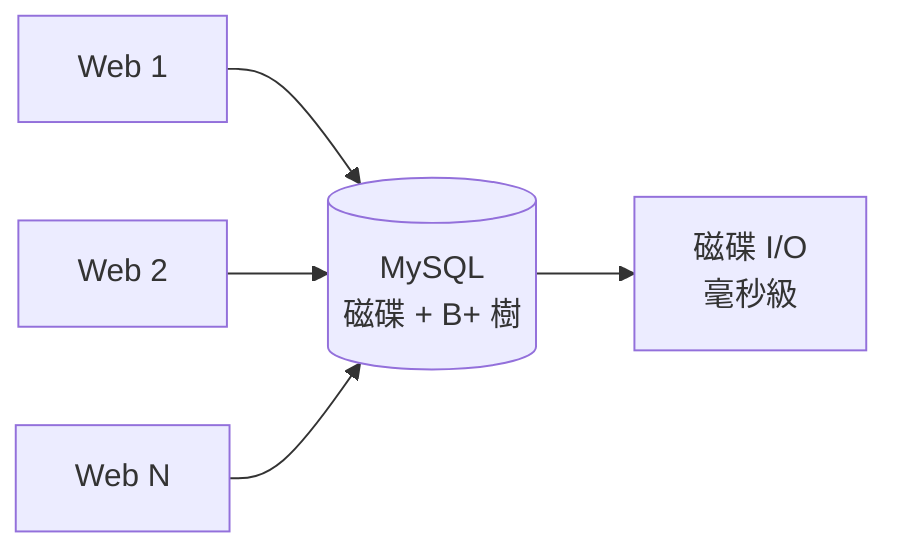
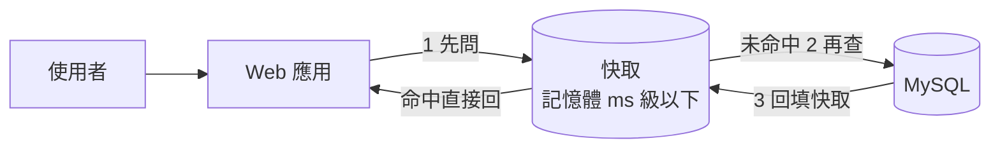

# 2.1 資料庫讀寫瓶頸與快取救星

## 從一個問題開始

Web 層好不容易能加機器了，流量一壓，掛的卻換成了 MySQL：CPU 100%，慢查詢堆積，商品詳情頁把同一個 `SELECT * FROM item WHERE id=?` 每秒打幾萬次。Web 加十台，資料庫還是只有一台——所有的讀壓力最終都匯聚到這一個點上。

資料庫為什麼扛不住讀？因為它是**用磁碟保證正確的系統，卻被拿來當記憶體用**。解法不是換更大的資料庫，而是加一層「記性很好、忘性也很大」的兄弟：**快取（Cache）**。

## 資料庫的讀寫困境



MySQL 的讀要走解析器、優化器、B+ 樹、磁碟 I/O，一次幾毫秒；寫還要保證事務、刷日誌、同步備庫，更慢。而商品詳情這類讀多寫少的數據（讀寫比可達 100:1），每次都查庫純屬浪費。瓶頸對照如下：

| 壓力類型 | 症狀 | 根因 |
|---|---|---|
| 讀太多 | CPU 跑滿、慢查詢堆積、QPS 到頂（單機約數千） | 相同數據被重複查詢，磁碟 I/O 跟不上 |
| 寫太多 | 主庫延遲、binlog 堆積、鎖等待 | 事務與持久化開銷大，無法並行加速 |
| 讀寫互相拖累 | 大促時讀把寫堵死，訂單寫不進去 | 同一個 InnoDB 實例競爭 Buffer Pool 與鎖 |

## 快取救星：用记忆换速度

快取的思想一句話：**把熱數據放在記憶體裡，讀不碰資料庫**。記憶體讀取是奈秒級，比磁碟快 4–5 個數量級。



加了快取之後，80%–90% 的讀請求在記憶體就被攔下，資料庫 QPS 從幾萬掉到幾百，瞬間「被治癒」。代價是什麼？**數據可能是舊的**——快取與資料庫之間出現了不一致窗口。整個 2.4 節都在討論這個代價。

## 最簡快取實戰：商品詳情頁

```java
// 偽碼：先查快取，未命中再查庫並回填
String key = "item:" + itemId;
Item item = cache.get(key);          // 1. 先問快取（0.5ms）
if (item == null) {
    item = itemDao.findById(itemId); // 2. 未命中才查庫（5ms）
    cache.set(key, item, 300);       // 3. 回填，TTL 5 分鐘
}
return item;
```

這短短 5 行就是第 2 章的起點，名叫 **Cache-Aside（旁路快取）**。它的三個參數決定一切：**Key 怎麼命名、TTL 設多久、未命中時誰來回填**。設錯任何一個，都會演變成 2.3 節的穿透、擊穿、雪崩。

## 快取的適用邊界

| 適合快取 | 不適合快取 |
|---|---|
| 讀多寫少（商品詳情、類目樹） | 寫多讀少（庫存扣減流水） |
| 允許秒級延遲（評論數、銷量） | 要求強一致（餘額、庫存） |
| 有熱點（80% 流量打 20% 商品） | 全是冷數據（後台翻頁查全表） |

一句話：**快取是熱數據的加速器，不是正確性的保證者**。把它放在正確的位置，它是救星；放錯位置，它是下一個凌晨告警的來源。

## 本章小結

- Web 能水平擴展後，**單點資料庫**成為新瓶頸：讀太多、寫太多、讀寫互拖
- 資料庫慢在磁碟 I/O 與事務開銷，不適合扛重複讀
- **快取**把熱數據放記憶體，攔截 80%+ 讀流量，是標準解法
- 最簡模式是 Cache-Aside：先查快取，未命中查庫並回填
- 代價是**數據可能滯後**，且只適合讀多寫少、容忍延遲的場景

## 想一想

1. 商品詳情讀寫比 100:1，庫存扣減寫多讀少，為什麼前者適合快取、後者不適合？
2. 快取把 DB QPS 從幾萬降到幾百，省下來的能力去哪了？寫壓力被解決了嗎？
3. TTL 設 5 分鐘意味著什麼？如果商品改價了，使用者最久會看到舊價格多久？

## 中英術語對照

| 中文 | 英文 |
|---|---|
| 快取 | Cache |
| 讀多寫少 | Read-heavy Workload |
| 旁路快取 | Cache-Aside |
| 存活時間 | Time To Live (TTL) |
| 每秒查詢數 | Queries Per Second (QPS) |
