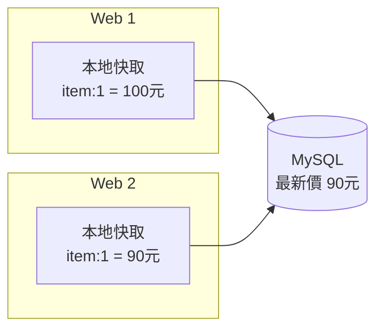
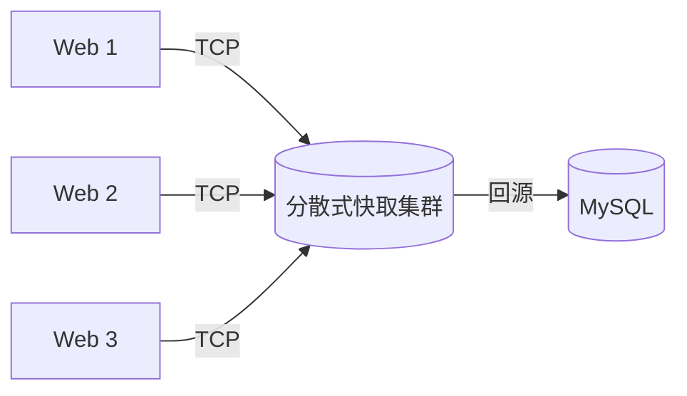
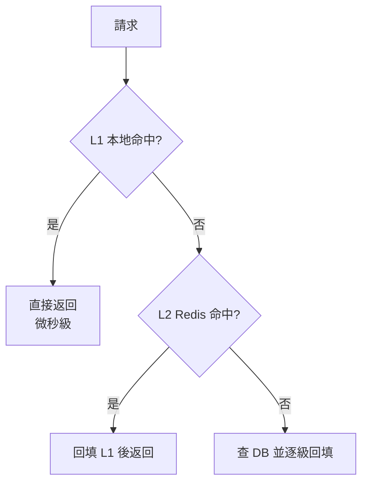

# 2.2 本地快取與分散式快取：Memcached / Redis / Tair

## 從一個問題開始

2.1 節加了快取，商品頁快如飛。但很快兩個新問題冒出來：第一，加了第二台 Web 機器後，兩台機器的快取各存一份，改價後一台新一台舊；第二，有人把大物件塞進 JVM 堆做快取，一個 Full GC 全站卡三秒。

這就是快取的第一個選型題：**快取放在應用進程裡（本地快取），還是放在獨立服務裡（分散式快取）？**

## 本地快取：快，但各自為政

本地快取就是 JVM 裡的一個 `HashMap`（如 Guava Cache、Caffeine）：讀寫都在進程內，延遲最低（奈秒級），但每台機器各存一份。



改價後 Web 2 回源拿到新價，Web 1 的舊快取要等 TTL 過期才刷新——**不一致窗口 × 機器數量**。機器越多，髒數據越多。這就是本地快取的原罪：**沒有共享，就沒有一致**。

## 分散式快取：獨立服務，共享記憶體

分散式快取把記憶體抽出來做成獨立集群，所有 Web 節點共享同一份數據。代表選手有三位：



| 特性 | Memcached | Redis | Tair（阿里自研） |
|---|---|---|---|
| 資料結構 | 純 KV 字串 | String/Hash/List/Set/ZSet/Stream | KV + 多種引擎（含持久化） |
| 持久化 | 無 | RDB + AOF | 有（LDB 引擎落盤） |
| 集群方案 | 客戶端一致性雜湊 | Sentinel / Cluster 分片 | 自動分區 + 多機房容災 |
| 適用場景 | 簡單 KV、大對象快取 | 排行榜、計數、分散式鎖、會話 | 電商大促、圖片特徵等自研場景 |
| 記憶體效率 | 高（slab） | 中等（物件開銷大） | 按場景優化 |

一句話選型：**簡單 KV 用 Memcached，玩資料結構用 Redis，阿里體量自研 Tair**。淘寶走的正是第三條路，但思想與 Redis 相通。

## 兩者不是二選一：分層快取

實務上成熟的答案是**兩級一起用**：L1 本地快取擋最熱的 10%（TTL 幾秒），L2 分散式快取擋次熱的 80%（TTL 幾分鐘），最後才回源 DB。

```java
// 分層讀：L1 → L2 → DB
Item item = caffeine.get(key);              // L1：進程內，3 秒過期
if (item == null) {
    item = redis.get(key);                  // L2：共享，5 分鐘過期
    if (item == null) {
        item = itemDao.findById(itemId);    // DB：最後防線
        redis.set(key, item, 300);
    }
    caffeine.put(key, item, 3);
}
```



代價是复杂度：兩層 TTL、兩層失效通知。但收益是 DB 幾乎收不到讀流量——大促就靠這套組合活下來。

## 本章小結

- **本地快取**最快但不共享，多台機器之間必然出現髒數據分歧
- **分散式快取**讓所有 Web 共享同一份記憶體，是集群時代的標配
- Memcached 專精簡單 KV，Redis 勝在資料結構，Tair 是阿里的規模化答案
- 實務正解是**分層快取**：L1 本地擋最熱數據，L2 分散式擋次熱數據
- 層數越多，不一致窗口與運維複雜度越高，為 2.3、2.4 節埋下伏筆

## 想一想

1. 兩台 Web 都用本地快取，改價後為什麼會出現「同一件商品兩種價格」？怎麼復現？
2. L1 只敢設 3 秒 TTL、L2 敢設 5 分鐘，背後的理由是什麼？
3. 計數器、排行榜這類需求為什麼 Redis 比 Memcached 合適？試舉一個具體命令。

## 中英術語對照

| 中文 | 英文 |
|---|---|
| 本地快取 / 分散式快取 | Local Cache / Distributed Cache |
| 分層快取 | Multi-level Cache |
| 一致性雜湊 | Consistent Hashing |
| 資料結構 / 持久化 | Data Structure / Persistence |
| 不一致窗口 | Inconsistency Window |
