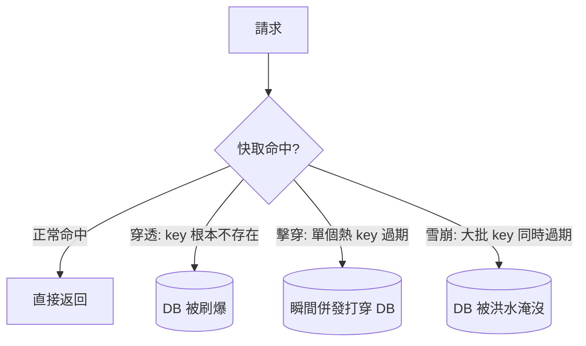
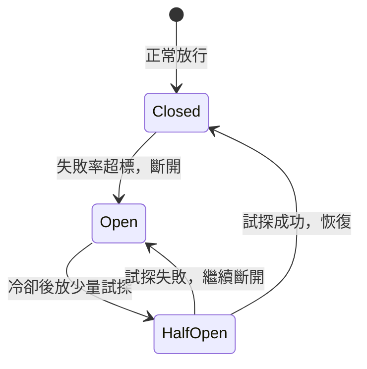

# 2.3 快取實戰痛點：穿透、擊穿、雪崩與熱點失效

## 從一個問題開始

快取上線後太平了一陣，直到某天凌晨：監控顯示快取命中率從 95% 掉到 5%，MySQL 被幾十萬 QPS 直接打穿。排查發現，有人在刷根本不存在的商品 ID——每個請求都穿過快取打到 DB。這還只是四種經典慘案中的第一種。

本節一次講透快取的四大殺手：**穿透、擊穿、雪崩、熱點失效**，以及對應的三件武器。

## 四大殺手：一張表認清它們



| 殺手 | 定義 | 典型場景 | 後果 |
|---|---|---|---|
| 穿透 Penetration | 查不存在的 key，快取永遠不命中 | 惡意刷 `id=-1`、爬蟲亂掃 | 每次都打 DB，可拖垮資料庫 |
| 擊穿 Breakdown | 單個熱點 key 過期，併發全打到 DB | 明星商品快取剛好到期 | 瞬間數千 QPS 壓垮單行查詢 |
| 雪崩 Avalanche | 大批 key 同時過期 | 整批快取 TTL 設成一樣的 30 分鐘 | DB 被洪水般的回源淹沒 |
| 熱點失效 Hotspot | 極熱 key 失效 + 重建太慢 | 雙十一零點的爆款詳情頁 | 重建期間所有流量直達 DB |

記法：**穿透是「查無此物」，擊穿是「單點過期」，雪崩是「集體過期」，熱點是「太火爆」**。

## 三件武器：布隆過濾器、互斥鎖、熔斷降級

| 武器 | 對付誰 | 原理 |
|---|---|---|
| 布隆過濾器 Bloom Filter | 穿透 | 記憶體裡先判「這個 key 可能存在嗎」，不存在直接拒絕，不碰快取和 DB |
| 互斥鎖 Mutex / Singleflight | 擊穿、熱點 | 同一 key 只放一個請求去 DB 重建，其他人等待結果，避免併發回源 |
| 熔斷降級 Circuit Breaker | 雪崩 | DB 快撐不住時直接返回預設值（降級），保住資料庫不死 |

```java
// 武器 1+2 合體：布隆過濾 + 互斥重建
if (!bloomFilter.mightContain(key)) {
    return null; // 穿透攔截：不存在的商品直接回空
}
Item item = redis.get(key);
if (item == null) {
    synchronized (key.intern()) {          // 單機互斥；集群用 Redis 鎖
        item = redis.get(key);             // 雙重檢查：別人可能剛重建完
        if (item == null) {
            item = itemDao.findById(id);
            redis.set(key, item, 300 + rand(60)); // TTL 加隨機值，防雪崩
        }
    }
}
```

防雪崩最便宜的一招就藏在上面：**TTL 加隨機抖動**，讓大批 key 不在同一秒過期。再配上熔斷器（DB 延遲超標就快速返回兜底數據），雪崩就很難形成。

## 熔斷器的狀態機



熔斷的哲學是**棄車保帥**：寧可讓部分使用者看到「稍後再試」的降級頁，也不能讓 DB 被拖死導致所有人不可用。這正是 5.4 節限流熔斷降級三板斧的前身。

## 本章小結

- **穿透**查無此物，用**布隆過濾器**在入口攔截，外加空值快取
- **擊穿**是單熱點過期，用**互斥鎖**保證只有一個請求回源重建
- **雪崩**是大批同時過期，用 **TTL 隨機抖動 + 多級快取 + 熔斷**化解
- **熱點失效**靠互斥重建 + 永不過期（後台非同步刷新）扛住
- 共同思想：**不在同一時刻讓 DB 承受超過它能力的併發**

## 想一想

1. 布隆過濾器說「不存在」一定準，說「存在」可能誤判，這個特性為什麼剛好適合防穿透？
2. 互斥鎖讓 1000 個併發只有 1 個去查 DB，另外 999 個在等——等待超時該怎麼辦？（提示：降級）
3. 全站快取 TTL 都設成整 30 分鐘會有什麼風險？只改一個數字怎麼化解雪崩？

## 中英術語對照

| 中文 | 英文 |
|---|---|
| 快取穿透 / 擊穿 / 雪崩 | Cache Penetration / Breakdown / Avalanche |
| 熱點失效 | Hotspot Invalidation |
| 布隆過濾器 | Bloom Filter |
| 互斥鎖 / 熔斷器 | Mutex Lock / Circuit Breaker |
| 降級 | Degradation / Fallback |
