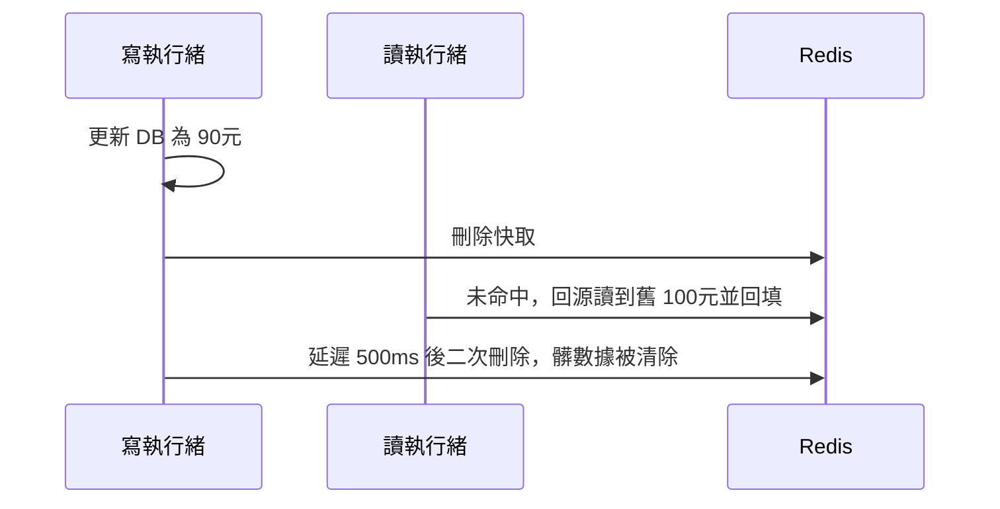

# 2.4 快取與資料庫的一致性難題

## 從一個問題開始

2.1–2.3 節我們把快取越加越厚，讀流量基本不碰 DB 了。但客服投訴來了：「商家明明改價成 90 元，使用者下單還是 100 元，多收的錢誰賠？」

這就是快取的終極代價：**同一份數據存了兩份（DB 一份、快取一份），怎麼保證它們一致？** 答案很殘酷：在分散式環境下，強一致做不到，我們只能在正確性與效能之間選一個可接受的 trade-off。

## 三種寫策略：沒有銀彈

| 策略 | 寫法 | 優點 | 缺點 |
|---|---|---|---|
| Cache-Aside（旁路） | 寫 DB，刪快取 | 實現簡單，快取只存真正被讀的 | 刪失敗就殘留髒數據，需重試 |
| Write-Through（穿透寫） | 同時寫快取與 DB（原子） | 快取永遠新，但每次寫都慢 | 寫放大，不熱的數據也佔記憶體 |
| Write-Behind（非同步寫） | 先寫快取，稍後刷 DB | 寫最快，適合計數器 | 掉電丟數據，只適合可丟場景 |

電商詳情頁的標準答案是 **Cache-Aside + 寫 DB 後刪快取**：讀多寫少，髒數據窗口只有幾百毫秒，商家和使用者都可接受。餘額、庫存這種不能髒的，則根本不走快取（直接讀 DB 或走 Tair 強一致引擎）。


為什麼是「先寫 DB 再刪快取」，而不是反過來？因為先刪快取再寫 DB 的窗口更大：刪完快取、還沒寫完 DB 時，別的請求會把舊數據重新載入快取，髒數據就被「焊死」了。

## 延遲雙刪：給髒數據二次打擊

主從延遲和併發會讓「寫後刪」仍有殘留，實務補丁叫**延遲雙刪（Delayed Double Delete）**：

```java
// 延遲雙刪偽碼
itemDao.update(item);        // 1. 寫 DB
redis.del(key);              // 2. 刪快取
Thread.sleep(500);           // 3. 等主從同步 + 併發讀過去
redis.del(key);              // 4. 再刪一次，清除窗口期載入的髒數據
```



醜，但有效。它的本質是承認「刪一次不夠」，用時間換正確性。500ms 睡多久，取決於主從延遲 + 一次讀寫往返，壓測說了算。

## canal：讓 MySQL 自己通知快取失效

靠應用「記得刪快取」終究不可靠——總有直連 DB 改數據的後台、總有刪失敗的重試黑洞。阿里最終的答案是：**監聽 MySQL 的 binlog，讓資料庫的變更自動驅動快取失效**。這就是 **canal**。


canal 把自己偽裝成 MySQL 從庫，實時解析 binlog，吐出「哪張表、哪一行、從 100 變成 90」的事件。下游服務訂閱後刪快取、更新搜尋索引，業務程式碼完全不用改。這套「**DB 變更即事件**」的思想，後來演變成 CDC（Change Data Capture），是搜尋、推薦、大數據的共同底座。

| 方案 | 一致性 | 複雜度 | 適用 |
|---|---|---|---|
| 過期 TTL 自然失效 | 最終一致（分鐘級） | 最低 | 評論數、銷量 |
| Cache-Aside + 延遲雙刪 | 準即時（秒級內） | 中 | 商品詳情、類目 |
| canal binlog 訂閱 | 準即時且可靠 | 高 | 搜尋索引、跨機房同步 |

## 本章小結

- 快取與 DB 不可能強一致，只能選可接受的**不一致窗口**
- 主流是 **Cache-Aside：先寫 DB 再刪快取**，順序不能反
- **延遲雙刪**用二次刪除覆蓋併發與主從延遲造成的髒數據
- **canal**偽裝從庫解析 binlog，讓 DB 變更自動驅動快取失效
- 選型按容忍度分級：可髒數據用 TTL，商品用雙刪，搜尋索引用 canal

## 想一想

1. 為什麼必須「先寫 DB 再刪快取」？畫出反過來時髒數據被焊死的時序。
2. 延遲雙刪的 `sleep(500)` 該怎麼定？設太短和太長分別有什麼後果？
3. canal 方案裡，如果消費者掛了半小時，快取會怎樣？恢復後如何追趕？（提示：binlog 位點）

## 中英術語對照

| 中文 | 英文 |
|---|---|
| 旁路快取 / 穿透寫 | Cache-Aside / Write-Through |
| 延遲雙刪 | Delayed Double Delete |
| 變更數據捕獲 | Change Data Capture (CDC) |
| 二進位日誌 | Binary Log (binlog) |
| 最終一致性 | Eventual Consistency |
