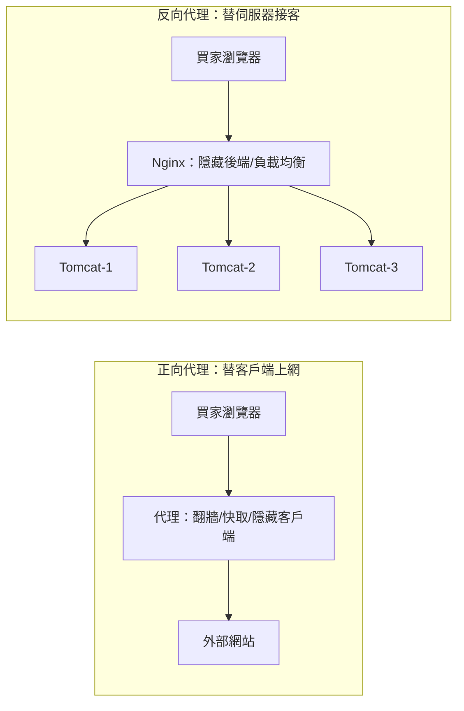
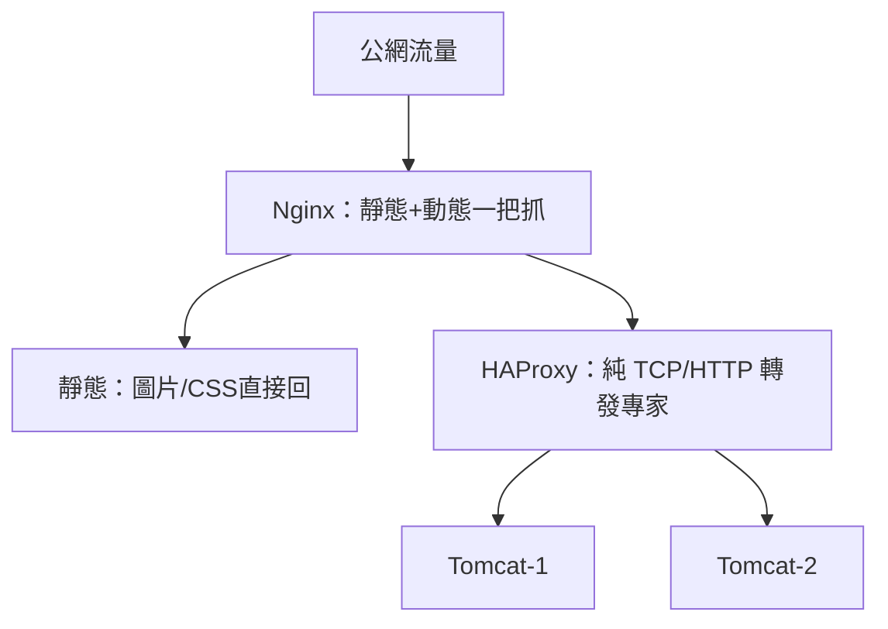

# 3.1 反向代理與 Web 集群：Nginx / HAProxy

## 一台 Tomcat 撐不住了，怎麼辦？

雙十一預熱一到，單台 Tomcat 的 CPU 衝到 100%，加記憶體也救不回來。最直接的想法是：**多加幾台 Web 伺服器，一起扛流量**。但問題來了——使用者該連哪一台？總不能叫買家自己挑 IP 吧？

答案是在 Web 集群前面放一個「交通指揮」：**反向代理（Reverse Proxy）兼七層負載均衡**。本節的主角就是 Nginx 與 HAProxy。

## 正向代理 vs 反向代理：一張圖分清



關鍵差別只有一句話：**正向代理隱藏的是客戶端，反向代理隱藏的是伺服器**。淘寶的 Web 入口用的就是反向代理——買家只看到一個域名，後面幾十台機器對他完全透明。

| 面向 | 正向代理 | 反向代理 |
|------|---------|---------|
| 服務對象 | 客戶端（幫你出去） | 伺服器端（幫你接客） |
| 典型用途 | 上網加速、存取控制、隱藏用戶 IP | 負載均衡、SSL 終結、靜態快取、WAF |
| 配置位置 | 瀏覽器/客戶端設定 | 機房入口、域名背後 |
| 例子 | 公司上網代理、VPN | Nginx、HAProxy、SLB |

## 七層負載：看得懂 HTTP 的指揮官

Nginx 工作在七層（應用層），看得懂 URL、Header、Cookie，所以能做很聰明的分流：`/img/` 走圖片集群，`/buy/` 走交易集群，VIP 用戶走專屬節點。

```nginx
# nginx.conf：三台 Tomcat 的七層負載範例
upstream taobao_web {
    least_conn;                    # 策略：連線數最少者優先
    server 10.0.1.11:8080 max_fails=3 fail_timeout=30s;
    server 10.0.1.12:8080 max_fails=3 fail_timeout=30s;
    server 10.0.1.13:8080 backup;  # 平時待命，前面全掛才上
}

server {
    listen 80;
    location / {
        proxy_pass http://taobao_web;
        proxy_set_header X-Real-IP $remote_addr;
        proxy_set_header X-Forwarded-For $proxy_add_x_forwarded_for;
    }
    location /img/ {
        proxy_pass http://img_cluster;  # 按 URL 分流
        proxy_cache img_cache;
    }
}
```

常見分流策略：`round-robin`（輪詢，均勻）、`least_conn`（最少連線，適合長連接）、`ip_hash`（同 IP 固定打到同台，見 3.2 節的代價）。

## Nginx vs HAProxy：怎麼選？



| 面向 | Nginx | HAProxy |
|------|-------|---------|
| 定位 | Web 伺服器 + 反向代理 + 快取 | 純負載均衡器（四/七層轉發之王） |
| 強項 | 靜態檔案、SSL 終結、rewrite、快取 | 超高併發轉發、健康檢查細膩、狀態頁豐富 |
| 效能 | 很好（事件驅動） | 極致（單進程事件模型，C 寫成） |
| 淘寶式用法 | 機房入口、動靜分離 | 內層交易集群前的轉發層 |

實務常見組合是**兩層**：外層 Nginx 做動靜分離與 SSL，內層 HAProxy 專心做交易請求的均衡與故障摘除。

## 健康檢查：自動把壞節點抬出去

負載均衡最值錢的能力不是「分流」，而是「**故障自動摘除**」。某台 Tomcat Full GC 卡死，Nginx 的 `max_fails` 計數一到就不再送流量給它，機器恢復後再自動加回來。沒有這招，集群加再多機器也只是「一起等故障」。

## 本章小結

- **反向代理隱藏伺服器**，是 Web 集群的統一入口
- **七層負載**看得懂 HTTP，可按 URL/Header/Cookie 分流
- **Nginx** 適合動靜分離 + 入口；**HAProxy** 適合內層高併發轉發
- 分流策略：輪詢、最少連線、ip_hash，各有代價
- 健康檢查與自動摘除，才是集群高可用的關鍵

## 想一想

1. 為什麼說「加機器」之前要先加「反向代理」？沒有統一入口的集群會遇到什麼問題？
2. 七層負載能按 URL 分流，四層負載為什麼做不到？（提示：它看得到 HTTP 嗎？）
3. `ip_hash` 看似解決了 Session 問題（3.2 節），它會帶來什麼新的負載不均與故障風險？
