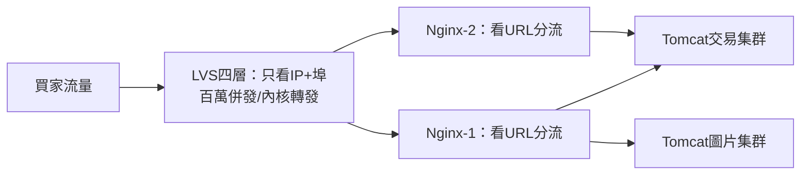
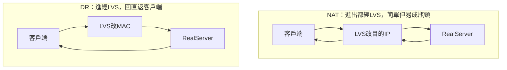
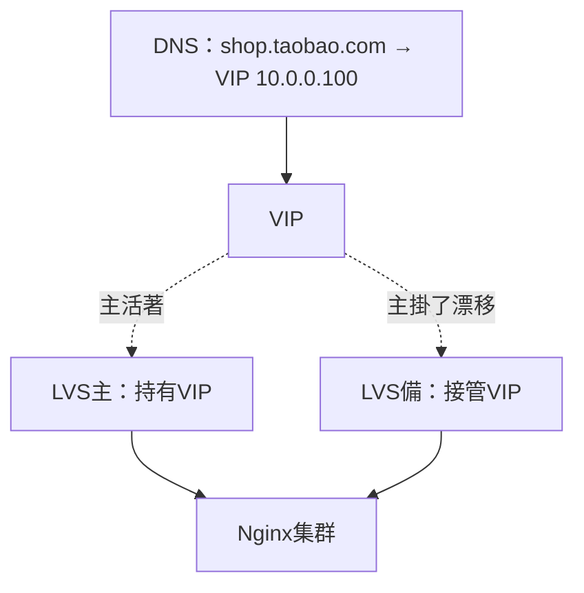

# 3.3 四層與七層的搭配：LVS / F5 + Keepalived

## Nginx 快被打爆了，誰來保護它？

3.1 節的 Nginx 集群上線後，流量又漲了十倍。這次倒下的是 Nginx 自己——七層解析 HTTP 太吃 CPU，單機幾萬併發就見頂。更糟的是 Nginx 只有一台，它一掛，全站跟著掛。

解法是**分層分工**：前面加一層看不懂 HTTP、只看 IP+埠的「蠻力型選手」擋海量流量，Nginx 退到後面做精細分流。這就是**四層負載（LVS/F5）+ 七層負載（Nginx）**的經典搭配。

## 四層 vs 七層：只看門牌 vs 拆信看內容



| 面向 | 四層負載（LVS/F5） | 七層負載（Nginx/HAProxy） |
|------|-------------------|--------------------------|
| 工作層次 | TCP/UDP：IP + 埠 | HTTP：URL/Header/Cookie |
| 效能 | 極高（LVS-DR 內核轉發，近線速） | 中高（要解析應用層協議） |
| 能力 | 純分流、故障摘除 | 內容路由、rewrite、快取、WAF |
| 代表 | LVS（開源免費）、F5（硬體昂貴） | Nginx、HAProxy、ALB |
| 角色 | 機房總入口擋量 | 業務精細路由 |

一句話記憶：**四層負責「扛住」，七層負責「分對」**。

## LVS 三種模式：NAT / DR / TUN



| 模式 | 原理 | 優點 | 缺點 |
|------|------|------|------|
| **NAT** | 改目的 IP，來回都經 LVS | 配置最簡單，RealServer 可用私網 IP | LVS 是頻寬瓶頸，只適合小流量 |
| **DR**（直接路由） | 只改 MAC，RealServer 直接回包給客戶端 | 效能最高，淘寶/大廠主流 | RealServer 要配 VIP、需同二層網路 |
| **TUN**（隧道） | IP 封裝隧道，可跨機房 | 支援跨網段、異地 | 要封包解包，RealServer 需支援隧道 |

淘寶式結論：**流量不大用 NAT，流量大了切 DR，跨機房才考慮 TUN**。DR 模式下回包不經 LVS，LVS 只處理「進」的一半流量，這正是它能扛百萬併發的秘密。

## Keepalived：VIP 漂移，入口永不失聯

LVS 本身也是單點，掛了照樣全站失聯。所以 LVS 一定是**一主一備 + Keepalived**：兩台 LVS 共享一個**VIP（虛擬 IP，如 10.0.0.100）**，平時主節點持有 VIP 對外服務，備節點用 VRRP 心跳監聽，主節點一死，VIP 幾秒內漂到備節點。

```text
# keepalived.conf（主備各一份，state 與 priority 不同）
vrrp_instance VI_TAOBAO {
    state MASTER            # 備機改為 BACKUP
    interface eth0
    virtual_router_id 51
    priority 100            # 備機改為 90，數字大者當主
    virtual_ipaddress {
        10.0.0.100          # VIP：域名解析到它，用戶只認它
    }
}
```



## F5 在哪？LVS 又在哪？

F5 是硬體四層/七層一體機，效能與穩定性頂級，但一台幾十萬起跳，還有授權費。淘寶的路徑是：**早期 F5 救急（花錢買時間），流量大到 F5 也貴到扛不住後，自研/開源 LVS 集群替代**。中小團隊記住結論即可：**直接用 LVS + Keepalived，省下的錢拿去加機器**；雲上則直接用雲廠商的 SLB/CLB（本質就是託管的 LVS+Nginx）。

## 本章小結

- 七層扛不住海量併發時，前面加**四層擋量**：四層扛住、七層分對
- LVS 三模式：**NAT 簡單、DR 高效主流、TUN 可跨機房**
- DR 回包直返，是高併發的關鍵；代價是 RealServer 要配 VIP
- **Keepalived + VIP 漂移**解決 LVS 單點，主掛備自動接管
- F5 花錢買時間，LVS 省錢撐規模，雲上直接用 SLB

## 想一想

1. 為什麼 DR 模式的 LVS 吞吐量可以比 NAT 高好幾倍？（提示：回包走哪條路？）
2. Keepalived 的 VIP 漂移解決了什麼單點問題？如果主備之間的心跳網路斷了會發生什麼？（提示：腦裂）
3. 畫出「LVS → Nginx → Tomcat」三層架構，標出每一層掛掉一台時，流量如何自動繞行。
