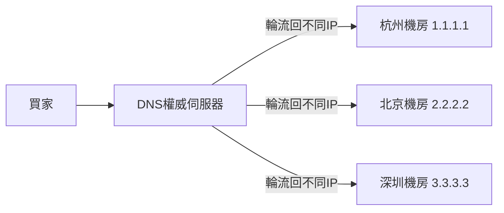
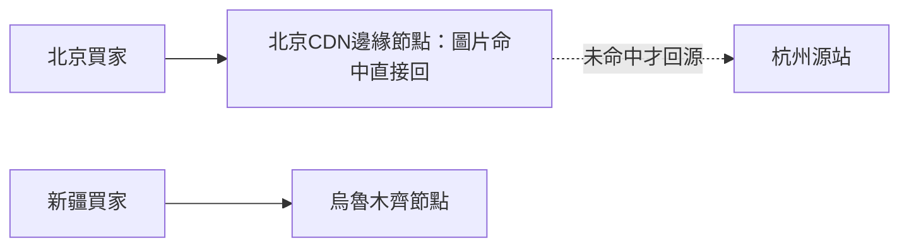
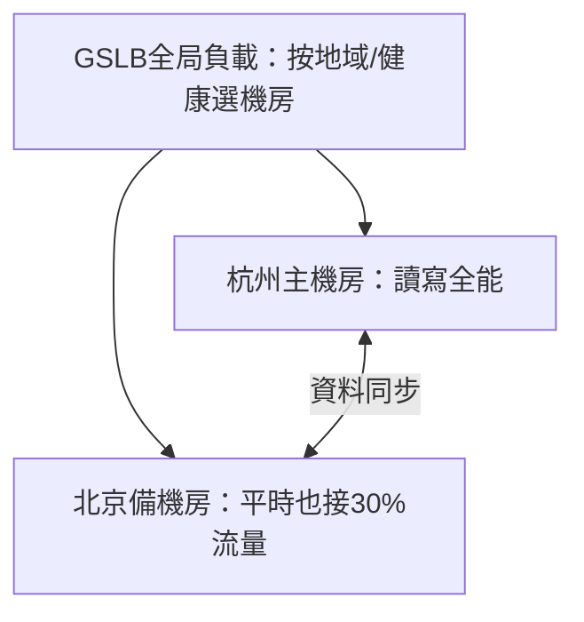
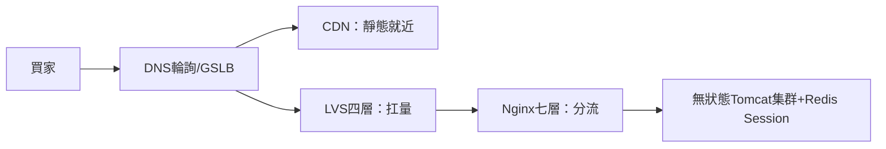

# 3.4 機房入口：DNS 輪詢、CDN 與異地多活基礎

## 杭州機房淹水了，淘寶還能賣嗎？

前面三節把「一個機房內部」做結實了：LVS + Nginx + 無狀態 Tomcat。但 2008 年一場光纖被挖斷，讓全站差點消失——**單機房本身就是最大的單點**。本節把視角拉到機房之外：流量進機房之前，還有兩道關——**DNS 與 CDN**，以及終極答案**異地多活**。

## 第一道門：DNS 輪詢，最便宜的入口負載



```text
; DNS Zone 檔案：同一個域名配多條 A 記錄即輪詢
shop.taobao.com.  60  IN  A  1.1.1.1   ; 杭州
shop.taobao.com.  60  IN  A  2.2.2.2   ; 北京
shop.taobao.com.  60  IN  A  3.3.3.3   ; 深圳
```

| 優點 | 缺點 |
|------|------|
| 零成本、人人會配、天然跨機房 | DNS 快取導致摘除慢（TTL 內還打到壞機房） |
| 配合短 TTL + 健康檢查可粗略容災 | 分流粗糙（按運營商/LocalDNS，不按真實負載） |

實務要點：TTL 設短（如 60 秒）以便故障時快速切走；再配**DNS 健康檢查**（壞機房的 IP 自動從解析結果拿掉）。但記住：**DNS 輪詢只能做粗排，精細分流還是靠機房內的 LVS/Nginx**。

## 第二道門：CDN，把圖片推出去

淘寶商品圖片佔了八成流量，全回源站又慢又貴。**CDN（內容分發網路）**的做法是：把靜態資源預先推到全國幾百個邊緣節點，買家就近下載。



| 面向 | 源站直出 | CDN 加速 |
|------|---------|---------|
| 速度 | 跨省幾百毫秒 | 就近幾十毫秒 |
| 成本 | 源站頻寬全額買單 | 邊緣分攤，頻寬費大降 |
| 動態請求 | 必須回源 | 只快取靜態；動態走「動態加速」回源 |

一句話：**靜態進 CDN，動態回源站**。雙十一前必做「預熱」——提前把會場圖片推到邊緣，否則開賣瞬間全網回源等於自殺。

## 終極答案：異地多活的雛形



異地多活有三個等級，淘寶是一步步爬上去的：

| 等級 | 做法 | 代價 |
|------|------|------|
| **同城雙活** | 同城市兩機房同時接流量 | 要解決資料同步延遲（毫秒級可忍） |
| **異地備援**（冷備） | 主掛了才切備，平時備閒置 | 切換慢、備機平時浪費 |
| **異地多活** | 多地同時接寫，各管一部分用戶 | 最難：寫衝突、資料一致、GSLB 調度 |

基礎三件套：**GSLB 按地域與健康選機房** + **資料多向同步** + **按用戶分片歸屬**（某省用戶固定歸某機房寫，減少寫衝突，詳見第四章分庫分表）。

## 機房入口全景：一張圖串起第三章



## 本章小結

- **DNS 輪詢**是最便宜的跨機房入口，但摘除慢、分流粗
- **CDN**解決靜態流量：就近命中、回源兜底，大促前要預熱
- 單機房是最大單點，終極答案是**異地多活**
- 多活三件套：GSLB 調度、資料同步、用戶分片歸屬寫
- 第三章全景：DNS → CDN → LVS → Nginx → 無狀態應用

## 想一想

1. DNS 的 TTL 為什麼故障時希望越短越好、平時卻希望長一點？這對矛盾怎麼取捨？
2. 為什麼 CDN 只能加速圖片/CSS/JS，交易下單請求還是得回源站？
3. 異地多活裡「北京用戶在杭州也下了一單」會造成什麼寫衝突？按用戶分片歸屬如何緩解？
