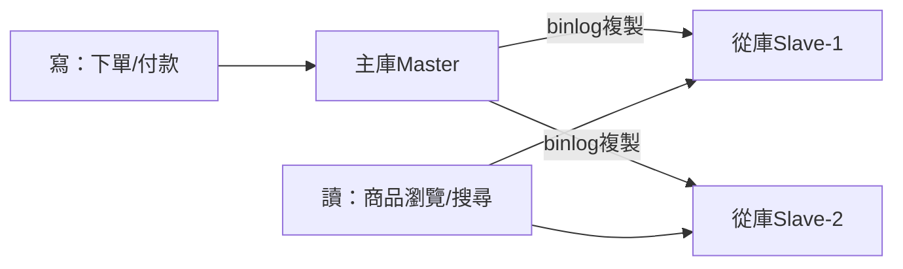
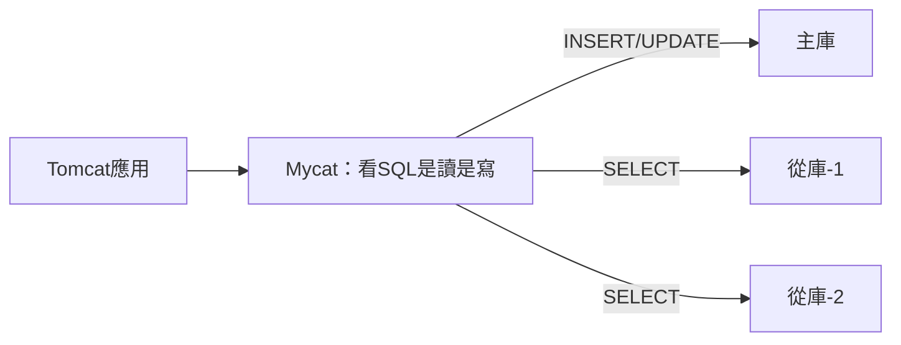

# 4.1 讀寫分離與主從同步：Mycat 與資料一致性

## Web 層加了十台，資料庫先投降了

第三章把應用層做成無狀態集群，流量一漲，MySQL 的 CPU 直接紅線。慢查詢日誌裡全是 `SELECT`——寫入一天幾十萬筆，讀取卻是上億次。**讀寫比例 100:1，單台資料庫先被讀拖死**。

直覺解法：**寫只走主庫，讀分散到多個從庫**——讀寫分離。而擋在中間的中介，就是 Mycat 這類資料庫中介軟體。

## 主從同步：先有複製，才有分離



MySQL 主從靠 `binlog`：主庫記下每次寫入，從庫重放。兩種模式要分清：

| 模式 | 做法 | 優點 | 代價 |
|------|------|------|------|
| **異步複製**（預設） | 主寫完即回，之後慢慢同步 | 主庫最快，不受從庫拖累 | 有延遲，剛寫的讀可能讀不到 |
| **半同步複製** | 至少一個從庫收到才回 | 資料更安全 | 寫入變慢，從庫掛了會卡主庫 |

## Mycat 讀寫路由：應用零改動的分流器



```xml
<!-- schema.xml：Mycat 讀寫分離範例 -->
<dataHost name="taobaoHost" balance="1" writeType="0">
  <heartbeat>select user()</heartbeat>
  <writeHost host="master" url="10.0.3.11:3306" user="root" password="***"/>
  <readHost host="slave1" url="10.0.3.12:3306" user="root" password="***"/>
  <readHost host="slave2" url="10.0.3.13:3306" user="root" password="***"/>
</dataHost>
```

`balance="1"` 表示讀走從庫，寫走主庫。應用只要把 JDBC 指向 Mycat，**一行業務程式碼都不用改**，讀寫就自動分家了。

## 最痛的坑：複製延遲

剛下完單去查訂單——「查無此單」！因為讀被 Mycat 路由到還沒追上 binlog 的從庫。這就是**複製延遲**，大促時延遲幾秒是家常便飯。

| 對策 | 做法 | 適用場景 |
|------|------|---------|
| **關鍵讀走主庫** | 下單後 N 秒內的訂單查詢強制走主 | 交易鏈路，讀量小但要求強一致 |
| **讀寫路由加 Hint** | `/*balance*/` 註解指定 | 框架層精細控制 |
| **監控延遲摘除** | `Seconds_Behind_Master` 超標就摘掉該從庫 | 通用兜底 |
| **緩解而非根治** | 緩解：快取剛寫的訂單 | 接受最終一致的查詢 |

## 一主多從的極限與主庫高可用

讀寫分離救得了一時：主庫寫仍是單點瓶頸（寫撐爆就沒轍），從庫加多了主庫的 binlog 分發也成負擔。經驗數字：**一主拖 3–5 個從庫是甜蜜點**，再多就該考慮 4.2 節的垂直分庫與 4.3 節的水平分片了。

主庫本身也不能單點：常用 **MHA / MMM + VIP** 做主庫切換，主掛了自動推一個從庫上位。雲上直接用雲資料庫的高可用版（主備同步 + 自動漂移），自建機房才需要手搭 MHA。記住順序：**先讀寫分離扛讀，再主備高可用保寫，最後才分庫分表動大刀**。

另一個常被忽略的點是**從庫的讀寫不均**：商品詳情頁的讀是訂單頁的幾十倍，可以給不同業務配不同的從庫權重（Mycat 的 `readHost` 配 `weight`），熱業務多分一點讀流量，冷業務少分一點。

## 本章小結

- 讀多寫少時，**讀寫分離**是最划算的第一刀
- 主從靠 binlog 複製：異步快但有延遲，半同步安全但寫慢
- **Mycat** 做讀寫路由，應用零改動即可分流
- 最大坑是**複製延遲**：關鍵讀走主庫 + 延遲摘除 + 快取兜底
- 一主 3–5 從是極限，寫瓶頸要靠分庫分表解決

## 想一想

1. 為什麼「剛下單就查不到」？畫出請求走主庫寫、走從庫讀的時間線，標出延遲窗口。
2. 哪些讀可以忍受延遲走從庫，哪些必須走主庫？試為淘寶列三例。
3. 從庫的 `Seconds_Behind_Master` 飆到 30 秒，Mycat 與監控分別該做什麼動作？
