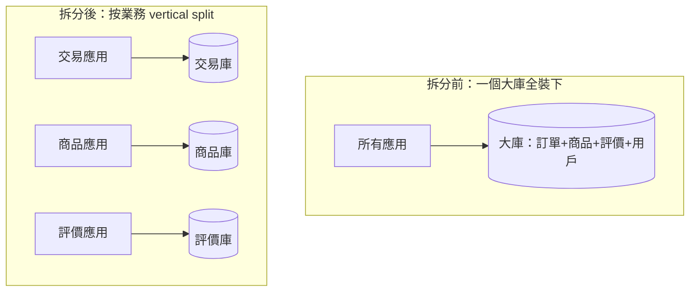
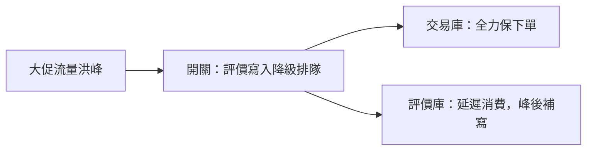

# 4.2 按業務垂直分庫：降低資源競爭

## 讀寫分離後，交易和評價還在打架

4.1 節做了讀寫分離，讀壓力散了。但大促一來，資料庫又抖了——這次是**寫和寫在打架**：下單、付款、評價、物流全擠在同一個庫裡搶 InnoDB Buffer、搶 redo log、搶連接數。慢的不是某條 SQL，而是**不相干的業務互相拖累**。

解法很符合直覺：**按業務拆庫**——交易歸交易，評價歸評價。這就是垂直分庫。

## 垂直分庫：一業務一庫，互不干擾



| 面向 | 拆分前（大一統） | 拆分後（垂直分庫） |
|------|---------------|-------------------|
| 故障隔離 | 評價慢查詢拖垮下單 | 評價庫掛了，交易照樣賣 |
| 資源競爭 | 共用 Buffer Pool、連接池 | 各庫獨立調優（交易重寫、商品重讀） |
| 擴展 | 只能整庫加機器 | 熱業務單獨加機器加從庫 |
| 代價 | 無 | 跨庫查詢、分散式事務（見 4.4 節） |

## 怎麼切：邊界就是業務邊界

垂直拆分的邊界，照著**業務模組**切：用戶庫、商品庫、訂單庫、評價庫、物流庫。每個庫配獨立的 Mycat `schema`，應用各連各的。

```xml
<!-- Mycat：垂直分庫只是多配幾個 schema -->
<schema name="trade_db" dataNode="dn_trade"/>
<schema name="item_db" dataNode="dn_item"/>
<schema name="rate_db" dataNode="dn_rate"/>
```

切分三步驟：先**只讀業務先搬**（評價、商品詳情風險小），再搬**寫入相對獨立**的（物流），最後啃**交易核心**；每步都做**雙寫驗證**——新舊庫同時寫、對帳一致後再切讀。

## 跨庫查詢：第一個代價現身

以前 `JOIN` 一把梭，現在訂單和商品不在一個庫，SQL 直接報錯。對策由簡到難：

| 對策 | 做法 | 例子 |
|------|------|------|
| **應用層組裝** | 查兩次，程式碼裡拼起來 | 先查訂單的 `item_id`，再調商品服務補詳情 |
| **資料冗餘** | 把常用欄位抄一份過去 | 訂單表冗餘 `item_title`、快照價格 |
| **同步/匯總庫** | Canal 同步到查詢專用庫 | 複雜報表走離線數倉，不碰線上庫 |

淘寶的經驗是：**線上交易鏈路用前兩招（快），複雜查詢全部趕到離線（見第六章大數據）**。

## 垂直分庫的運維紅利：獨立備份與獨立限流

拆開後還有兩個隱形好處。第一，**備份與恢復變快**：以前整庫幾百 GB，備一份幾小時；拆開後交易庫單獨做高頻備份，評價庫一天一次即可，故障恢復也只需恢復出事的那個庫。第二，**限流與降級可分開做**：大促時評價、物流可以先降級（延遲顯示），把連接數與 IO 全部讓給交易，這在單庫時代是做不到的——一個庫的連接池是大家搶的。



## 垂直拆到頭，下一步是什麼？

垂直分庫治好了「業務打架」，但治不好「單業務太大」——交易庫的訂單表一年幾十億行，單表照樣撐爆。這時就要對**單張大表**動刀：4.3 節的水平分片。

## 本章小結

- 寫與寫打架時，按**業務邊界垂直分庫**，一業務一庫
- 好處：故障隔離、獨立調優、熱業務單獨擴展
- 步驟：只讀先搬、雙寫對帳、最後啃核心
- 代價：跨庫 JOIN 失效，用應用組裝 + 冗餘 + 離線匯總應對
- 垂直拆完，單表過大就要水平分片

## 想一想

1. 為什麼「評價庫掛了不影響下單」是垂直分庫最大的價值？這和微服務拆分有何相通之處？
2. 訂單表冗餘了商品標題，會帶來什麼一致性麻煩？（提示：商家改標題後，已下訂單該變嗎？）
3. 你的系統裡哪兩個業務最該先拆庫？用「故障影響面 × 資源競爭」排個序。
