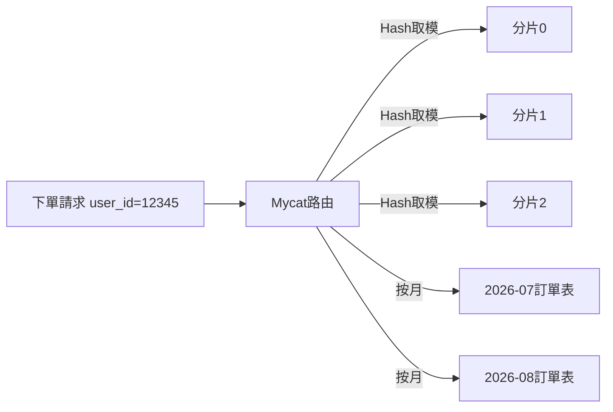
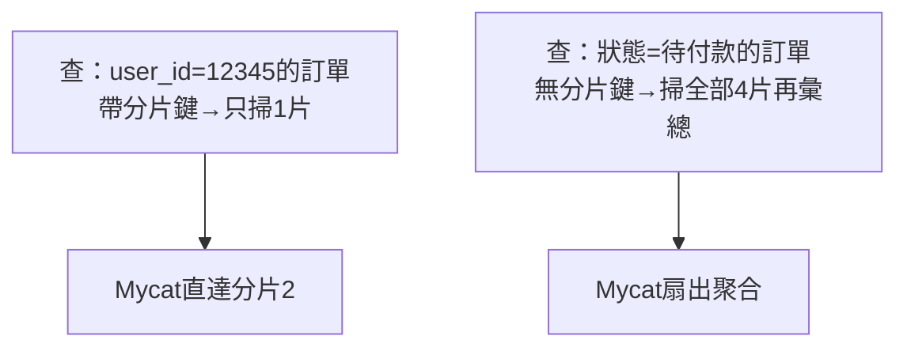
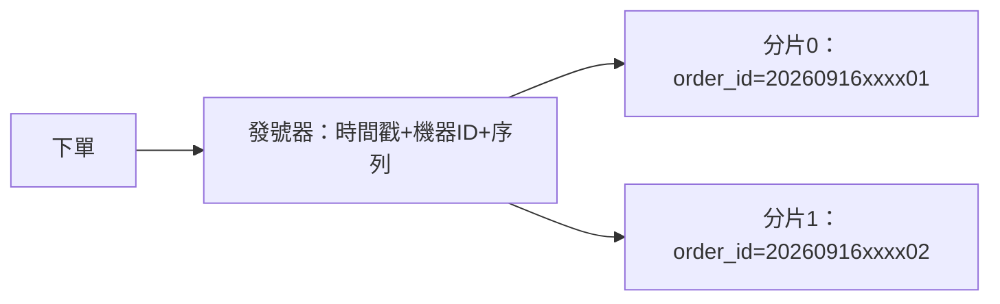

# 4.3 大表拆小表：Hash / 時間分片與水平擴展

## 訂單表三億行，一條查詢跑一分鐘

垂直分庫後，交易庫還是越來越慢。`order` 表三億行，索引再優化也救不了——B+ 樹太深、備份一跑業務就抖。這不是「哪個業務」的問題，是**單張表太大**的問題。只能把一張大表切成多張小表：**水平分片（Sharding）**。

## 兩種切法：Hash 分片 vs 時間分片



| 切法 | 路由規則 | 優點 | 缺點 |
|------|---------|------|------|
| **Hash 分片**（按 user_id） | `shard = hash(user_id) % N` | 寫入均勻，併發最高 | 按時間查要掃全片；擴容要重算 |
| **時間分片**（按月/天） | 當月寫當月表 | 熱點集中、冷數據好歸檔 | 當月分片是寫熱點；跨月查詢麻煩 |

```xml
<!-- Mycat：按 user_id 的 Hash 分片範例 -->
<table name="orders" dataNode="dn1,dn2,dn3,dn4" rule="rule_userid"/>
<!-- rule.xml：一致性 Hash / 取模 -->
<function name="rule_userid" class="HashMod"><property name="count">4</property></function>
```

淘寶實務：**交易訂單用 user_id Hash**（買賣家各自只查自己的單，天然帶分片鍵），**日誌流水用時間分片**（只查近期，冷數據直接歸檔）。

## 分片鍵：選錯了全盤皆輸

分片鍵（Shard Key）是路由的唯一依據。選得好，90% 查詢帶著鍵直達單片；選得差，全是掃全片的慢查詢。**第一原則：用最高頻查詢的條件做分片鍵**（訂單按買家、商品按賣家）。沒有分片鍵的查詢（如後台按狀態掃單）一律趕到離線數倉，別在線上掃。

## Mycat 路由實戰：直達單片 vs 掃全片



```sql
-- 好查詢：帶分片鍵，只打一片，又快又穩
SELECT * FROM orders WHERE user_id = 12345 AND created_at > '2026-09-01';

-- 壞查詢：無分片鍵，Mycat 要掃全片再彙總，大促時禁用
SELECT * FROM orders WHERE status = 'WAIT_PAY';
```

規矩只有三條：**線上查詢一律帶分片鍵**；帶不了鍵的走 ES 寬表或數倉；後台運維的全表掃描一律限流 + 走從片。很多團隊分片後效能反而更差，根因都是放任了掃全片的 SQL 上線。

## 全局主鍵：自增 ID 不能再用了

分到 4 個片，每片都有自己的自增序列，4 片都會蹦出 `id=1001`——合併查詢直接撞車。對策三選一：**UUID**（簡單但無序、索引大）、**Snowflake 雪花算法**（有序、要自建發號服務）、**Mycat 全局序列**（`db.table` 中介表發號，最省事）。淘寶訂單號就是雪花思路：時間戳 + 機器 ID + 序列，天然有序又全域唯一。



## 最難的一課：擴容翻倍難題


Hash 取模最痛的就是擴容：4 片變 8 片，幾乎所有數據的歸屬都變了，得全量搬遷。業界三招：**一致性 Hash**（只搬相鄰 1/N）、**預先分足夠多片**（如先分 256 片，擴容只搬整片不重算）、**按時間冷熱分離**（舊片封存唯讀，只給新片寫）。雲原生時代的新答案是 TiDB 這類**自動分片**資料庫（見 4.4 節）。

## 本章小結

- 單表過大時，用**水平分片**把大表拆小表
- **Hash 分片**均勻扛併發，適合交易；**時間分片**便於歸檔，適合日誌
- **分片鍵決定生死**：最高頻查詢條件做鍵，無鍵查詢趕去離線
- 最大代價是**擴容搬家**：一致性 Hash、預分片、冷熱分離可緩解
- 分片的終極代價（事務/Join）見下一節

## 想一想

1. 訂單按 `user_id` 分片後，「商家查自己店鋪所有訂單」會變成什麼操作？（提示：要掃多少片？）
2. 為什麼說 Hash 取模擴容時「幾乎全表都要搬」？用 4 片變 5 片舉例算一算。
3. 時間分片下「雙十一當月分片」會遇到什麼寫熱點？如何用二級 Hash 打散？
