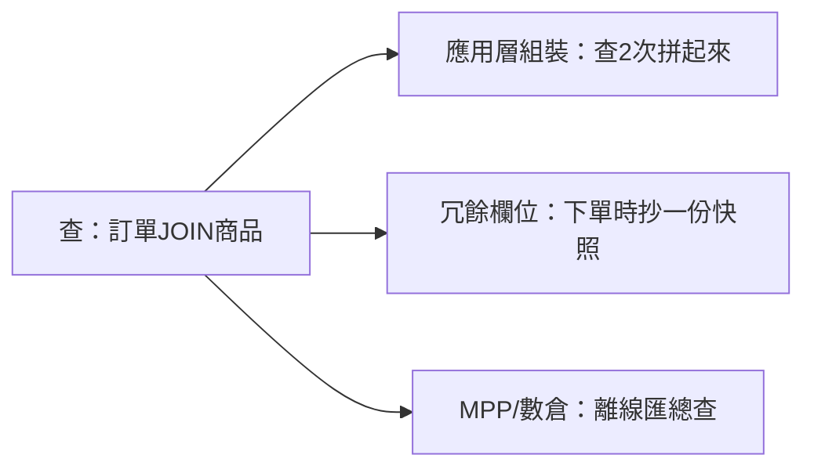
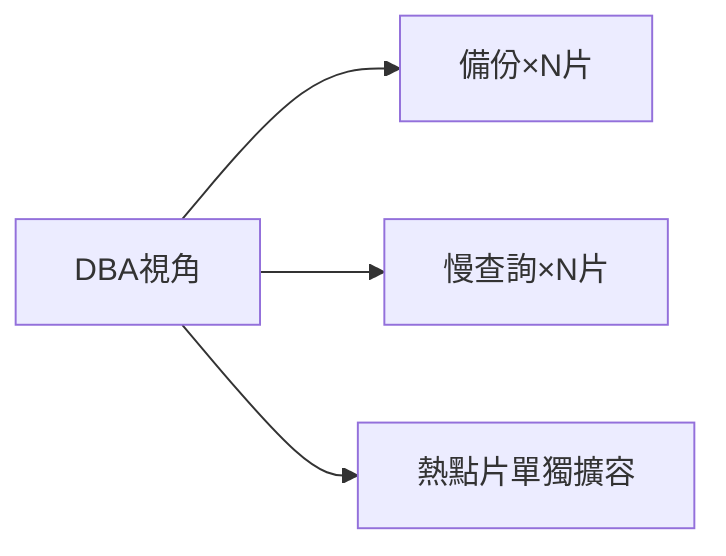
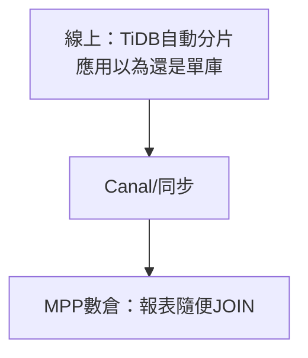

# 4.4 拆分後的代價：分散式事務、跨庫 Join 與 MPP

## 庫拆完了，煩惱才真正開始

前三節一路拆：讀寫分離、垂直分庫、水平分片，效能是上去了。但程式設計師開始抱怨：以前一個本地事務搞定的下單扣庫存，現在跨三個庫，**一半成功一半失敗怎麼辦**？以前一個 JOIN 查出的報表，現在數據散在八個片，**怎麼查**？本節直面拆分的代價。

## 代價一：分散式事務

| 方案 | 做法 | 優點 | 代價 |
|------|------|------|------|
| **2PC**（兩階段提交） | 協調者先問 all-ready 再 commit | 強一致 | 同步阻塞、協調者單點、效能差 |
| **TCC**（Try-Confirm-Cancel） | 業務拆三段：預留/確認/取消 | 一致性好、靈活 | 業務侵入大，每個操作寫三遍 |
| **Saga** | 長事務拆多個本地事務，失敗逐段補償 | 高可用、適合長流程 | 要寫補償邏輯，最終一致非即時 |
| **最終一致**（可靠消息） | 本地事務 + MQ：單建完發消息扣庫存 | 效能最高、解耦 | 短暫不一致，需接受延遲 |

淘寶的選擇很務實：**核心資金鏈用 TCC/Saga 保底，普通鏈路用「本地事務 + RocketMQ 事務消息」做最終一致**（扣款成功後發消息，庫存服務消費到再扣，失敗重試 + 對帳兜底）。記住原則：**能接受短暫不一致的，一律用最終一致，別碰 2PC**。

## 代價二：跨庫 Join

| 對策 | 適用場景 |
|------|---------|
| 應用層組裝 | 線上 TP 查詢，結果集小 |
| 欄位冗餘快照 | 高頻展示欄位（標題、價格快照） |
| ES/寬表同步 | 搜尋、篩選等多維查詢 |
| 離線數倉 | 後台報表、跨全量統計 |

## 代價三：運維複雜度翻倍

別只盯著程式碼，運維的 pain 更直接：備份從 1 份變 N 份，慢 SQL 排查要逐片看，某片熱點要單獨擴容，監控儀表從一張變一打。以前一個 DBA 搞定，現在要配分片治理：**統一的發號器、分片元數據、跨片追蹤 ID**，缺一不可。很多小團隊分片後被運維拖垮，不是效能不夠，而是**人手不夠**——這也是 4.3 節說「能不分片就不分片」的原因。

## 救星：MPP 與 NewSQL（TiDB / Greenplum）

手寫分片太苦，業界造了兩類新輪子：

| 類型 | 代表 | 特點 |
|------|------|------|
| **NewSQL**（線上事務） | TiDB | 相容 MySQL 協議，自動分片、自動擴容，事務接近單機體驗 |
| **MPP**（離線分析） | Greenplum / ClickHouse | 列存 + 大規模並行，專吃跨全量報表與 OLAP |

路線圖：**線上用 NewSQL 藏住分片複雜度，線下用 MPP 承接複雜查詢**，中間用同步鏈路連起來。這正是第五、六章服務化與大數據的入口。

## 本章小結

- 拆分的三個代價：**分散式事務、跨庫 Join、運維複雜度**
- 事務選型：2PC 強一致但慢；**TCC/Saga 保核心，最終一致扛大流量**
- 跨庫 Join：線上組裝 + 冗餘，複雜查詢趕去 ES 與數倉
- **NewSQL（TiDB）藏分片、MPP（Greenplum）扛分析**，是拆分複雜度的終極收斂
- 第四章全景：讀寫分離 → 垂直分庫 → 水平分片 → 新硬體收斂

## 想一想

1. 為什麼大促核心鏈路寧願用「最終一致 + 對帳」也不用 2PC？（提示：鎖住全鏈路的代價）
2. TCC 的 Try/Confirm/Cancel 三段各在做什麼？以「下單扣庫存」舉例寫出來。
3. 什麼查詢該走線上組裝，什麼該趕去 MPP？試為淘寶各舉兩例並說明理由。
