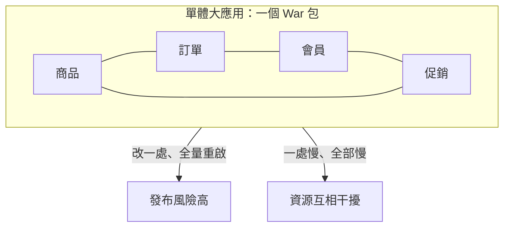
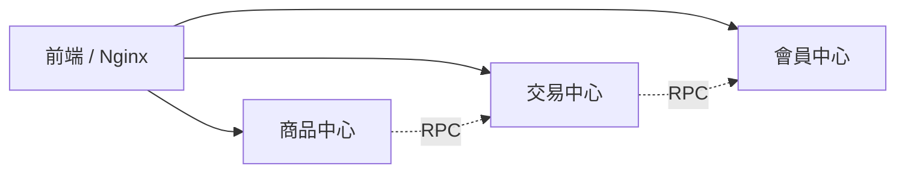

# 5.1 大應用拆小應用：業務邊界與 DDD 簡介

## 單體撐不住了

第四章我們把資料庫拆了，但應用層還是「一個大 War 包」。雙十一前夕，這個大應用的痛點全部爆發：改一行促銷邏輯，全站要一起重新部署；商品模組 CPU 吃滿，訂單、會員也被拖慢；上百人擠在同一個程式碼庫，合併衝突天天上演。



這時淘寶的選擇不是「把機器加更大」，而是「把應用拆更小」：按業務邊界做**垂直拆分**。

## 怎麼拆：跟著業務邊界走

拆分的原則只有一句話：**高內聚、低耦合的，不再是類別，而是應用**。

- 按業務領域拆：商品中心、交易中心、會員中心、促銷中心各自獨立部署。
- 拆完各有自己的程式碼庫、自己的資料庫（呼應 4.2 節垂直分庫）。
- 應用之間不再直接調用 DAO，只能走網路介面。



| 拆分方式 | 做法 | 缺點 |
|---|---|---|
| 按技術層拆 | Web 層、Service 層各一包 | 跨層呼叫頻繁，沒解決耦合 |
| 按業務邊界拆 | 商品、交易、會員各一應用 | 初期要處理跨應用調用 |
| 按團隊拆（反向） | 一個團隊一應用 | 若邊界錯，團隊互相等待 |

## DDD 限界上下文：拆分的尺

怎麼判斷邊界對不對？**領域驅動設計（DDD）** 給了一把尺：**限界上下文（Bounded Context）**。

同一個詞，在不同上下文意義不同，就是拆分訊號：

- 商品上下文的「訂單」：只是銷量統計。
- 交易上下文的「訂單」：價格、優惠、支付狀態、履約的核心實體。

```java
// 商品上下文：輕量的 OrderSnapshot
class OrderSnapshot {
    Long orderId;
    Long itemId;
    int count;
}

// 交易上下文：完整的 Order 聚合根
class Order {
    Long orderId;
    Money payAmount;
    OrderStatus status;
    List<OrderItem> items;
    void pay() { /* 狀態機 + 不變條件 */ }
}
```

實務做法：先畫**上下文映射圖**，再決定拆幾個應用。初期寧可少拆（3~5 個），跑順了再細拆。過早拆成幾十個微服務，只會提前掉進 6.4 節的運維地獄。

## 拆分的三條紀律

1. **獨立部署**：各應用有自己的發布節奏，促銷天天發版不影響交易。
2. **獨立資料**：不允許跨庫 Join，要數據就調介面。
3. **顯式介面**：依賴關係寫在介面上，而不是偷連資料庫。

## 本章小結

- 大應用拆小的動力：發布風險、資源干擾、團隊協作三重壓力。
- 正確拆法是按**業務邊界垂直拆分**，而非按技術層拆。
- **DDD 限界上下文**是判斷邊界的工具：一詞多義處即是邊界。
- 紀律：獨立部署、獨立資料、顯式介面。
- 拆完的新問題：應用間如何高效調用？下一節用 RPC 回答。

## 想一想

1. 為什麼「按技術層拆分」解決不了單體的根本問題？它和「按業務拆」差在哪裡？
2. 舉一個電商例子，說明同一個「商品」在不同限界上下文中有什麼不同含義？
3. 如果一開始就拆成 50 個微服務，可能帶來什麼代價？為什麼建議先少拆？
