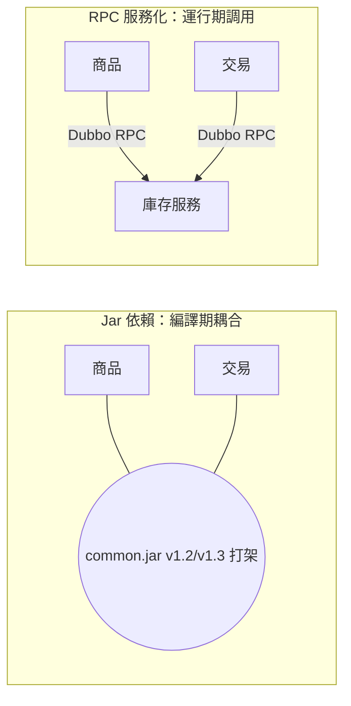
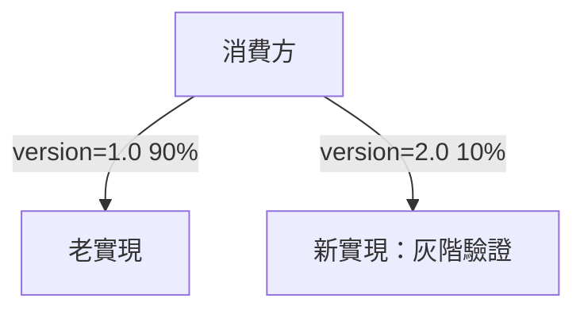

# 5.2 公共模組服務化：Dubbo / Spring Cloud RPC

## 公共程式碼的噩夢

5.1 節拆出商品、交易、會員三個應用後，新問題立刻出現：三個應用都要用「查庫存」「算價格」「鑑權」。最初的做法是打成 `common.jar`，各應用引用。結果升級一次工具包，三個應用要一起重新編譯發布，版本很快就亂了。

解法是**公共模組服務化**：把共用能力變成獨立服務，用 **RPC（遠端過程調用）** 對外提供。



## Dubbo RPC 實戰

阿里系當年的主力就是 **Dubbo + HSF（High-speed Service Framework）**。服務提供方暴露介面，消費方像調本地方法一樣調用。

```java
// 1. 定義介面（打成 api 包）
public interface StockService {
    boolean deduct(Long itemId, int count);
}

// 2. 提供方實現
@DubboService(version = "1.0", timeout = 300)
public class StockServiceImpl implements StockService {
    public boolean deduct(Long itemId, int count) {
        // 扣減庫存邏輯
        return true;
    }
}

// 3. 消費方引用：像本地一樣調用
@DubboReference(version = "1.0")
private StockService stockService;

public void createOrder(Long itemId) {
    if (stockService.deduct(itemId, 1)) {
        // 建單
    }
}
```

Spring Cloud 則用 HTTP + OpenFeign 風格，介面更貼近 REST：

```java
@FeignClient(name = "stock-service")
public interface StockClient {
    @PostMapping("/stock/deduct")
    boolean deduct(@RequestParam Long itemId, @RequestParam int count);
}
```

## 介面版本：服務化的生命線

服務一旦獨立，大促時「老介面還有人用、新邏輯又要上」是常態。Dubbo 用 `version` + `group` 做灰階：

| 策略 | 做法 | 適用場景 |
|---|---|---|
| 版本號路由 | `version=1.0` 舊邏輯，`2.0` 新邏輯並存 | 大促新玩法試點 |
| 分組隔離 | `group=taobao/tmall` 隔離 | 不同業務線複用同一介面 |
| 超時 + 重試 | `timeout=300ms, retries=2` | 避免慢服務拖垮調用方 |



## Dubbo vs Spring Cloud vs HSF

| 框架 | 協議 | 註冊中心 | 特點 |
|---|---|---|---|
| HSF | 自研二進制 | ConfigServer / Diamond | 淘寶內部主力，效能極致 |
| Dubbo | Dubbo/TCP、Triple | Zookeeper / Nacos | 開源、介面級治理強 |
| Spring Cloud | HTTP + JSON | Eureka / Nacos | 生態全、REST 友好、稍慢 |

選型建議：內部高併發核心鏈路用 Dubbo/HSF 二進制協議；對外、跨語言場景用 Spring Cloud HTTP。

## 本章小結

- `common.jar` 共享是編譯期耦合，升級困難；服務化改為運行期 RPC 調用。
- Dubbo 用 `@DubboService` / `@DubboReference` 實現透明遠調；Spring Cloud 用 Feign 走 HTTP。
- **介面版本**是服務治理的關鍵，支撐灰階與大促並存。
- 新問題：服務地址天天變，消費方怎麼找到提供方？下一節談服務發現。

## 想一想

1. `common.jar` 共享和「庫存服務化」在本質上有什麼不同？為什麼後者更適合多應用？
2. Dubbo 二進制 RPC 和 Spring Cloud HTTP 各有什麼取捨？你會怎麼選？
3. 如果沒有介面版本機制，大促上新功能會遇到什麼風險？
