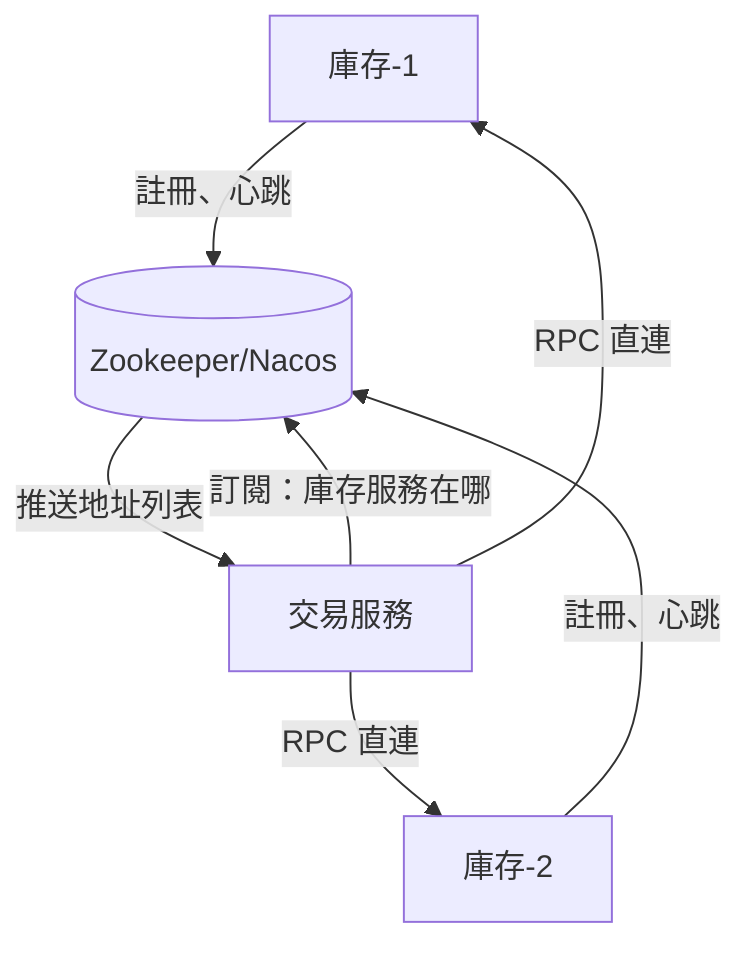
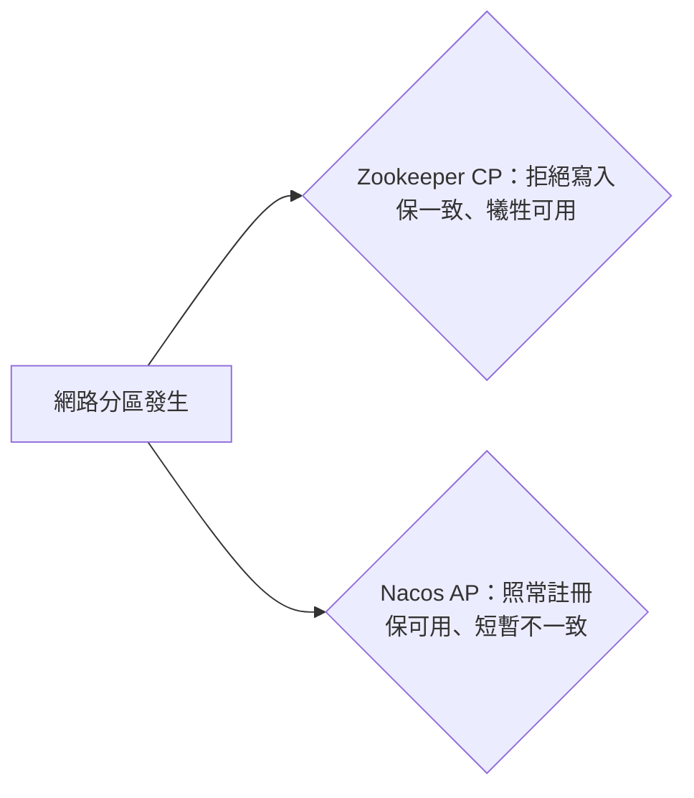

# 5.3 分散式協調：Zookeeper / Nacos 配置中心與服務發現

## 地址寫死就行了嗎

5.2 節有了 RPC，但消費方要知道「庫存服務有 3 台，分別是 10.0.0.1、.2、.3」。上線初期有人把地址寫在設定檔，結果一擴容就得改配置重啟，大促前夜最怕這個。

答案是**服務發現**：提供方啟動時向註冊中心報到，消費方動態訂閱；再加上**配置中心**，改配置不用重啟。



## 註冊、心跳與健康檢查

服務發現的核心是三個動作：註冊、續約、剔除。

```yaml
# Nacos 客戶端配置：bootstrap.yml
spring:
  cloud:
    nacos:
      discovery:
        server-addr: 127.0.0.1:8848
        heart-beat-interval: 5000   # 5s 一次心跳
        heart-beat-timeout: 15000   # 15s 沒心跳標不健康
        ip-delete-timeout: 30000    # 30s 沒心跳直接剔除
      config:
        server-addr: 127.0.0.1:8848
        file-extension: yaml
        refresh-enabled: true       # 配置變更熱刷新
```

```java
// 配置熱刷新：降級開關不用重啟
@RefreshScope
@RestController
public class PriceController {
    @Value("${promotion.enabled:true}")
    private boolean promotionEnabled;
}
```

心跳超時就剔除，配合客戶端負載均衡（隨機、輪詢、權重），壞節點自動不再被選中。

## CAP：為什麼有兩個註冊中心

分散式系統逃不開 **CAP 定理**：一致性（C）、可用性（A）、分區容忍（P）三者只能取其二，而 P 是必選，實際是在 C 與 A 之間取捨。

| 註冊中心 | 設計取向 | 行為 | 適用場景 |
|---|---|---|---|
| Zookeeper | CP | 腦裂時少數派不可寫，保證數據一致 | Dubbo 早期、強一致協調、分散式鎖 |
| Nacos / Eureka | AP | 腦裂時各寫各的，保證服務可發現 | 大促核心鏈路：寧可拿到舊地址，也不能找不到服務 |
| Nacos（可切換） | CP/AP 可配 | 臨時實例走 AP，持久實例走 CP | 一個集群兩種需求都要 |



## 配置中心：把開關抽出來

雙十一最常用的就是配置中心做**動態開關**：限流閾值、降級開關、活動開關全部放在 Nacos/Diamond，推送秒級生效。

- 本地快取 + 遠端推送：即使配置中心短暫掛掉，客戶端用快照照常跑。
- 版本與回滾：每次發布有版本號，出問題一鍵回滾。
- 灰階推送：先推 10% 機器驗證，再全量。

## 本章小結

- 服務發現解決「地址天天變」：註冊、心跳、訂閱、推送四步閉環。
- 配置中心解決「改配置要重啟」：熱刷新、版本回滾、灰階推送。
- CAP 決定選型：Zookeeper 偏 CP 保一致，Nacos/Eureka 偏 AP 保可用。
- 新風險：服務多了，一個慢服務會拖垮整條鏈路，下一節用三板斧應對。

## 想一想

1. 為什麼「把服務地址寫死在設定檔」在大促擴容時是災難？服務發現如何解決？
2. 用 CAP 解釋：為什麼大促核心鏈路寧可選 AP 的註冊中心？
3. 配置中心的「本地快照」有什麼用？如果沒有它會發生什麼？
